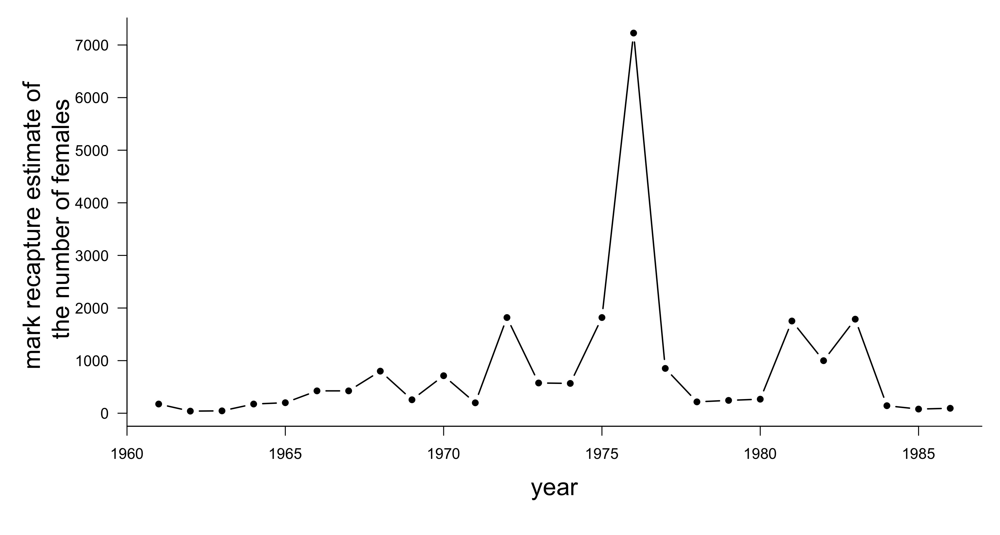
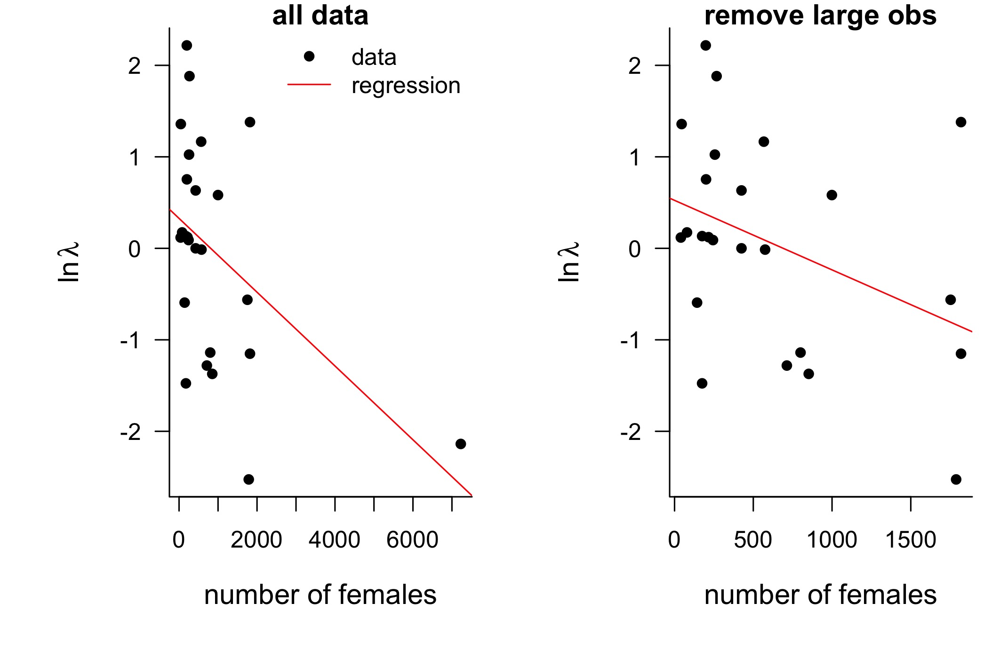
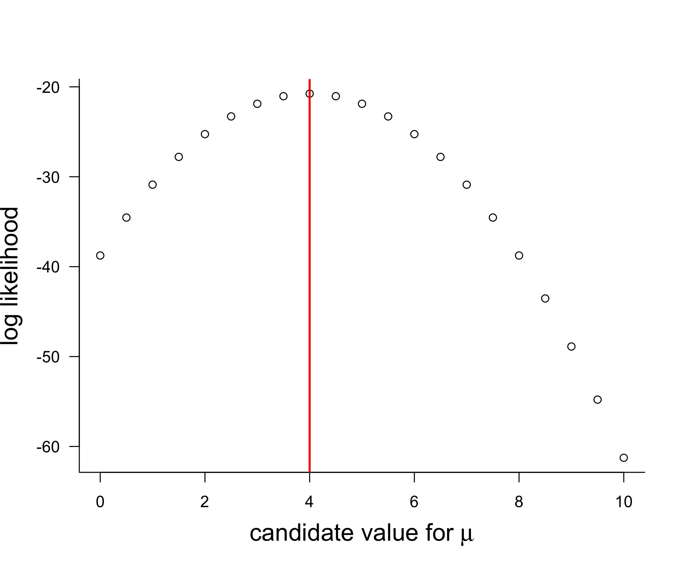
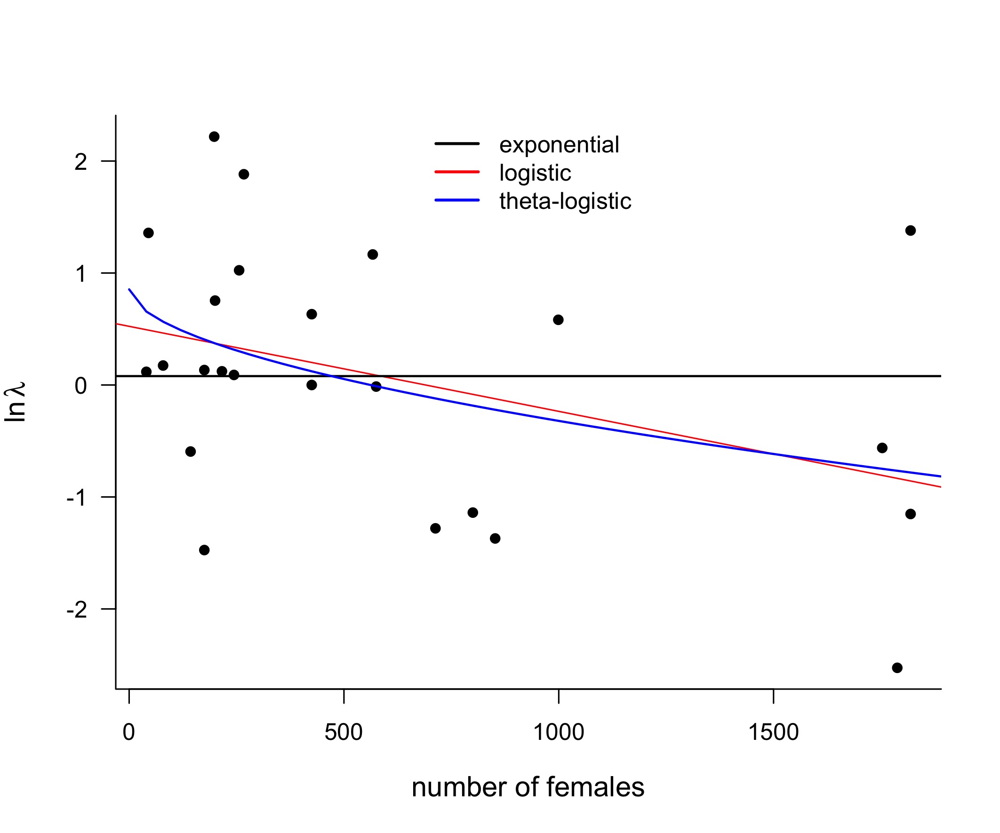

### Outline
1. Intro to model selection
	1. Motivating example with Harrison data
	2. How does model selection differ from model fitting?

2. Intro to likelihood
	1. Difference between probability and likelihood
	2. maximum likelihood 
	3. example with coin toss?
	4. Least squares and max like are the same for normal distribution: example with regression
	5. ??How does likelihood differ from R2?

3. Model comparison with AIC
	1. Comparing 3 different models with max like
	2. Example of overfitting
	3. Simplicity and AIC
	4. ??Likelihood ratio test?


## 1. How do we tell which model to use for our data?
- If we have several candidate models and no *a priori* reason to assume one is better than the others, we can use data to determine which is best.

- For example, you may have reason to believe your population has density dependent growth rates, but we introduced a couple of density-dependent models, which one should we choose?

### Which model is most likely given my data?

{width=80%}

### Model selection with the Bay Checkerspot data
- data from Harrison's famous paper testing whether there were multiple populations or a single population
- number of females estimated using mark recapture over 20 years

{ width=50% } 
{ width=30% }

Figure: Data from Harrison (1991). Image Wikipedia Commons (CC BY-SA 3.0)

### Probably negative density dependence
- plot natural logarithm of $\lambda$, 
- expect a negative slope with density if there is density dependence
- check without outlier 

{ width=70% }

### Probability of the data: What we just did there
- looked at the probability of the **data** given the null hypothesis of zero slope
- frequentist hypothesis testing
- very unlikely (low probability)

|             |   Estimate| Std. Error|   t value| $Pr(>\lvert t \rvert)$|
|:------------|----------:|----------:|---------:|------------------:|
|(Intercept)            |     0.75|        0.3|    2.46|               0.02|
|slope |     0.00|        0.0|   -3.06|               0.01|


		RSE: 1.039 on 22 degrees of freedom
		Multiple R-squared:  0.2992,	
		Adjusted R-squared:  0.2674 
		F-statistic: 9.393 on 1 and 22 DF,  
		p-value: 0.005672
		
### Model selection: how likely is this model?
- the hypothesis testing did give us some clues (exponential model unlikely.... do you know why?), but does not tell us if we should use a logistic or theta logistic model

- look at the problem in the opposite direction: we have the data
- how likely is it that each one of our models could have generated this data?


density independent model: $log(N_{t+1}/N_t)=r$  

logistic model:$log(N_{t+1}/N_t)=r(1-N_t/K)$

theta logistic model:$log(N_{t+1}/N_t)=r(1-(N_t/K)^\theta)$

## 2. Likelihood
-   The probability of obtaining the observed data, given a particular set of parameter values (q) for a particular model (Edwards 1974)
   $$L(q|data,model)$$ 
-   is read as the “likelihood of the parameter values q given the collected data and specified model x"
  
### Probability and Likelihood

- the likelihood of a given hypothesis (model) is proportional to the probability of obtaining the data given the model
$$L (model|data) = c * P(data|model)$$
- and since likelihood can only be used to compare models, we don't need to worry about the constant


### Calculating Likelihood  for Datasets
$$L(\phi|X)=P(X|\phi)=\prod g(x_i|\phi),$$

where $g(x_i|\phi)$ is the appropriate probability density function

### But actually... use log-likelihood 
- easier to calculate 
- less likely to result in computer rounding errors

Log-likelihood
$$ln[ \, L(\phi|X) ] \,=\sum ln [ \,g(x_i|\phi) ] \,$$

### Example: use likelihood to find mean and variance of data
-   given a set of data, determine if the data came from a normal distribution with a given mean (5) and variance (4)
-   assume independent observations, so likelihood is the product of their individual probabilities
``` R   		
X = c(0,4,5,7,8,2,2,4,4)
like1=prod(dnorm(X,mean=5,sd=2))
```
     > like2 
	 [1] 4.443365e-12
- compare to another parameter value (mean = 6)
``` R  
like2=prod(dnorm(X,mean=6,sd=2))
```
	> like2
	[1] 1.072149e-11
- this value is less likely

### Maximum likelihood estimate (MLE)
-   The parameter(s) values that make the likelihood as large as possible
-   Note: because likelihoods are often very small numbers, normally use the logarithm of the likelihood or log-likelihood to compare between models

### Likelihood: finding mean and variance of data	
- but of course, probably better to use log likelihood so
- Using a related definition of likelihood as the –sum of the log transform of individual probabilities given a mean 5 and variance 2:
``` R
X = c(0,4,5,7,8,2,2,4,4) 
like1=-sum(dnorm(X,mean=5,sd=2,log=T))
like2=-sum(dnorm(X,mean=6,sd=2,log=T))
```
	> like1
	[1] 21.88377
	> like2
	[1] 25.25877
	
### Likelihood: example
- try some other possibilities, all assuming normal error:
```R
#varying the mean
means = seq(0,10,by=.1)
mean.likes =
  sapply(means,function(y) sum(dnorm(x=X,m
  =y,sd=2, log=T)))
```
{ width=50% }

### Maximum log likelihood
-   The probability of obtaining the observed data given a particular set of parameter values for a particular model

{ width=60% }

- varying both mean and variance to find the most likely values for these parameters

### Optimization problem
- nice thing about using negative log likelihood: we have a minimization problem

``` R
normL = function(par) {
y.pred = par[1] + par[2]*cdat$females[-1][-idx]
	#-idx to remove outlier
          -sum(dnorm(log(pcap[-idx]),
		mean=y.pred,sd=sqrt(par[3]),log=T)) }
          
mlest=optim(par=c(0,1/100,1),normL) 
#par argument is the starting search values for par[1:3]
```

	 
### Linear regression and maximum likelihood
- if we have normally distributed errors with known variance, we will get the same result for linear least squares or max likelihood regression fits

## 3. Model comparison
{ width=80% }

### Comparing 3 different models with max like
- apply this to our model selection problem
- calculate the maximum likelihood for each model
- mean is given by our model, one extra parameter for variance (assuming normal distribution)

| model          | # parameters | ln $L_{max}$ |   |
|----------------|----------------------|----------|---|
| exponential    | 2                    | -41.3    |   |
| logistic       | 3                    | -37.8    |   |
| theta-logistic | 4                    | -37.1    |   |

### Wait.....

• if a model has n data points and n parameters (one for each data point), then the residual variance will be ZERO

• Would this be a still better model???

• Is a model with more parameters, functions, entities, etc. more likely to be “true”?

(more explanatory, accurate, predictive, representative of reality?)

### Overfitting

>“with four parameters I can fit an elephant, and with five I can make him wiggle his trunk.”
>- John von Neumann

- More complex models are more flexible, and more likely to be misled by errors and noise

, via Wikimedia Commons](FermiNeumannElephant.gif){ width=40% }


### Overfitting example?

### Parsimony
>"Do not multiply entities without necessity."
>-William of Ockham
- choose the model with the fewest assumptions 

 [Creative Commons CC BY-NC-SA 4.0 license](https://creativecommons.org/licenses/by-nc-sa/4.0/). ](69126_evo_resources_resource_image_36_original.gif){ width=80% }


### Model selection using parsimony
-   Information criterion statistics combine the maximum log likelihood for a model with the number of parameters it include to provide a measure of “support”
    

“Support” is higher for:

-   •  models with higher likelihoods, and
    
-   •  models with fewer parameters
    
    More complex models are penalized because more parameters will always lead to a better fit to the data, but at the cost of less precision in the estimate of each parameter and incorporation of spurious patterns from the data
	
### Model selection criteria

-   •  Goodness of fit (e.g., R2 , distribution of residuals)
    
-   •  Likelihood (ML)
    
-   •  Parsimony (number of parameters)

### Akaike information criteria (AIC)

$AIC=-2ln(m|y, \theta) +2k$

-  takes into account BOTH model fit and parsimony
- goodness-of-fit: where y is the data set and $\theta$ the maximum- likelihood parameter estimate (But can also use residual sum of squares)
- penalty for model complexity number of adjustable model parameters k
- Used to compare models,value has no meaning on its own
- Akaike 1973

- another advantage of using information criterion statistics to compare models is that they do not assume (as do likelihood ratio tests, for example) that the models are nested (i.e. that one model can be converted to another by setting one or more parameters equal to 0 or 1; for example, the theta logistic model and the Allee  effect model are not nested 

### Comparing our 3 models with AIC

| model          | # parameters | ln $L_{max}$ | AIC  |
|----------------|----------------------|----------|---|
| exponential    | 2                    | -41.3    | 86.5  |
| **logistic**       | 3                    | -37.8    | **81.6** |
| theta-logistic | 4                    | -37.1    | 82.2  |


### References
Akaike, H. (1973). Information theory and an extention of the maximum likelihood principle. In _2nd Inter. Symp. on information Theory_. Akademiai Kiado.

Edwards, A. W. (1974). The history of likelihood. _International Statistical Review/Revue Internationale de Statistique_, 9-15.

Harrison, S. (1991). Local extinction in a metapopulation context: an empirical evaluation. _Biological journal of the Linnean Society_, _42_(1-2), 73-88.
