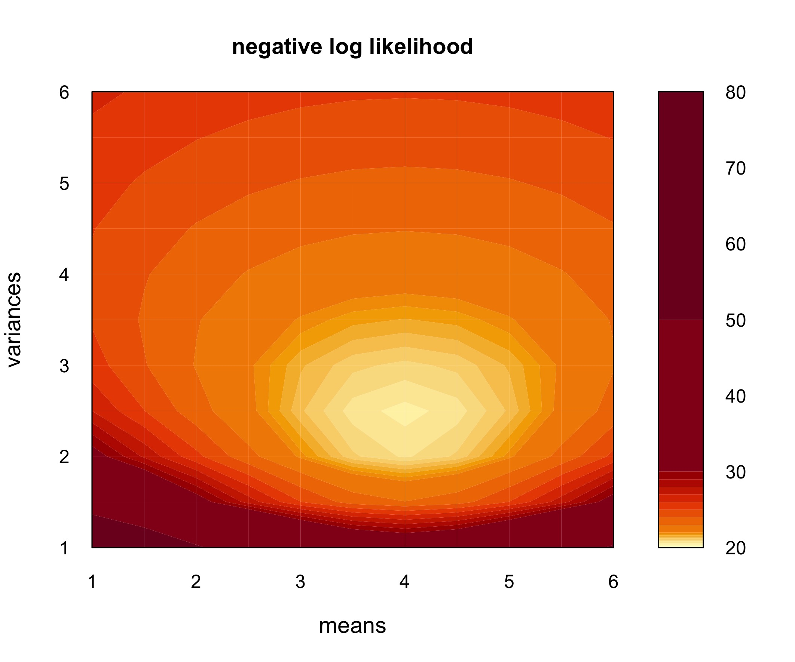

## Model Selection: How do we tell which model to use for our data?
We have introduced several models to describe how population size may change over time. If we have several candidate models and no *a priori* reason to assume one is better than the others, we can use population data to determine which model is best. For example, you may have reason to believe your population has density-dependent growth rates, but we introduced a couple of density-dependent models, which one should we choose?

{width=80%}

#### Example: Model selection with the Bay Checkerspot data
Let's use some data from Harrison's (1991) famous paper testing whether there were multiple populations or a single population of the Bay Checkerspot butterfly. In order to test her hypotheses, Dr. Harrison used 20 years of mark recapture data that was used to estimate the number of female butterflies in each year.

{ width=50% } 
{ width=30% }

Figure: Data from Harrison (1991). Image Wikipedia Commons (CC BY-SA 3.0)

We can use this data to calculate the annual population growth rate $\lambda$ as $N_{t+1}/N_{t}$. If we use least squares regression to predict the natural logarithm of estimated annual growth rates from the number of females, we find some indication there is a negative slope, even if we remove a large outlier. 

{ width=70% }

Table: Least squares regression of $ln \lambda = intercept - slope*females$

|             |   Estimate| Std. Error|   t value| $Pr(>\lvert t \rvert)$|
|:------------|----------:|----------:|---------:|------------------:|
|(Intercept)            |     0.52|        0.32|    1.63|               0.12|
|slope |     -0.00076|        0.00038|   -2.00|               0.057|


While the results seem suggestive, it is important to realize what this regression does and does not do. The linear regression is a test of the hypothesis that the slope is equal to zero. That is we are testing the null hypothesis that there is no effect of population size on the per capita growth rate. This null hypothesis actually corresponds to *one* candidate model: geometric population growth, where $\lambda$ does not change from year to year.  Our p-value is very close to a threshold p-value of 0.05, but is in fact larger than that value, so we cannot reject this null hypothesis. Moreover, we need to remember that even if we did reject this null hypothesis, that does not mean that we accept one of the other models! For example, a significant linear regression would not tell us if we should use a logistic or theta-logistic model.

### Likelihood
In order to determine which model best fits our data, instead of using null hypothesis testing, we need to compare the performance of several different models. That is, we need to look at the problem in the opposite direction. Since we have the data, we need to ask the question of how likely is it that each one of our models could have generated this data. To answer this question we will use **likelihood**. 

We use the word *likely* all the time in english, but our use in casual conversation normally differs a from the formal usage we will employ here. While you may tell a friend that it is *likely* you will take advantage of a once in a lifetime opportunity to attend a local concert by your favorite band, that statement is not supported by data. Your statement refers to a prediction about the future. In contrast, our use here will refer to  how well our model fits data from the past. 

**Likelihood** is the probability of obtaining the observed data if a particular model was a good description of the underlying processes. We can write this as:

$$L (model|data), $$

which is read as the "likelihood of the model given the collected data" (see Edwards, 1974).

#### Probability and Likelihood

The likelihood of a given model is proportional to the probability of obtaining the data given the model. 
$$L (model|data) = c * P(data|model), $$
but is not itself a probability. As you can see, multiplying a probability by a constant means that likelihood can be greater than one. In fact, it doesn't matter greatly what the value of this constant might be. Since we are using likelihood to compare models, and so the constant will cancel out. 

Our main challenge is to calculate the probability, however, if we can assume that each data point is independent, this calculation is straightforward, for each data point $x_i$ in a vector of data, X, we can find the probability given the model. To get the total probability, we can then just multiply the probability of each one of these data points. So we have:

$$L(model|X)=P(X|model)=\prod g(x_i|model),$$

where $g(x_i|model)$ is the appropriate probability density function.

#### Example: use likelihood to find mean and variance of data
Let's try this out for a simple problem. We have been given a set of data, and we wish to determine if the data came from a normal distribution with a given mean (5) and variance (4). In this case then, our model is simply the normal distribution. We assume independent observations, so likelihood is the product of their individual probabilities as given by the probability density function. 

``` R   		
X = c(0,4,5,7,8,2,2,4,4)
# the probability density function of the normal distribution for a given mean and variance
# is given by **dnorm()**
like1=prod(dnorm(X,mean=5,sd=2))
```
     > like1
	[1] 3.133277e-10
Of course, the value we calculate is not very informative, we need to compare it to another explanation of the data. For example, what if the data came from a normal distribution with a different mean? 

``` R  
# set the mean of the normal distribution to 6
like2=prod(dnorm(X,mean=6,sd=2))
```
	> like2
	[1] 1.072149e-11
We see that a mean of 6 is less likely than a mean of 5.

Note: because likelihoods are often very small numbers, we usually use the logarithm of the likelihood or *log-likelihood* to compare between models. Since we are taking the log of the probability to calculate this quantity, we can use the sum of these quantities rather than the product, which is a bit easier. More importantly, using the log gives us larger numbers that are less likely to result in computer rounding errors. 


Log-likelihood
$$ln[ \, L(model|X) ] \,=\sum ln [ \,g(x_i|model) ] \,$$

We still get the same answer though!
``` R
X = c(0,4,5,7,8,2,2,4,4) 
like1=sum(dnorm(X,mean=5,sd=2,log=T))
like2=sum(dnorm(X,mean=6,sd=2,log=T))
```
		> like1
	[1] -21.88377
	> like2
	[1] -25.25877
A mean of 5 is the most likely. 

#### Maximum likelihood estimate (MLE)
Of course, a mean of 5 and 6 aren't the only possibilities, Let's look at a range of potential values for the mean.  
```R
#varying the mean
means = seq(0,10,by=.1)
mean.likes =
  sapply(means,function(y) sum(dnorm(x=X,m
  =y,sd=2, log=T)))
```

{ width=50% }

We can see that there is a value for the mean which is more likely than the other candidates. This value of the mean parameter for the normal distribution is our *maximum likelihood estimate*. This is the likelihood for which we have chosen parameter(s) values that make the likelihood of our model as large as possible.

So, we can see that we probably need to be a bit more specific when we talk about likelihood of a model, since that value is going to change depending on the values of the parameters in the model. So, we will calculate the likelihood for given a particular set of parameter values (q) for a particular model (Edwards, 1974)
   $$L(q|data,model),$$ 
which is read as the “likelihood of the parameter values q given the collected data and specified model".
 
Most models have more than one parameter, and in fact our simple example of the normal distribution has two: mean and variance. So the maximum likelihood for this model would be at the best values for both mean and variance. 

We can vary both of these, and output the results as a likelihood surface. Notice that we have ploted the negative of the log-likelihood. As a result the lowest values of the surface give us the parameter values for which we have the  maximum likelihood of the normal distribution. In this case, we think  $\mu \approx 4, \sigma \approx 2.5$.

{ width=60% }


#### Finding the maximum likelihood is an optimization problem
The reason for using the *negative* of the log likelihood is all about convenience. We don't want to have to plot out likelihood surfaces for every problem, and in fact, it will be tricky to do for models with more than two parameters! Instead we normally use [optimization](https://www.quantitative-biology.ca/optimization.html) routines to find the best values. Finding the parameter values where we have the minimum of a function is a standard problem for optimization. For example, here I use a built-in optimization function in R in order to find the best mean and variance for our data. 

```R
X = c(0,4,5,7,8,2,2,4,4) 
normL = function(par) {
    -sum(dnorm(X, mean=par[1],sd=par[2],log=T))
  }
          
mlest=optim(par=c(1,1),normL) 
#par argument is the starting search values for par[1], and par[2], so our function is the same as before, just written in a way that we can use it with optim()
mlest$par
mlest$value
```

We can see that the **optim()** function gives a bit more precision, and tells us that the maximum likelihood (minimum negative log-likelihood) is found for parameter values of $\mu$ = 4.0, $\sigma$ = 2.4. 

### Model comparison
Let's go back to our original problem with the Harrison data (1991), and use maximum likelihood to find the best parameter values for each model, and then compare their likelihood. 

Just like we did for find the mean and variance of a set of data, we can find the slope and intercept of a linear regression model, this time, by setting the expected value of each observation using the equation for a line, with normally distributed errors, where our x is the number of female Bay Checkerspot butterflies, and y is the per capita growth rate.

``` R
percap=c(0.229,1.125,3.889,1.143,2.125,1.000,1.882,0.320,2.785,0.278,9.187,0.316,0.986,3.208,3.973,0.254,1.130,1.094,6.566,0.570,1.790,0.080,0.552,1.190)

females=c(175,40,45,175,200,425,425,800,256,713,198,1819,575,567,1819,852,216,244,267,1753,999,1788,143,79)

normReg = function(par) {
          y.pred = par[1] + par[2]*females
          -sum(dnorm(log(percap),mean=y.pred,sd=sqrt(par[3]),log=T)) }

mlest=optim(par=c(0,1/100,1),normReg) #par argument is the starting search values for par[1:3] 
```
	> mlest$par[1:2]
	[1]  0.5244783529 -0.0007595998

Reassuringly, we find that our estimates intercept (par[1]) and slope (par[2]) are similar to those that we found earlier using least squares regression. In fact, when we have normally distributed errors, maximum likelihood and least square regression estimates for simple linear regression will be the same. 

We complete the same exercise for three of candidate models and plot out our results: 

Density independent model: $log(N_{t+1}/N_t)=r$  

Logistic model: $log(N_{t+1}/N_t)=r(1-N_t/K)$

Theta logistic model: $log(N_{t+1}/N_t)=r(1-(N_t/K)^\theta)$

``` R
percap=c(0.229,1.125, 3.889,1.143,2.125, 1.000,1.882,0.320,2.785, 0.278,9.187,0.316,0.986,3.208,3.973,0.254,1.130,1.094,6.566, 0.570, 1.790,0.080,0.552,1.190)

females=c(175,40,45,175,200,425,425,800,256,713,198,1819,575,567,1819,852,  216,244,267,1753,999,1788,143,79)

# function for logistic model with normally distributed errors
normReg = function(par) {
          y.pred = par[1] + par[2]*females
          -sum(dnorm(log(percap),mean=y.pred,sd=sqrt(par[3]),log=T)) }

mle.normReg=optim(par=c(0,1/100,1),normReg) #par argument is the starting search values

# plot data and model predictions at mle
plot(log(percap)~females, type="p", pch=16, lwd=1.5, bty="l", cex.lab=1.2,
     ylab=expression(ln~lambda),las=1,
     xlab="number of females")
abline(a=mle.normReg$par[1], b=mle.normReg$par[2],col="red")

# function for density independent model
normDI = function(par) {
          -sum(dnorm(log(percap),mean=mean(log(percap)),sd=sqrt(par[2]),log=T)) }
mle.normDI=optim(par=c(1/100,1),normC) #par argument is the starting search values 

# plot predictions
abline(h=mle.normDI$par[1],lwd=1.5 )

# function for theta-logistic model
normTh = function(par) {
          y.pred = par[1] + par[2]*(females)^par[4]
          -sum(dnorm(log(percap),mean=y.pred,sd=sqrt(par[3]),log=T)) }
mle.normTh=optim(par=c(0,1/100,1,1),normTh) #par argument is the starting search values 

# plot predictions and legend
curve(mle.normTh$par[1]+mle.normTh$par[2]*(x)^mle.normTh$par[4], from=0, 
      to=4000,add=T, lwd=1.5, col="blue")
legend("top", legend=c("exponential", "logistic","theta-logistic" ),
       col=c(1,2,4), lty=1, lwd=2, bty="n")
```

{ width=80% }

For each model, we have an estimate of likelihood  (e.g, 

	> mle.normReg$value
	[1] 35.22501
and we can compare these, to see that the lowest negative log-likelihood is found for the theta-logistic. 

Table: Negative log-likelihood values for three candidate population models applied to Harrison's (1991) Bay Checkerspot data 

| model          | # parameters | - ln $L_{max}$ | 
|----------------|----------------------|----------|
| exponential    | 2                    | 37.237    | 
| logistic       | 3                    | 35.225    | 
| theta-logistic | 4                    | 35.174    | 

So perhaps we should select the theta-logistic model? After all it **does** have the greatest likelihood. However, there is another point to consider. The theta-logistic model has four parameters (r, k, $\theta\$, and $\sigma\$, the variance of the normal distribution of errors), while the logistic model has 3.  We note that if a model has n data points and n parameters (one for each data point), then the residual variance will be ZERO. Would a model with n parameters then be a better model, since it explains all the variance?

More generally, is a model with more parameters, functions, entities, etc. more likely to be “true”? Where we use the word "true" as more explanatory, accurate, predictive, representative of reality?

#### Overfitting
We have a conundrum here. If we use goodness of fit as our only criteria for model selection, then we will always choose the most complex model. Unfortunately, really complex and flexible models are more likely to be misled by errors and noise. For example, compare the fit of a highly flexible curve with a linear fit. The flexible curve fits every point, but some of this variance is just noise or error.

, via Wikimedia Commons](Overfitted_Data.png){ width=60% }

#### Parsimony
In order to avoid overfitting data, the principle of parsimony is often used to select between models. This idea has been expressed by many philosophers, perhaps the most famous statement:

>"Do not multiply entities without necessity."
>-William of Ockham

expresses the concept best. We should choose the the model with the fewest assumptions. For example, given a unique colour trait found in two different bird species, if they were closely related it would make more sense to assume that the trait had evolved once rather than twice (see Figure below)

 [Creative Commons CC BY-NC-SA 4.0 license](https://creativecommons.org/licenses/by-nc-sa/4.0/). ](69126_evo_resources_resource_image_36_original.gif){ width=60% }


#### Model selection using parsimony
To incorporate the idea of parsimony in our model selection, we will use Information criterion statistics. These statistics combine the maximum log likelihood for a model with the number of parameters, as a measure of the complexity of the model. Then we can compare the statistics for various candidate models. We use these statistics to decide if a given model has more "support" than another.  

Support is higher for models with higher likelihoods, and models with fewer parameters. More complex models are penalized because more parameters will always lead to a better fit to the data, but at the cost of less precision in the estimate of each parameter and incorporation of spurious patterns from the data.
	
#### Akaike information criteria (AIC)

One commonly used information criteria statistic is the Akaike information criteria (AIC) (Akaike, 1973). Goodness of fit is usually determined by the maximum log-likelihood parameter estimate $\theta$ for a model with a given dataset, $y$, but we can also use residual sum of squares. In fact the R function **AIC()** can be used on a given model fit with the **lm()** function to calculate this quantity. There is a penalty for model complexity given as the number of adjustable model parameters,  $k$. So we have: 

$$AIC=-2ln(m|y, \theta) +2k$$

Its easy to remember that when comparing models, we are always looking for the lowest value of the AIC metric, since the complexity penalty makes the AIC *larger*. You can see examples of using this metric with ecological data in Anderson et al. (2000). 

AIC has the advantage of taking into account BOTH model fit and parsimony. However, unlike some metrics for model evaluation (e.g., $R^2$), the AIC value has no meaning on its own. It can only be used to compare models. It does have some advantages over other strategies of model comparison such as the likelihood ratio test,  since we can compare very different models using the same metric. In comparison, the likelihood ratio tests assumes that the models are nested (i.e. that one model can be converted to another by setting one or more parameters equal to 0 or 1; for example, the theta logistic model and logistic model are nested). 

#### Comparing our 3 models with AIC

Let's use this metric to compare our three models fit to the Harrison (1991) data. 

| model          | # parameters | -ln $L_{max}$ | AIC  | AICc |
|----------------|--------------|----------|---|---|
| exponential    | 2            | 37.237    | 78.5 | 79.0|
| **logistic**   | 3            | 35.225   | **76.4** | 77.6|
| theta-logistic | 4            | 35.174   | 78.3  | 80.5|

In general, AIC values for models that are different by more than 2 units are interpreted as having importantly different predictive performance (Anderson et al., 2000). In this case, we might select the logistic model as it has the lowest AIC, but it is still within two units of the theta-logistic model. However we do note that for small sample sizes, a correction is recommended when the number of data points, n, divided by the number of parameters, is small:  $n/k<40$ (Burnham & Anderson,  2004): $AIC_c=-2ln L +2k+\frac{2k(k+1)}{n-k-1}$, which in this case would indicate the exponential model and the logistic had the same support.

Finally, when the AIC differences are very small, the raw values cannot tell us much about the extent to which the data support one model over another. To look at this more closely we can calculate the **Akaike weights**. For each model, we find the differences in AIC with respect to the AIC of the best candidate model as: $\Delta_i(AIC)=AIC_i- min(AIC)$.  We can then obtain an estimate of the relative likelihood of each model $M_i$ by the transform:  $L(M_i|data)\propto exp (- \frac {1}{2} \Delta_i(AIC))$ where $\propto$ stands for “is proportional to.” Then,  the relative model likelihoods are divided by the sum of the likelihoods of all models to obtain Akaike weights, $w_i (AIC)$ (e.g., Burnham & Anderson, 2001), as: $$w_i (AIC) = \frac {exp (- \frac {1}{2} \Delta_i(AIC))}{\sum exp (\frac{1}{2}\Delta_k(AIC) )}$$. 


| model          | # parameters | -ln $L_{max}$ | AIC  | w(AIC) |)
|----------------|--------------|----------|---|----|
| exponential    | 2            | 37.237    | 78.5  |0.21| 
| **logistic**   | 3            | 35.225   | **76.4** |**0.57**|
| theta-logistic | 4            | 35.174   | 78.3  | 0.22|

Since these weights sum to 1, they can be interpreted as the probability that a given model is the best one, given the data and the set  of candidate models (e.g., Burnham & Anderson, 2001).  Thus, the strength of evidence in favor of one model over the other is obtained by dividing their Akaike weights. So comparing the logistic model and theta-logistic we have $$\frac {w_{Log}}{w_{Theta}}=\frac {.57}{.22}=2.6,$$ indicating that the logistic model is about 2.6 times more likely than the next best model.

### References
Akaike, H. (1973). Information theory and an extention of the maximum likelihood principle. In _2nd Inter. Symp. on information Theory_. Akademiai Kiado.

Anderson, D. R., Burnham, K. P., & Thompson, W. L. (2000). Null hypothesis testing: problems, prevalence, and an alternative. _The Journal of Wildlife Management_,_64_, 912-923.

Anderson, D., & Burnham, K. (2004). Model selection and multi-model inference. _Second edition_. NY: Springer-Verlag.

Burnham, K. P., & Anderson, D. R. (2001). Kullback-Leibler information as a basis for strong inference in ecological studies. _Wildlife Research_, _28_(2), 111-119.

Edwards, A. W. (1974). The history of likelihood. _International Statistical Review/Revue Internationale de Statistique_,_42_, 9-15.

Harrison, S. (1991). Local extinction in a metapopulation context: an empirical evaluation. _Biological Journal of the Linnean Society_, _42_(1-2), 73-88.
