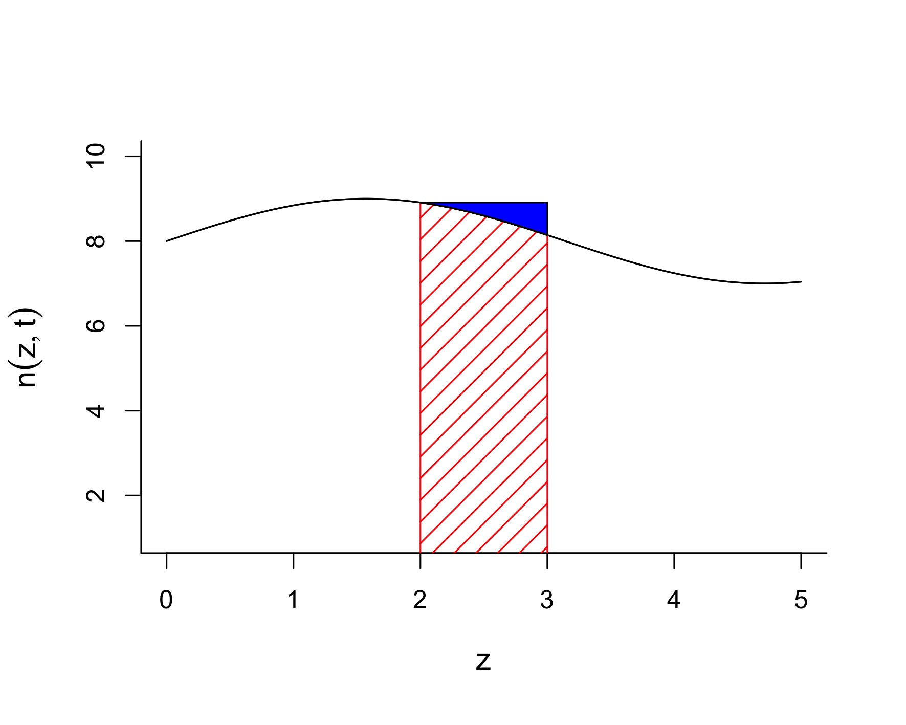
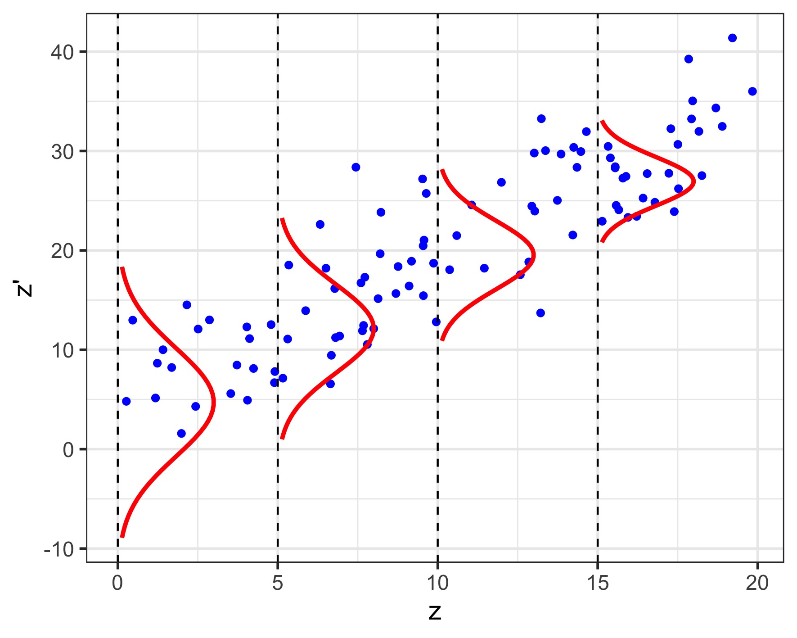

# Integral Projection Models

This chapter covers a more advanced topic in (structured) population modelling, integral projection models (IPM). We will first **derive the formula** for IPM analogously to what we learned in Chapter 2, matrix projection models (MPM). Next, we will introduce the method to **build simple IPM** with case studies. We will then move on to the analysis of IPM, including **asymptotic behaviors, sensitivity and elasticity**. Lastly, we will incorporate **density-dependence and stochasticity** into our IPM, just as what we did in previous chapters.

## Learning outcomes

- Understand the analogy between IPM and MPM, and the mathematics behind IPM
- Being able to choose the proper model for different species based on their life cycles, and construct simple IPM from data
- Getting familiar with various numerical methods, such as regression, numerical integration
- Being able to perform basic analysis of IPM

## Introduction: MPM vs. IPM

**Matrix projection models (MPM)** are widely used in modelling structured biological populations. They are easy to understand and are conceptually simple to represent population structures. A matrix model divides the population into a set of classes, which give rise to some potential problems (Ellner and Rees, 2006):

- Representing individuals with different characteristics as a distinct stage or category is bound to introduce some amount of inaccuracy
- Increasing the number of stages leads to higher sampling error because of fewer available data

In fact, for some organisms, instead of dividing their life cycles into discrete classes (e.g. juveniles and adults), it is more appropriate to use continuous variables (e.g. body size) (Ellner and Rees, 2006). Easterling et al. (2000) proposed **integral projection models (IPM)** as an alternative to MPM for populations in which demographic rates are primarily influenced by a continuous variable. This kind of model was analogous to MPM, allowing researchers to avoid inaccurate classifications.


## Contruction of IPM

In this section, we will introduce the basic concepts underlying IPM. We will make the assumption that differences between individuals in a population are completely described by a **continuous** variable $z$, which could be some continuous measure of body size (e.g. total mass and volume). $z$ could also be unrelated to “size”, such as the individual’s spatial location in a linear habitat. However, $z$ must have finite limits.

### Model structure

Let $n(z,t)$ be the size distribution of individuals at time $t$. The number of individuals with size $z$ in the interval $[a,b]$ is
$$\int_a^bn(z,t)\ dz.$$

This may seem a bit hard to follow. Here we present a more intuitive description:

> The number of individuals in the size interval $[a,b]$ at time $t$ is approximately $n(a,t)(b-a)$, given a very small difference $b-a$.

This comes directly from the intuition behind an integral, which we will show in the following figures:

{width=80%}

The integral $\int_a^bn(z,t)\ dz$ is equal to the area under the curve, which is shaded in red (stripe); $n(a,t)(b-a)$ is equal to the rectangular area shaded in red (stripe) **and** blue (solid). When $b$ is close enough to $a$, the blue area is small enough to be ignored, making
$$\int_a^bn(z,t)\ dz\approx n(a,t)(b-a).$$

Now if we assume the limit of $z$ is from $L$ to $U$ (i.e. $z\in[L,U]$), the total population is the integral of $n(z,t)$ over the domain $[L,U]$,
$$N(t)=\int_L^Un(z,t)\ dz.$$
We should notice that $n(z,t)$ is different from a probability distribution, whose integral over the domain is **1**. Another thing we should notice is that $n(z,t)$ is **NOT** the number of individuals of size $z$ at time $t$. If we want to know the number of individuals in a size range, we have to calculate the integral.

### Kernel

Similar to MPM, IPM also operates in discrete time. From $t$ to $t+1$, individuals could die or change in size. They could also produce offsprings that vary in size. We use two functions, $P(z',z)$ and $F(z',z)$, to describe these two types of size transitions (and for convenience, we further let $z'$ be the size at time $t+1$). The total transition is represented by $K(z',z)=P(z',z)+F(z',z)$, which is called the **kernel**.

#### Survival/growth kernel

$P(z',z)$ is called the **survival/growth kernel** (Merow et al., 2014), which is often written as $P(z',z)=s(z)G(z',z)$, where $s(z)$ is the survival rate and $G(z',z)$ represents the size transition. We can think of $G(z',z)$ as the probability density function of the subsequent size $z'$ of an size-$z$ individual, so we always have
$$\int_L^UG(z',z)\ dz'=1.$$
The idea can be explained with the following plot

{width=80%}

Suppose that we have collected data of sizes at $t$ and $t+1$, we assume that, for every $z$, the subsequent size $z'$ follows some probability distribution, which is represented by the red curves.

#### Fecundity kernel

$F(z',z)$ is called the **fecundity kernel** (Merow et al., 2014), which represents reproduction of offsprings. $F(z',z)$ is analogous to a probability density function. It is the size distribution of offsprings produced by a size-$z$ individual. In other words, the number of the offsprings of size $z'$ in the interval $[a,b]$ by a size-$z$ individual is
$$\int_a^bF(z',z)\ dz'.$$
That is, it follows a similar idea of $n(z,t)$.

Now, putting everything together, the population size distribution at time $t+1$ can be calculated as the integral
$$n(z',t+1)=\int_L^UK(z',z)n(z,t)\ dz.$$
The kernel $K(z',z)$ in the IPM is analogous to the projection matrix in MPM (Gonzalez et al., 2021).


### From life cycle to model

An essential step of building an IPM is to translate population census data into the vital rates in the kernel.

First, we recall the two population census methods discussed in an earlier section [Population Census](https://github.com/kcudding/kcudding.github.io/blob/main/teach/structured_intro.md#population-census):

- _Pre-reproductive census_: Census takes place before reproduction. This is common in plants, as the size of offsprings are hard to collect before growth to noticeable small individuals.

- _Post-reproductive census_: Census takes place after reproduction. This is more common in animals, when we can easily distinguish newborns from adults and measure their sizes.


#### Building kernels

Once we decided the census method, and collected data at each time point, it's time to build the kernel for our IPM, which will be divided into two parts:

- _Survival_: After we observed the number of individuals survived from each census to the next, we can estimate the survival rate $s$. By recording the size changes, we can also obtain the distribution of size transition $G$.
- _Reproduction_: We can estimate some basic parameters: per capita offspring number $b$, and probability of successful recruitment $p_r$. When we are able to distinguish breeders and non-breeders, we can further define the probability of reproducing $p_b$. Similarly, by recording the recruit sizes, we can also obtain the size distribution of recruits, $C$.

For different census methods, kernels are defined differently. Here we present the most basic situations for both census methods.

|   | Pre-reproductive census | Post-reproductive census |
|:-------|:-------------------|:-------------------|
| **Survival kernel** | $s(z)G(z',z)$ | $s(z)G(z',z)$ |
| **Fecundity kernel** | $p_b(z)b(z)p_rC(z',z)$ | $s(z)p_b(z)b(z)C(z',z)$ |

The survival kernel is pretty much the same, while the fecundity kernel is slightly different between two census methods. This is because

- In a **post-reproductive census**, new recruits are censused before mortality, so every new recruit is essentially "successful", making $p_r=1$ in the fecundity kernel.
- In a **pre-reproductive census**, since the census happens right before reproduction, it is usually assumed that no death occurs between census and reproduction, making $s(z)=1$ in the fecundity kernel.

Now, let's first look at the total population at the time $t+1$, $N(t+1)$. It can be calculated as
$$N(t+1)=\int_L^U\underbrace{[s(z)+p_b(z)b(z)p_r]}_{\text{kernel}}n(z,t)\ dz$$
in a pre-reproductive census. Considering the size transition, we further have
$$n(z',t+1)=\int_L^U\underbrace{[s(z)G(z',z)+p_b(z)b(z)p_rC(z',z)]}_{\text{kernel}}n(z,t)\ dz.$$

Similarly, in a post-reproductive census, we have
$$n(z',t+1)=\int_L^U\underbrace{[s(z)G(z',z)+s(z)p_b(z)b(z)C(z',z)]}_{\text{kernel}}n(z,t)\ dz.$$

_Note_: based on different census methods, the recruit size distribution $C(z',z)$ will be different. For **pre-reproductive census**, $C(z',z)$ is the size distribution of new recruits at age 1 (after they grow to noticeable individuals after one year), so we denote it as $C_1(z',z)$; for **post-reproductive census**, $C(z',z)$ is the size distribution of new recruits at age 0 (immediately after they are born), so we denote it as $C_0(z',z)$.


### Vital rates with examples

Here, we present some examples of kernels based on life cycles of different species.

#### Example 1: long-lived perennial plant with no seed bank

This example comes from Merow et al. (2014) and it represents the most basic case. For plants, key life history transitions usually depend more on size than on age (Ellner et al., 2016). We assume that once seeds germinate, individuals grow until they are large enough to produce seeds, after which they continue to reproduce until they die. The survival/growth kernel is
$$P(z',z)=s(z)G(z',z),$$
and the fecundity kernel is
$$F(z',z)=p_b(z)b(z)p_rC_1(z').$$
The kernel is just the sum
$$K(z',z)=s(z)G(z',z)+p_b(z)b(z)p_rC_1(z').$$
We should notice that

- $p_r$ describes the ratio of recruits observed at $t+1$ compared to the seeds produced at $t$ (Metcalf et al., 2008).
- $C_1(z')$ is size distribution of recruits observed at time $t+1$. It does not depend on $z$, since we do not know the parental size.

#### Example 2: monocarpic perennial

The following two examples were discussed in Ellner et al. (2016). We will also use them as case studies in the next section. This example is based on _Oenothera glazioviana_, a monocarpic plant that often occurs in sand dune areas. For a monocarpic plant, we should keep in mind that reproduction is fatal. The kernel function we will study is
$$K(z',z)=(1-p_b(z))s(z)G(z',z)+p_b(z)b(z)p_rC_1(z').$$
We should notice that

- The factor $(1-p_b(z))$ in the survival/growth kernel represents the proportion of non-flowering plants, as flowering plants die after reproduction.
- Similar to Example 1, since we are unable to track parentage, the recruit size distribution is independent of parental size $z$.

, [Creative Commons CC BY-SA-3.0 license](https://creativecommons.org/licenses/by-sa/3.0/)](oenothera-glazioviana.jpg)

#### Example 3: soay sheep

Let's look at a classic animal example, in which we are able to track parental sizes. For animals, age or life stage (e.g. mature vs. immature) plays a more important role in life history transitions. Here we present a example of Soay sheep (_Ovis aries_), whose demographic rates are assumed to be functions of body mass. The kernel function is
$$K(z',z)=s(z)G(z',z)+s(z)p_b(z)p_r\left(\frac{C_0(z',z)}{2}\right).$$
We should notice that

- We are using post-reproduction census, so the survival rate $s(z)$ appears in both survival/growth and fecundity kernels.
- We assume that a single lamb is born at each reproductive event, so $b(z)=1$.
- The factor $1/2$ appears in the fecundity kernel because we only track female population and an equal sex ratio is assumed.
- Since we know the parents of each newborn, the recruit size distribution should be dependent on both $z$ and $z'$.

, [Creative Commons CC BY-2.0 license](https://creativecommons.org/licenses/by/2.0/)](soay-sheep.jpg)


#### Example 4: integral projection phenology models

As we mentioned earlier, the continuous variable $z$ could be unrelated to "size". Here we present a paper about an integral projection phenology model, in which the authors treated the physiological age as a continuous variable (Goodsman et al., 2018).

- Phenology models are primarily used on insects, and IPM have been shown to be useful for modelling phenology (Ellner and Rees, 2006). In this paper, the authors focused on the timing of summer flights (from brood trees to attack new trees) of mountain pine beetles (_Dendroctonus ponderosae_ Hopkins). 
- Physiological age is different from the discrete time $t$ in IPM, which is usually referred as the "chronological age". Physiological age accumulates over time at some rate and is a standard approach to measure maturation.
- The IPM used in the paper is relatively complicated. The authors applied an multidimensional (stage- and age-structured) model, and incorporated environmental stochasticity. The kernels vary from one time point to the next. So we will not present the actual model discussed in the paper, but a brief idea on the possibility of treating physiological age as the continuous variable $z$.
- Details on incorporating stochasticity into IPM will be discussed in a following section.


### The first step of IPMs: regressions

To perform an IPM model, regression models are commonly fit to  vital rate data relative to relevant state variables. Such models include linear or logistic regressions, or non-linear models such as generalized additive models (GAMs). Candidate models can be assessed using the Akaike information criteria (AIC), which you were introduced to in the section [Model Selection](https://www.ecotheory.ca/teach/BIOL652.html#model-selection-how-do-we-tell-which-model-to-use-for-our-data). The dynamics for each vital rate can be modelled by the commonly used examples below:


Table: Functions commonly used for vital rates

Vital_rate                                                Function                                                                   
--------------------------------------------------------  ---------------------------------------------------------------------------
Survival                                                  Logistic regression (generalized linear model with binomial link function) 
Growth                                                    Linear model with normal error distribution                                
Probability of life-history transition (eg., flowering)   Poisson regression (generalized linear model with log link function)       
Offspring number (eg., fruit number)                      Logistic regression (generalized linear model with binomial link function) 
Recruit size distribution                                 Normal or log-normal distribution                                          

&rarr; Note that it is not always necessary to use the above mentioned regressions. For example, functions can be used when there is no data available for growth. One illustration is the IPM model for grass carp developed by Erickson et al. (2017), where the growth function consisted of a normal distribution with 2 variables centered around a modified von Bertalanffy function of fish length at each time step. A derivative was then calculated to map length changes as a function of length.     

### Case study: an IPM for snapping turtles 

Armstrong and colleagues (2018) studied the importance of indeterminate growth to ectotherm population dynamics. We used the [dataset](https://datadryad.org/stash/dataset/doi:10.5061/dryad.2j05h) provided in their publication to obtain growth, reproduction and survival information for a female population of North American snapping turtles (*Chelydra serpentina*). 

, [Creative Commons Attribution-Share Alike 3.0 Unported license](https://creativecommons.org/licenses/by-sa/3.0/)](https://raw.github.com/kcudding/kcudding.github.io/main/teach/IPM_implementation_files/turtle.jpg){ fig.width=180 fig.height=120 dpi=300 } 

Because measurements were made across several years, we selected the 2 greatest size measurements as the size at time t and time t+1, and the largest fecundity measurement for surviving individuals. For non-surviving individuals, the latest measurement was considered for time t+1. New recruits (eg., individual in the 3rd row below) are individuals initially measured at the latest years of the data collection process.


```r
# Download the dataset
d <- read.csv("https://raw.githubusercontent.com/kcudding/kcudding.github.io/main/teach/snapping_turtles.csv",header=TRUE, stringsAsFactors = TRUE,fileEncoding="UTF-8-BOM")

head(d)
```

```
   ID size sizeNext surv   fec
1 767 26.3     26.4    1 300.4
2 C15 26.9     26.9    1 365.0
3 J09   NA     27.3   NA    NA
4 H04 30.2     30.3    1   0.0
5 T19 25.7     26.0    1   0.0
6 H18 28.5     28.5    1   0.0
```


We will demonstrate the regression for reproduction:

```r
# After setting up an empty data frame to store model parameters, we proceed with our Poisson regression for reproduction
fec.reg=glm(fec~size,data=d,family=poisson())
params$offsp.int=coefficients(fec.reg)[1]
params$offsp.slope=coefficients(fec.reg)[2]
summary(fec.reg)
```

```

Call:
glm(formula = fec ~ size, family = poisson(), data = d)

Deviance Residuals: 
    Min       1Q   Median       3Q      Max  
-34.320   -1.294    2.041    4.742   17.207  

Coefficients:
            Estimate Std. Error z value Pr(>|z|)    
(Intercept)  2.96203    0.03959   74.82   <2e-16 ***
size         0.10609    0.00137   77.46   <2e-16 ***
---
Signif. codes:  0 '***' 0.001 '**' 0.01 '*' 0.05 '.' 0.1 ' ' 1

(Dispersion parameter for poisson family taken to be 1)

    Null deviance: 37977  on 258  degrees of freedom
Residual deviance: 32023  on 257  degrees of freedom
  (39 observations deleted due to missingness)
AIC: 33798

Number of Fisher Scoring iterations: 5
```

```r
# Now you can continue creating regressions for survival and growth
```

Here are the observations and the model fit:

{ dpi=300 }  


Now it is time to define a function to predict the reproduction of our population (and the same should be done for the other vital rates):

```r
f.yx=function(xp,x,params) {
params$establishment.prob*
dnorm(xp,mean=params$recruit.size.mean,sd=params$recruit.size.sd)*
exp(params$offsp.int+params$offsp.slope*x)
}
```


The parameters of these regressions will later be used during the numerical implementation of IPMs.

