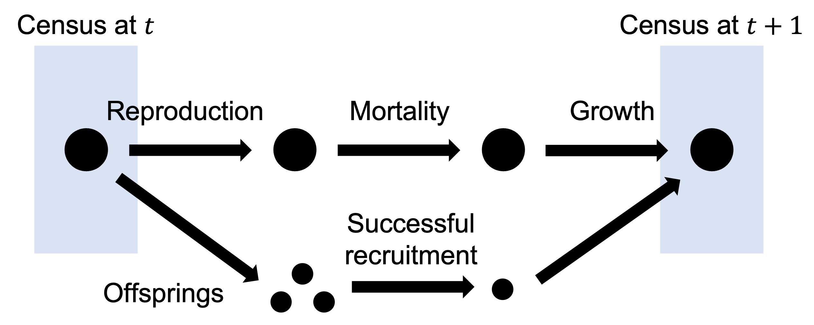
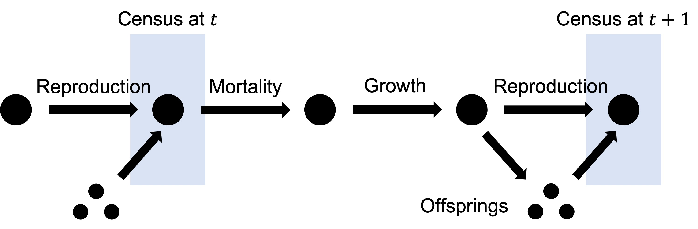

# Integral Projection Models

This chapter covers a more advanced topic in (structured) population modelling, integral projection models (IPM). We will first **derive the formula** for IPM analogously to what we learned in Chapter 2, matrix projection models (MPM). Next, we will introduce the method to **build simple IPM** with case studies. We will then move on to the analysis of IPM, including **asymptotic behaviors, sensitivity and elasticity**. Lastly, we will incorporate **density-dependence and stochasticity** into our IPM, just as what we did in previous chapters.

## Learning outcomes

- Understand the analogy between IPM and MPM, and the mathematics behind IPM
- Being able to choose the proper model for different species based on their life cycles, and construct simple IPM from data
- Getting familiar with various numerical methods, such as regression, numerical integration
- Being able to perform basic analysis of IPM

## Introduction: MPM vs. IPM

**Matrix projection models (MPM)** are widely used in modelling structured biological populations. They are easy to understand and are conceptually simple to represent population structures. A matrix model divides the population into a set of classes, which give rise to some potential problems (Ellner and Rees, 2006):

- Representing individuals with different characteristics as a distinct stage or category is bound to introduce some amount of inaccuracy
- Increasing the number of stages leads to higher sampling error because of fewer available data

In fact, for some organisms, instead of dividing their life cycles into discrete classes (e.g. juveniles and adults), it is more appropriate to use continuous variables (e.g. body size) (Ellner and Rees, 2006). Easterling et al. (2000) proposed **integral projection models (IPM)** as an alternative to MPM for populations in which demographic rates are primarily influenced by a continuous variable. This kind of model was analogous to MPM, allowing researchers to avoid inaccurate classifications.

## Contruction of IPM

In this section, we will introduce the basic concepts underlying IPM. We will make the assumption that differences between individuals in a population are completely described by a **continuous** variable $z$, which could be some continuous measure of body size (e.g. total mass and volume). $z$ could also be unrelated to “size”, such as the individual’s spatial location in a linear habitat. However, $z$ must have finite limits.

### Model structure

Let $n(z,t)$ be the size distribution of individuals at time $t$. The number of individuals with size $z$ in the interval $[a,b]$ is
$$\int_a^bn(z,t)\ dz.$$

This may seem a bit hard to follow. Here we present a more intuitive description:

> The number of individuals in the size interval $[a,b]$ at time $t$ is approximately $n(a,t)(b-a)$, given a very small difference $b-a$.

This comes directly from the intuition behind an integral, which we will show in the following figures:

{width=80%}

The integral $\int_a^bn(z,t)\ dz$ is equal to the area shaded in red, while $n(a,t)(b-a)$ is equal to the total area shaded in red **and** blue. When $b$ is close enough to $a$, the blue area is small enough to be ignored, making
$$\int_a^bn(z,t)\ dz\approx n(a,t)(b-a).$$

Now if we assume the limit of $z$ is from $L$ to $U$ (i.e. $z\in[L,U]$), the total population is the integral of $n(z,t)$ over the domain $[L,U]$,
$$N(t)=\int_L^Un(z,t)\ dz.$$
We should notice that $n(z,t)$ is different from a probability distribution, whose integral over the domain is **1**. Another thing we should notice is that $n(z,t)$ is **NOT** the number of individuals of size $z$ at time $t$. If we want to know the number of individuals in a size range, we have to calculate the integral.

### Kernel

Similar to MPM, IPM also operates in discrete time. From $t$ to $t+1$, individuals could die or change in size. They could also produce offsprings that vary in size. We use two functions, $P(z',z)$ and $F(z',z)$, to describe these two types of size transitions (and for convenience, we further let $z'$ be the size at time $t+1$). The total transition is represented by $K(z',z)=P(z',z)+F(z',z)$, which is called the **kernel**.

#### Survival/growth kernel

$P(z',z)$ is called the **survival/growth kernel** (Merow et al., 2014), which is often written as $P(z',z)=s(z)G(z',z)$, where $s(z)$ is the survival rate and $G(z',z)$ represents the size transition. We can think of $G(z',z)$ as the probability density function of the subsequent size $z'$ of an size-$z$ individual, so we always have
$$\int_L^UG(z',z)\ dz'=1.$$

#### Fecundity kernel

$F(z',z)$ is called the **fecundity kernel** (Merow et al., 2014), which represents reproduction of offsprings. $F(z',z)$ is analogous to a probability density function. It is the size distribution of offsprings produced by a size-$z$ individual. In other words, the number of the offsprings of size $z'$ in the interval $[a,b]$ by a size-$z$ individual is
$$\int_a^bF(z',z)\ dz'.$$

Now, putting everything together, the population size distribution at time $t+1$ can be calculated as the integral
$$n(z',t+1)=\int_L^UK(z',z)n(z,t)\ dz.$$
The kernel $K(z',z)$ in the IPM is analogous to the projection matrix in MPM.

### From life cycle to model

IPM are data-driven (Ellner et al., 2016), so an essential step of building an IPM is to translate population census data into the vital rates in the kernel.

#### Population census

First, we introduce two different census methods:

- _Pre-reproductive census_: Census takes place before reproduction. This is common in plants, as the size of offsprings are hard to collect before germination of seeds and growth to noticeable small plants.

{width=70%}

- _Post-reproductive census_: Census takes place after reproduction. This is more common in animals, when we can easily distinguish newborns from adults.

{width=70%}

#### Building kernels

Once we decided the census method, and collected data at each time point, it's time to build the kernel for our IPM, which will be divided into two parts:

- _Survival_: Once we observed the number of individuals survived from each census to the next, we can estimate the survival rate $s$.
- _Reproduction_: We could define some basic parameters: per capita offspring number $b$, and probability of successful recruitment $p_r$. When we are able to distinguish breeders and non-breeders, we can further define the probability of reproducing $p_b$.

Now, let's ignore different sizes of individuals. The population at the time $t+1$, $N(t+1)$, can be calculated as
$$N(t+1)=\underbrace{sN(t)}_{survival}+\underbrace{p_bbp_rN(t)}_{reproduction}=\underbrace{(s+p_bbp_r)}_{kernel}N(t).$$

When individual sizes are considered, the above vital rates become functions of size $z$ (except $p_r$, which is usually assumed to be independent of size). We also need to further include the transition rate/number from size $z$ to size $z'$ for both survival and reproduction, making
$$n(z',t+1)=\int_L^U[s(z)G(z',z)+p_b(z)b(z)p_rC(z',z)]n(z,t)\ dz,$$
where $G(z',z)$ denotes the size transition and $C(z',z)$ is the recruit size distribution.

Based on different census methods, the recruit size distribution will be different. For **pre-reproductive census**, $C(z',z)$ is the size distribution of new recruits at age 1 (after they grow to noticeable individuals after one year), which we denote as $C_1(z',z)$; for **post-reproductive census**, $C(z',z)$ is the size distribution of new recruits at age 0 (immediately after they are born), which we denote as $C_0(z',z)$. For **post-reproductive census**, the probability of recruitment $p_r$ is essentially 1 because new recruits are censused before mortality. However, since mortality is assumed to happen before reproduction, the probability of reproducing $p_b(z)$ is essentially $s(z)p_b(z)$.

### Vital rates with examples

Here, we present some examples of kernels based on life cycles of different species.

#### Example 1: long-lived perennial plant with no seedbank

This example comes from Merow et al. (2014) and it represents the most basic case. For plants, key life history transitions usually depend more on size than on age (Ellner et al., 2016). We assume that once seeds germinate, individuals grow until they are large enough to produce seeds, after which they continue to reproduce until they die. The survival/growth kernel is
$$P(z',z)=s(z)G(z',z),$$
and the fecundity kernel is
$$F(z',z)=p_b(z)b(z)p_rC_1(z').$$
The kernel is just the sum
$$K(z',z)=s(z)G(z',z)+p_b(z)b(z)p_rC_1(z').$$
We should notice that

- $p_r$ describes the ratio of recruits observed at $t+1$ compared to the seeds produced at $t$ (Metcalf et al., 2008).
- $C_1(z')$ is size distribution of recruits observed at time $t+1$. It does not depend on $z$, since we do not know the parental size.

#### Example 2: monocarpic perennial

The following two examples were discussed in Ellner et al. (2016). We will also use them as case studies in the next section. This example is based on _Oenothera glazioviana_, a monocarpic plant that often occurs in sand dune areas. For a monocarpic plant, we should keep in mind that reproduction is fatal. The kernel function we will study is
$$K(z',z)=(1-p_b(z))s(z)G(z',z)+p_b(z)b(z)p_rC_1(z').$$
We should notice that

- The factor $(1-p_b(z))$ in the survival/growth kernel represents the proportion of non-flowering plants, as flowering plants die after reproduction.
- Similar to Example 1, since we are unable to track parentage, the recruit size distribution is independent of parental size $z$.

, [Creative Commons CC BY-SA-3.0 license](https://creativecommons.org/licenses/by-sa/3.0/)](oenothera-glazioviana.jpg)

#### Example 3: ungulate

Let's look at a classic animal example, in which we are able to track parental sizes. For animals, age or life stage (e.g. mature vs. immature) plays a more important role in life history transitions. Here we present a example of Soay sheep (_Ovis aries_), whose demographic rates are assumed to be functions of body mass. The kernel function is
$$K(z',z)=s(z)G(z',z)+s(z)p_b(z)p_r\left(\frac{C_0(z',z)}{2}\right).$$
We should notice that

- We are using post-reproduction census, so the survival rate $s(z)$ appears in both survival/growth and fecundity kernels.
- We assume that a single lamb is born at each reproductive event, so $b(z)=1$.
- The factor $1/2$ appears in the fecundity kernel because we only track female population and an equal sex ratio is assumed.
- Since we know the parents of each newborn, the recruit size distribution should be dependent on both $z$ and $z'$.

, [Creative Commons CC BY-2.0 license](https://creativecommons.org/licenses/by/2.0/)](soay-sheep.jpg)

### Illustration of current application: grass carp

Invasive fish species, such as grass carp, have caused economic damage throughout the United States during the last two decades. One of the effective methods to control populations of invasive fish is to release YY-males. Here we present a recent research paper that applied IPM to model the use of YY-males for grass carp control.

> Erickson, R.A., Eager, E.A., Brey, M.K., Hansen, M.J. and Kocovsky, P.M. (2017), An integral projection model with YY-males and application to evaluating grass carp control. _Ecological Modelling_, 361:14-25.

(We will only discuss the model, while the detailed simulation methods will be ignored.)

, [Creative Commons CC BY-SA 3.0 license](https://creativecommons.org/licenses/by-sa/3.0/)](grass-carp.jpg)

#### Snapshot of the study

- YY-males are fish with 2 male chromosomes, so they only produce male (XY) offsprings, decreasing the female proportion and biasing the sex ratio.

- Like other fish, grass carp experience indeterminate growth and continue to grow throughout their life. They do not start to generate offsprings until their body size reaches some level. In this paper, the authors used body length as the continuous state variable.

- The authors developed an IPM for grass carp including (XX-)females, XY-males and YY-males.
  - The size distribution of YY-males is
  $$n_{YY}(z',t+1)=\int_\Omega[s(z)G(z',z)n_{YY}(z,t)]\ dz+\mathbf{n}_{YY}(z,t)$$
  where $\Omega$ denotes the size range of YY-males and $\mathbf{n}_{YY}(z,t)$ is the (only) recruitment from pulse release. $s(z)$ and $G(z',z)$ have the usual definition as we discussed.
  - The size distribution of XY-males is
  $$n_{XY}(z',t+1)=\int_\omega\left[s(z)G(z',z)n_{XY}(z,t)+F(z',z)n_{XX}(z,t)p_{XY}^*dp_r\right]\ dz,$$
  where $\omega$ denotes the size range of regular grass carp. $p_{XY}^*$ is the XY-male ratio, $d$ quantifies grass carp density, $p_r$ has the usual meaning of probability of successful recruitment. The fecundity kernel $F(z',z)$ is defined as
  $$F(z',z)=e_ts(z)p_b(z)b(z)C_1(z'),$$
  where $e_t$ is the probability of eggs transitioning to become a recruit. $p_b(z)$, $b(z)$ and $C_1(z')$ have the usual definitions.
  - Similarly, The size distribution of XX-females is
  $$n_{XX}(z',t+1)=\int_\omega\left[s(z)G(z',z)n_{XX}(z,t)+F(z',z)n_{XX}(z,t)p_{XX}^*dp_r\right]\ dz.$$

### Reference

Easterling, M.R., Ellner, S.P. and Dixon, P.M. (2000), Size-specific sensitivity: applying a new structured population model. _Ecology_, 81: 694-708.

Ellner, S.P., Childs, D.Z. and Rees, M. (2016), _Data-driven Modelling of Structured Populations_. Springer Cham.

Merow, C., Dahlgren, J.P., Metcalf, C.J.E., Childs, D.Z., Evans, M.E.K., Jongejans, E., Record, S., Rees, M., Salguero-Gómez, R. and McMahon, S.M. (2014), Advancing population ecology with integral projection models: a practical guide. _Methods Ecol Evol_, 5: 99-110.
