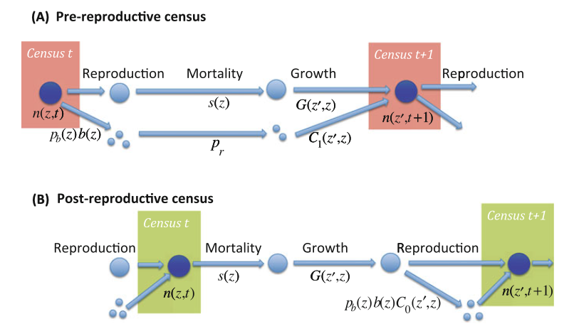

# Integral Projection Models

This chapter covers a more advanced topic in (structured) population modelling, integral projection models (IPM). We will first **derive the formula** for IPM analogously to what we learned in Chapter 2, matrix projection models (MPM). Next, we will introduce the method to **build simple IPM** with case studies. We will then move on to the analysis of IPM, including **asymptotic behaviors, sensitivity and elasticity**. Lastly, we will incorporate **density-dependence and stochasticity** into our IPM, just as what we did in previous chapters.

## Learning outcomes

- Understand the analogy between IPM and MPM, and the mathematics behind IPM
- Being able to choose the proper model for different species based on their life cycles, and construct simple IPM from data
- Getting familiar with various numerical methods, such as regression, numerical integration
- Being able to perform basic analysis of IPM

## Introduction: MPM vs. IPM

**Matrix projection models (MPM)** are widely used in modelling structured biological populations. They are easy to understand and are conceptually simple to represent population structures. A matrix model divides the population into a set of classes, which give rise to some potential problems (Ellner and Rees, 2006):

- Representing individuals with different characteristics as a distinct stage or category is bound to introduce some amount of inaccuracy
- Increasing the number of stages leads to higher sampling error because of fewer available data

In fact, for some organisms, instead of dividing their life cycles into discrete classes (e.g. juveniles and adults), it is more appropriate to use continuous variables (e.g. body size) (Ellner and Rees, 2006). Easterling et al. (2000) proposed **integral projection models (IPM)** as an alternative to MPM for populations in which demographic rates are primarily influenced by a continuous variable. This kind of model was analogous to MPM, allowing researchers to avoid inaccurate classifications.

## Contruction of IPM

### Model structure

Let $n(z,t)$ be the number of individuals with size $z$ at time $t$. The number of individuals with size $z$ in the interval $[a,b]$ is
$$\int_a^bn(z,t)\ dz.$$

- Intuition: _the number of individuals in the size interval $[z,z+\Delta z]$ at time $t$ is approximately $n(z,t)\Delta z$, given a very small $\Delta z$._
- $z$ could be some continuous measure of body size, such as total mass, volume, etc.
- $z$ could also be unrelated to “size”, such as the individual’s spatial location in a linear habitat
- $n(z,t)$ is not a probability distribution

### Kernel

Let $z$ be the size at time $t$, and $z'$ be the size at time $t+1$. The kernel $K(z',z)=P(z',z)+F(z',z)$ contains two parts:

- Growth kernel $P(z',z)=s(z)G(z',z)$, with $s(z)$ the survival rate
- Fecundity kernel $F(z',z)$

Given $[L,U]$ the range of the sizes of the population, population size at time $t+1$ can be calculated as an integral
$$n(z',t+1)=\int_L^UK(z',z)n(z,t)\ dz.$$

### From life cycle to model

Some basic vital rates are:

- Survival rate $s(z)$
- Growth rate $G(z',z)$
- Probability of life-history transition $p_b(z)$
- Offspring number $b(z)$
- Establishment probability $p_r$
- Recruit size distribution $C(z',z)$

But based on life cycles of different species, we might need to include more vital rates.

- Pre-reproductive census
$$K(z',z)=s(z)G(z',z)+p_b(z)b(z)p_rC_1(z',z)$$
- Post-reproductive census
$$K(z',z)=s(z)G(z',z)+s(z)p_b(z)b(z)C_0(z',z)$$

### Vital rates with examples

- Example 1: long-lived perennial plant with no seedbank (Merow et al., 2014) (This is the most basic case)
- Example 2: monocarpic perennial (Merow et al., 2014)
- Example 3: ungulate (Ellner et al. 2016)
- (Examples 2 and 3 will be discussed in detail in "numerical implementation" as 2 case studies)

## Numerical Implementation

### Modelling vital rates: regression

- Introduce proper vital rate regressions

### Numerical intrgration methods: midpoint rule

- Divide the domian $[L,U]$ into $m$ classes with equal length $h$
$$n(z_j,t+1)\approx h\sum_{i=1}^mK(z_j,z_i)n(z_i,t)$$
- Perhaps relate the kernel to the projection matrix of MPM as $hK(z_j, z_i)$ is an $m\times m$ matrix (Gonzalez et al., 2021)

### Case study 1: Monocarpic perennial

- Example of _Oenothera_ (Ellner et al. 2016)
- Parentage is unknown

### Case study 2: Ungulate

- Example of Soay sheep (Ellner et al. 2016)
- Parentage is known. Probably only need to provide the estimate for the recruit size distribution (estimates for other vital rates are similar, so there is no need to repeat)

### Model diagnostics

Creating an effective model involves an iterative approach of creating potential models using information about the biology and life history of the species. It's crucial to review and verify the model throughout the entire process, starting from outlining the life cycle and continuing until implementing it on the computer.

- Vital rate diagnostics
- Kernel diagnostics
- Size range and mesh points

## Basic Analysis of IPM

### Asymptotic behavior

- Stable population growth (analogous to SSD in matrix models)
- Mean size/mean reproductive size
- Density estimate

### Sensitivity and elasticity

- Sensitivity analysis of population growth rate

## Density dependence

A general guide to building density-dependent IPM is impossible, so we will only present some (simple) ways of modelling density-dependence in IPM with case studies

- Theory (brief intro, see Section 5.4 in Ellner et al. (2016))
- Possible case study: Recruitment limitation in _Oenothera_

## Environmental stochasticity

- Two basic approaches
  - Kernel selection
  - Parameter selection
- Possible case study: _Carlina vulgaris_ (another monocarpic perennial)
- Long-run growth rate (probably only provide results)
  - It exists
  - It can be computed

## Key Papers for Further Reading

### Classical reading

These three papers provide mathematics/theories of IPM:

- Easterling, M.R., Ellner, S.P. and Dixon, P.M. (2000), Size-specific sensitivity: applying a new structured population model. _Ecology_, 81: 694-708.
- Ellner, S.P. and Rees, M. (2006), Integral projection models for species with complex demography. _Am Nat._, 167(3):410-28.
- Ellner, S.P. and Rees, M. (2007), Stochastic stable population growth in integral projection models: theory and application. _J. Math. Biol._, 54: 227–256

The following two papers provide useful practical guide:

- Rees, M., Childs, D.Z. and Ellner, S.P. (2014), Building integral projection models: a user's guide. _J Anim Ecol_, 83: 528-545.
- Merow, C., Dahlgren, J.P., Metcalf, C.J.E., Childs, D.Z., Evans, M.E.K., Jongejans, E., Record, S., Rees, M., Salguero-Gómez, R. and McMahon, S.M. (2014), Advancing population ecology with integral projection models: a practical guide. _Methods Ecol Evol_, 5: 99-110.

The following book provides a thorough introduction about IPM. The practical parts are summarized in Rees et al. (2014)

- Ellner, S.P., Childs, D.Z. and Rees, M. (2016), _Data-driven Modelling of Structured Populations_. Springer Cham.

### New reading

Here are some recent applications of IPM

- Erickson, R.A., Eager, E.A., Kocovsky, P.M., Glover, D.C., Kallis, J.L. and Long, K.R. (2018), A spatially discrete, integral projection model and its application to invasive carp. _Ecological Modelling_, 387:163-171.
- Peirce, J., Sandland, G., Bennie, B. and Erickson, R. (2023), An integral projection model for gizzard shad (_Dorosoma cepedianum_) utilizing density-dependent age-0 survival. _Ecological Modelling_, 477:110260.

## R resources

- _IPMpack_ (Metcalf et al., 2013)
- ipmr (Levin et al., 2021)
- lefko3 (Shefferson et al., 2021) (This package is devoted to the analysis of demographic data through MPM. It also builds discretized IPM)

## References

Ellner, S.P., Childs, D.Z. and Rees, M. (2016), _Data-driven Modelling of Structured Populations_. Springer Cham.

Easterling, M.R., Ellner, S.P. and Dixon, P.M. (2000), Size-specific sensitivity: applying a new structured population model. _Ecology_, 81: 694-708.

Ellner, S.P. and Rees, M. (2006), Integral projection models for species with complex demography. _Am Nat._, 167(3):410-28.

Rees, M., Childs, D.Z. and Ellner, S.P. (2014), Building integral projection models: a user's guide. _J Anim Ecol_, 83: 528-545.

Merow, C., Dahlgren, J.P., Metcalf, C.J.E., Childs, D.Z., Evans, M.E.K., Jongejans, E., Record, S., Rees, M., Salguero-Gómez, R. and McMahon, S.M. (2014), Advancing population ecology with integral projection models: a practical guide. _Methods Ecol Evol_, 5: 99-110.

Shefferson, R.P., Kurokawa, S. and Ehrlén, J. (2021), lefko3: Analysing individual history through size-classified matrix population models. _Methods Ecol Evol_, 12: 378-382.

Levin, S.C., Childs, D.Z., Compagnoni, A., Evers, S., Knight, T.M. and Salguero-Gómez, R. (2021), ipmr: Flexible implementation of Integral Projection Models in R. _Methods in Ecology and Evolution_, 12, 1826-1834.

Metcalf, C.J.E., McMahon, S.M., Salguero-Gómez, R. and Jongejans, E. (2013), IPMpack: an R package for integral projection models. _Methods Ecol Evol_, 4: 195-200.

Gonzalez, E.J., Childs, D.Z., Quintana-Ascencio, P.F. and Salguero-Gomez, R. (2021), Integral projection models. In: _Demographic Methods Across the Tree of Life_. Edited by Roberto Salguero-Gomez and Marlene Gamelon, Oxford University Press.

Doak, D.F., Waddle, E., Langendorf, R.E., Louthan, A.M., Isabelle Chardon, N., Dibner, R.R., Keinath, D.A., Lombardi, E., Steenbock, C., Shriver, R.K., Linares, C., Begona Garcia, M., Funk, W.C., Fitzpatrick, S.W., Morris, W.F., and DeMarche, M.L. (2021), A critical comparison of integral projection and matrix projection models for demographic analysis. _Ecological Monographs_, 91(2):e01447.
