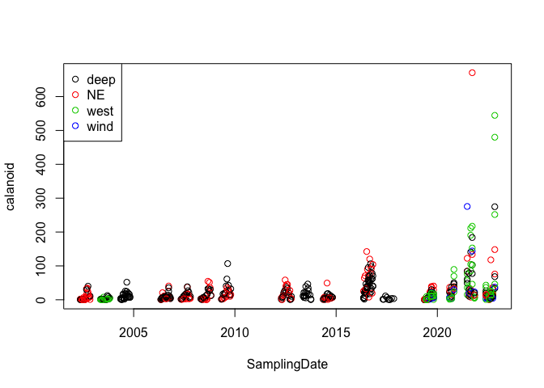
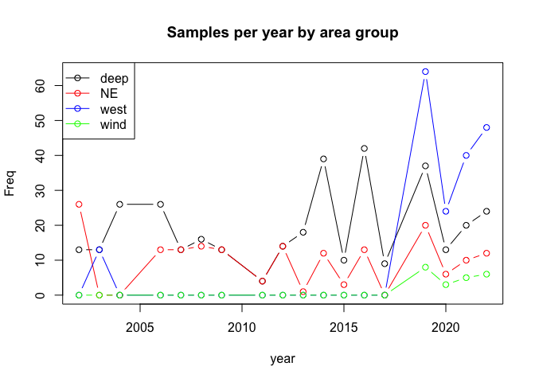

# Basic introduction to R

This is an introduction to basic stats in R with a focus on regression. We will assume a familiarity with R to the extent of having tried to do something with the programming environment in the past (e.g., a t-test), but no more than this. If you have never used R in anyway at a all, it may be helpful to take a quick look at this interactive tutorial for undergraduates at the University of Guelph. Just complete the tutorial entirely online rather than downloading.

[https://shiny.math.uwaterloo.ca/biology/QBshiny/IntroR/](https://shiny.math.uwaterloo.ca/biology/QBshiny/IntroR/)

Then, when you are ready, get some help installing R on your laptop. You will need R installed for use in the workshop. 


##  Data import and basic summary

We will be using a flat .xlsx file of Hamilton Harbour data for our exercises today. Our first job is to import the data.

### Data import & packages

We can import .csv files without any special tools (and we encourage you to consider this data format). So while base R includes the function **read.csv()** to read .csv files, to import proprietary formats like .xlsx we will need to use a _package_ to import the data. 

R is an open source platform, which means that anyone can contribute code for everyone to use. There are thousands of functions in R written by scientists, statisticians and mathematicians all over the world. Sometimes a group of functions related to a particular task are grouped together in what is called a “library” or "package". We are going to use one such library that has been created to import .xlsx files, "readxl". 

On your own computer, you will need download the package and install it. This is pretty easy. On the RStudio menu select 'Tools', and then 'Install packages' from the drop down list. Enter 'readxl' in the search window, and then select  'Install'. You can also use the function install.packages. Just type install.packages("readxl").


```r
install.packages("readxl")
```

The function install.package downloads the indicated package from the internet and stores it. Eventually, in the console window you should see an indication the R has downloaded and installed the package. 

Once you've done this once, you don't need to do it ever again, unless you update the version of R you are using, or wish to use an updated version of the package.

The package is now part of R’s set of functions, but since it is not a standard part of the program, you will have to mention to R when you wish to use functions from this collection. The **library()** function tells R you wish to use commands from that package on this occasion. 

Every time you restart R, or try to compile a .Rmd file, you will have to mention to R when you wish to use functions from this collection. The simplest method to do this is to always include the statement 'library(readxl)' at the beginning of code that uses functions from this package.

Here R loads the package into active memory.


```r
library(readxl)
```

## Read in data


Next we will use this library to read in the .xlsx file. The function we need is **read_excel()**. In general, I advise uses to examine the help functions in R every time they use a new function. If you type '?read_xlsx' in the console window, a help window will be called.

The help file indicates the inputs that the function takes. We see that we need the *path* to the .xlsx file, the *sheet* of that file we want to read. Note that if we do not specifiy which sheet, the function will default to reading the first sheet. Most functions in R will have default settings for the inputs so that you do not necessary have to set these. For example, to read in you Hamilton Harbour data, we are not going to using the *range* inpput that selects a cell range to read in. 

### Where’s my file??
 If you don’t know where you have saved a file (the *path*) you can combine the **file.choose()** function to get a drop down menu of your computers file system as source(file.choose()). You can then use the menu to choose the appropriate file.

However, it might be better to save the file somewhere specific! The command getwd() allows you to see which directory R is currently focusing on, and the command setwd("C:/Users yourusername/workshop") or similar should change the directory to the location you want to save to. You can check by typing getwd() again. Then you could simply enter "read_excel("ind dates flat all parameters Hamilton only FOR Kim.xlsx"), since R would already be focusing on the correct directory.


```r
# xlsx files
ham <- read_excel("ind dates flat all parameters Hamilton only FOR Kim.xlsx")
```


### Did the import work?


```r
colnames(ham)
```

```
##   [1] "waterbody"                   "area_group"                 
##   [3] "Latitude"                    "Longtitude"                 
##   [5] "Station_Acronym"             "report_Stn"                 
##   [7] "SamplingDate"                "season"                     
##   [9] "year"                        "Julian_Day"                 
##  [11] "Julian_Week"                 "Month"                      
##  [13] "Station_depth"               "water level"                
##  [15] "Ammonia_ECCC1m"              "DIC_ECCC1m"                 
##  [17] "DOC_ECCC1m"                  "POC_ECCC1m"                 
##  [19] "Chl_ECCC1m"                  "Chl Cor_ECCC1m"             
##  [21] "NO2_NO3_ECCC1m"              "PON_ECCC1m"                 
##  [23] "TKN dissolved_ECCC1m"        "SRP_ECCC1m"                 
##  [25] "TP_ECCC1m"                   "TP dissolved_ECCC1m"        
##  [27] "Chl_a_uncorrected"           "Secchi"                     
##  [29] "Kd light_attenuation"        "Cyano"                      
##  [31] "Chloro"                      "Eugleno"                    
##  [33] "Chryso"                      "Diatom"                     
##  [35] "Crypto"                      "Dino"                       
##  [37] "Total_phyto"                 "Ceratium"                   
##  [39] "edible"                      "less_edible"                
##  [41] "mixotroph"                   "toxin_producer"             
##  [43] "colonial_BG"                 "filamentous_BG"             
##  [45] "flagellate"                  "small_flagellate"           
##  [47] "filamentous_Diatom"          "2-20um_BM"                  
##  [49] "gt20um_BM"                   "lt2um_BM"                   
##  [51] "Bacteria_BM"                 "APP_BM"                     
##  [53] "HNF_BM"                      "ciliate_BM"                 
##  [55] "Bacterial_Growth_rate"       "gt20um_rate"                
##  [57] "2-20um_rate"                 "lt2um_rate"                 
##  [59] "sum_SFP_rate"                "Rotifer"                    
##  [61] "Bosmina"                     "Chydorus"                   
##  [63] "Ceriodaphnia"                "D.ambigua"                  
##  [65] "D.galeatamendotae"           "D.retrocurva"               
##  [67] "D.unknown"                   "Diaphanosoma"               
##  [69] "Eubosmina"                   "litoral.clad"               
##  [71] "Bythotrephes"                "Cercopagis"                 
##  [73] "Leptodora"                   "cycl.nauplii"               
##  [75] "cycl.copepodite"             "Diacyclops"                 
##  [77] "Acanthocyclops"              "Mesocyclops"                
##  [79] "cycl.unknown"                "calan.nauplii"              
##  [81] "calan.copepodite"            "Skistodiaptomus oregonensis"
##  [83] "Leptodiaptomus sicilus"      "calan.unknown"              
##  [85] "veliger"                     "Daphnia"                    
##  [87] "bosminid"                    "other.herb.cladocera"       
##  [89] "predatory cladocera"         "cladocera total"            
##  [91] "cyclopoid"                   "calanoid"                   
##  [93] "total.zoop"                  "bottom_epi_depth"           
##  [95] "bottom_meta_depth"           "bottom_exo_depth"           
##  [97] "watercolumn_temp"            "mean_mixing_depth_temp"     
##  [99] "meta_temp"                   "hypo_temp"                  
## [101] "epi_DO"                      "meta_DO"                    
## [103] "hypo_DO"                     "min_DO"                     
## [105] "epi_chl"                     "meta_chl"                   
## [107] "hypo_chl"                    "bottom hypoxia (Y/N)"       
## [109] "stratified"
```

```r
str(ham)
```

```
## tibble [742 × 109] (S3: tbl_df/tbl/data.frame)
##  $ waterbody                  : chr [1:742] "Hamilton Harbour" "Hamilton Harbour" "Hamilton Harbour" "Hamilton Harbour" ...
##  $ area_group                 : chr [1:742] "deep" "NE" "deep" "west" ...
##  $ Latitude                   : num [1:742] 43.3 43.3 43.3 43.3 43.3 ...
##  $ Longtitude                 : num [1:742] -79.9 -79.8 -79.8 -79.9 -79.9 ...
##  $ Station_Acronym            : chr [1:742] "HH908" "HH6" "HH258" "HHBayfront" ...
##  $ report_Stn                 : chr [1:742] "908" "6" "258" "BF" ...
##  $ SamplingDate               : POSIXct[1:742], format: "2016-05-10" "2021-06-23" ...
##  $ season                     : num [1:742] 1 2 2 2 2 2 2 2 2 2 ...
##  $ year                       : num [1:742] 2016 2021 2021 2022 2022 ...
##  $ Julian_Day                 : num [1:742] 131 174 174 174 174 174 174 174 174 174 ...
##  $ Julian_Week                : num [1:742] 20 26 26 26 26 26 26 26 26 26 ...
##  $ Month                      : num [1:742] 5 6 6 6 6 6 6 6 6 6 ...
##  $ Station_depth              : num [1:742] 14.6 9.1 21.8 8.9 15 12.5 4.3 9.1 6.4 10.1 ...
##  $ water level                : num [1:742] 75.1 74.7 74.7 75.1 75.1 ...
##  $ Ammonia_ECCC1m             : num [1:742] 0.219 0.09 0.09 0.046 0.046 0.046 0.046 0.046 0.046 0.046 ...
##  $ DIC_ECCC1m                 : num [1:742] 30.3 26.8 26.8 30 30 30 30 30 30 30 ...
##  $ DOC_ECCC1m                 : num [1:742] 4 2.96 2.96 3.6 3.6 3.6 3.6 3.6 3.6 3.6 ...
##  $ POC_ECCC1m                 : num [1:742] 1.09 NA NA 0.833 0.833 0.833 0.833 0.833 0.833 0.833 ...
##  $ Chl_ECCC1m                 : num [1:742] 1.8 5.64 5.64 8.7 8.7 8.7 8.7 8.7 8.7 8.7 ...
##  $ Chl Cor_ECCC1m             : num [1:742] 1.4 4.77 4.77 7.3 7.3 7.3 7.3 7.3 7.3 7.3 ...
##  $ NO2_NO3_ECCC1m             : num [1:742] 2.4 3.4 3.4 2.76 2.76 2.76 2.76 2.76 2.76 2.76 ...
##  $ PON_ECCC1m                 : num [1:742] 0.181 NA NA 0.171 0.171 0.171 0.171 0.171 0.171 0.171 ...
##  $ TKN dissolved_ECCC1m       : num [1:742] 0.748 NA NA 0.601 0.601 0.601 0.601 0.601 0.601 0.601 ...
##  $ SRP_ECCC1m                 : num [1:742] 0.0011 0.0046 0.0046 0.0006 0.0006 0.0006 0.0006 0.0006 0.0006 0.0006 ...
##  $ TP_ECCC1m                  : num [1:742] 0.0157 0.0226 0.0226 0.0192 0.0192 0.0192 0.0192 0.0192 0.0192 0.0192 ...
##  $ TP dissolved_ECCC1m        : num [1:742] NA 0.0137 0.0137 0.0092 0.0092 0.0092 0.0092 0.0092 0.0092 0.0092 ...
##  $ Chl_a_uncorrected          : num [1:742] 9.51 NA 10.76 15.37 NA ...
##  $ Secchi                     : num [1:742] 1.05 2.5 2.5 1.5 1.8 1.75 1.7 1.7 1.5 1.95 ...
##  $ Kd light_attenuation       : num [1:742] 0.768 0.761 0.862 1.088 0.589 ...
##  $ Cyano                      : num [1:742] 5.49 NA NA 6.4 NA ...
##  $ Chloro                     : num [1:742] 35 NA NA 804 NA ...
##  $ Eugleno                    : num [1:742] 0 NA NA 0 NA NA NA NA NA NA ...
##  $ Chryso                     : num [1:742] 123.53 NA NA 1.21 NA ...
##  $ Diatom                     : num [1:742] 386 NA NA 3837 NA ...
##  $ Crypto                     : num [1:742] 382 NA NA 1925 NA ...
##  $ Dino                       : num [1:742] 184 NA NA 258 NA ...
##  $ Total_phyto                : num [1:742] 1116 NA NA 6832 NA ...
##  $ Ceratium                   : num [1:742] 0 NA NA 121 NA ...
##  $ edible                     : num [1:742] 557 NA NA 3896 NA ...
##  $ less_edible                : num [1:742] 529 NA NA 2936 NA ...
##  $ mixotroph                  : num [1:742] 397 NA NA 2059 NA ...
##  $ toxin_producer             : num [1:742] 2.85 NA NA 5.52 NA ...
##  $ colonial_BG                : num [1:742] 5.49 NA NA 6.4 NA ...
##  $ filamentous_BG             : num [1:742] 0 NA NA 0 NA NA NA NA NA NA ...
##  $ flagellate                 : num [1:742] 682 NA NA 2187 NA ...
##  $ small_flagellate           : num [1:742] 499 NA NA 1928 NA ...
##  $ filamentous_Diatom         : num [1:742] 8.31 NA NA 1779.98 NA ...
##  $ 2-20um_BM                  : num [1:742] 918 NA NA 4677 NA ...
##  $ gt20um_BM                  : num [1:742] 183 NA NA 2155 NA ...
##  $ lt2um_BM                   : num [1:742] 15.7 NA NA 0 NA ...
##  $ Bacteria_BM                : num [1:742] 2101 NA NA 315 NA ...
##  $ APP_BM                     : num [1:742] 2.06 NA NA 187.41 NA ...
##  $ HNF_BM                     : num [1:742] 6258 NA NA 302 NA ...
##  $ ciliate_BM                 : num [1:742] NA NA NA NA NA NA NA NA NA NA ...
##  $ Bacterial_Growth_rate      : num [1:742] 0.168 NA 0.214 1.744 NA ...
##  $ gt20um_rate                : num [1:742] 1.84 NA 24.48 20.04 NA ...
##  $ 2-20um_rate                : num [1:742] 9.73 NA 20.95 28.16 NA ...
##  $ lt2um_rate                 : num [1:742] 5.96 NA 2.3 11.03 NA ...
##  $ sum_SFP_rate               : num [1:742] 17.5 NA 47.7 59.2 NA ...
##  $ Rotifer                    : num [1:742] NA NA NA NA NA NA NA NA NA NA ...
##  $ Bosmina                    : num [1:742] 114.19 6.52 51.37 402.96 232.88 ...
##  $ Chydorus                   : num [1:742] 0 0.0637 0.052 0.132 0 ...
##  $ Ceriodaphnia               : num [1:742] 0 0 0 0.119 0.127 ...
##  $ D.ambigua                  : num [1:742] 0 0 0 2.9 0.674 ...
##  $ D.galeatamendotae          : num [1:742] 0 88.1 176.2 12.4 12.5 ...
##  $ D.retrocurva               : num [1:742] 0 0 0 1.79 2.26 ...
##  $ D.unknown                  : num [1:742] 32.6 NA NA NA NA ...
##  $ Diaphanosoma               : num [1:742] 0 0 0 0 0 NA 0 NA 0 NA ...
##  $ Eubosmina                  : num [1:742] 4.82 0 3.43 22.99 15.73 ...
##  $ litoral.clad               : num [1:742] 0 0 0 0.047 0 ...
##  $ Bythotrephes               : num [1:742] 0 1.79 1.96 0 0 ...
##  $ Cercopagis                 : num [1:742] 0 0 0.0091 0.2002 0.0667 ...
##  $ Leptodora                  : num [1:742] 0 0 0.259 0 0 ...
##  $ cycl.nauplii               : num [1:742] 20.181 0.912 1.188 1.621 2.755 ...
##  $ cycl.copepodite            : num [1:742] 206.7 14.1 31.5 213.8 39.5 ...
##  $ Diacyclops                 : num [1:742] 314.98 4.76 13.42 7.59 2.61 ...
##  $ Acanthocyclops             : num [1:742] 0 0.896 0.398 1.039 1.336 ...
##  $ Mesocyclops                : num [1:742] 11.77 2.5 6.75 10.4 18.53 ...
##  $ cycl.unknown               : num [1:742] 0 NA NA NA NA NA NA NA NA NA ...
##  $ calan.nauplii              : num [1:742] 0.792 5.046 3.944 0.037 0.278 ...
##  $ calan.copepodite           : num [1:742] 3.63 27.09 18.36 4.7 5.66 ...
##  $ Skistodiaptomus oregonensis: num [1:742] 0 2.82 11.98 2.05 2.8 ...
##  $ Leptodiaptomus sicilus     : num [1:742] 0 49.14 49.98 3.19 5.09 ...
##  $ calan.unknown              : num [1:742] 0 NA NA NA NA NA NA NA NA NA ...
##  $ veliger                    : num [1:742] 0 0 0.157 0 0 ...
##  $ Daphnia                    : num [1:742] 32.6 88.1 176.2 17.1 15.4 ...
##  $ bosminid                   : num [1:742] 119.01 6.52 54.79 425.96 248.6 ...
##  $ other.herb.cladocera       : num [1:742] 0 0.0637 0.052 0.298 0.1271 ...
##  $ predatory cladocera        : num [1:742] 0 1.7941 2.2254 0.2002 0.0667 ...
##  $ cladocera total            : num [1:742] 151.6 96.4 233.3 443.5 264.2 ...
##  $ cyclopoid                  : num [1:742] 553.6 23.2 53.3 234.4 64.7 ...
##  $ calanoid                   : num [1:742] 4.42 84.09 84.26 9.97 13.82 ...
##  $ total.zoop                 : num [1:742] 710 204 371 688 343 ...
##  $ bottom_epi_depth           : num [1:742] 14.34 7.74 6.4 4.27 6.73 ...
##  $ bottom_meta_depth          : num [1:742] NA 8.74 10.14 8.27 14.54 ...
##  $ bottom_exo_depth           : num [1:742] 14.34 9.52 20.95 8.27 14.54 ...
##  $ watercolumn_temp           : num [1:742] 10.9 18.8 15.3 18.7 17.7 ...
##  $ mean_mixing_depth_temp     : num [1:742] 10.7 19.8 19.1 19.6 21.1 ...
##  $ meta_temp                  : num [1:742] NA 16.3 16.2 17.8 14.8 ...
##   [list output truncated]
```

```r
#View(ham)
```

### Selecting data


```r
# by column
head(ham$Station_Acronym)
```

```
## [1] "HH908"      "HH6"        "HH258"      "HHBayfront" "HH908"     
## [6] "HH9031"
```

```r
# by condition
ham$calanoid[ham$Station_Acronym=="HH6" & ham$year==2016]
```

```
##  [1]  64.145098  25.256348  70.721192 142.447448  89.268307  70.066000
##  [7]  32.332505  78.560037   7.974158 120.229185  91.171246  19.286071
## [13] 104.393878
```

```r
ham$calanoid[ham$Station_Acronym=="HH6" & ham$year==2015]
```

```
## [1] NA NA NA
```


### Plotting data


```r
ham$area_group=as.factor(ham$area_group)
plot(calanoid~SamplingDate, data=ham, col=area_group)
legend("topleft", legend=levels(ham$area_group), 
       pch=1,col=c(1:length(levels(ham$area_group))))
```

<!-- -->


### Summarizing data 


```r
table(ham$Station_Acronym)
```

```
## 
##       CCIW dock            HH17            HH1B             HH2          HH2000 
##               3              13              22               1               1 
##          HH2001          HH2002          HH2003          HH2004           HH258 
##               1               1               1               1             172 
##            HH2B            HH39       HH4_PHYTO             HH6             HH8 
##              21               1              22             136              38 
##          HH9031          HH9033           HH908           HH917      HHBayfront 
##              22              22              96              22              22 
## HHBayfront-West       HHBFouter        HHBURSTP       HHCarolsP          HHRHYC 
##              22               3              22              22              21 
##      HHRHYC out            HHWC 
##              21              13
```

```r
knitr::kable(table(ham$Station_Acronym), col.names = c("Station Name", "No. of samples"))
```


|Station Name    | No. of samples|
|:---------------|--------------:|
|CCIW dock       |              3|
|HH17            |             13|
|HH1B            |             22|
|HH2             |              1|
|HH2000          |              1|
|HH2001          |              1|
|HH2002          |              1|
|HH2003          |              1|
|HH2004          |              1|
|HH258           |            172|
|HH2B            |             21|
|HH39            |              1|
|HH4_PHYTO       |             22|
|HH6             |            136|
|HH8             |             38|
|HH9031          |             22|
|HH9033          |             22|
|HH908           |             96|
|HH917           |             22|
|HHBayfront      |             22|
|HHBayfront-West |             22|
|HHBFouter       |              3|
|HHBURSTP        |             22|
|HHCarolsP       |             22|
|HHRHYC          |             21|
|HHRHYC out      |             21|
|HHWC            |             13|

### Simple tests


### Plotting data


```r
samps=as.data.frame(table(ham[,c("year","area_group")]))
samps$year=as.numeric(as.character(samps$year))
plot(Freq~year,data=samps[samps$area_group=="deep",],
     xlim=c(min(samps$year), max(samps$year)),
     ylim=c(min(samps$Freq), max(samps$Freq)),
     col="black", type="b", main="Samples per year by area group")
lines(Freq~year,data=samps[samps$area_group=="NE",],
      col="red", type="b")
lines(Freq~year,data=samps[samps$area_group=="west",],
      col="blue", type="b")
lines(Freq~year,data=samps[samps$area_group=="wind",],
      col="green", type="b")

legend("topleft", legend=levels(ham$area_group), lty=1,
       pch=1,col=c("black", "red", "blue", "green"))
```

<!-- -->


```r
# similar plot using ggplot
library(ggplot2)
ggplot(samps, aes(x = year, y = Freq, 
    group = area_group, colour = area_group)) + geom_line()
```

<!-- -->
