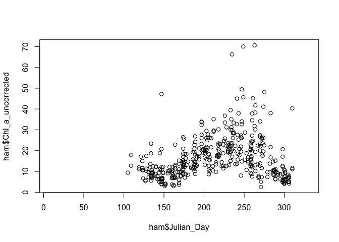
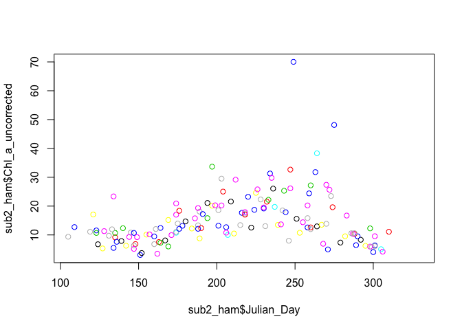
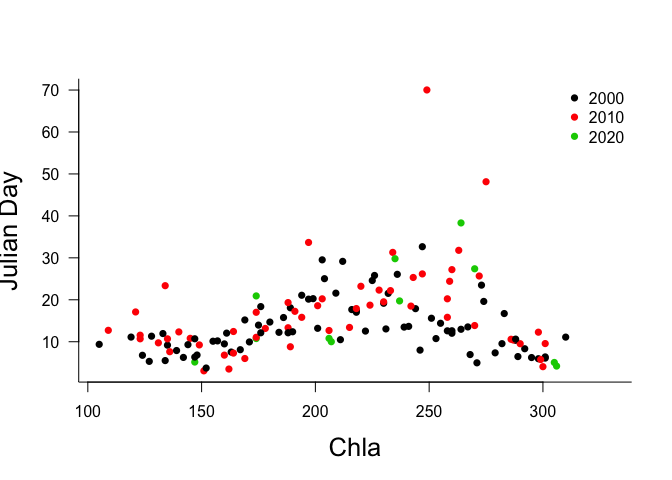
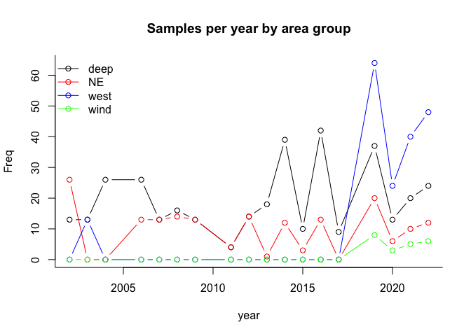
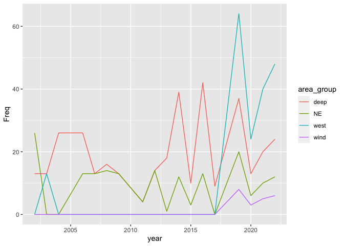

# Basic introduction to R

## Get ready for the workshop

This is an introduction to basic stats in R with a focus on regression. We will assume a familiarity with R to the extent of the participant having tried to do something with the programming environment in the past (e.g., a t-test), but no more than this. 

### R from zero warmup

If you have never used R in any way at a all, it may be helpful to take a quick look at this interactive tutorial for undergraduates at the University of Waterloo. Just complete the tutorial entirely online rather than downloading, starting from "R as a calculator".

[https://shiny.math.uwaterloo.ca/biology/QBshiny/IntroR/](https://shiny.math.uwaterloo.ca/biology/QBshiny/IntroR/)

Then, when you are ready, get some help installing R on your laptop. You will need R installed to participate in workshop. 


### Download needed files and packages

We will be using a flat .xlsx file of Hamilton Harbour data for our workshop exercise today. Our first job at the workshop will be to import that data. 

Please download the .xlxs to your personal computer prior to the workshop. 

In addition, we encourage you to download and install the packages we will be using for the workshop.

### Package to read .xlsx files

R is an open source platform, which means that anyone can contribute code for everyone to use. There are thousands of functions in R written by scientists, statisticians and mathematicians all over the world. Sometimes a group of functions related to a particular task are grouped together in what is called a “library” or "package". We are going to use one such library that has been created to import .xlsx files, "readxl". 

On your own computer, you will need download the package and install it. This is pretty easy. On the RStudio menu select 'Tools', and then 'Install packages' from the drop down list. Enter 'readxl' in the search window, and then select  'Install'. You can also use the function install.packages. Just type install.packages("readxl").


```r
install.packages("readxl")
```

The function install.package downloads the indicated package from the internet and stores it. Eventually, in the console window you should see an indication the R has downloaded and installed the package. 

Once you've done this once, you don't need to do it ever again, unless you update the version of R you are using, or wish to use an updated version of the package.

In addition, the exercise on multivariate analysis will use the "vegan". Please install this package prior to the workshop as well.s

Thee package are now part of R’s set of functions, but since it they not part of the standard environment, you will have to mention to R when you wish to use functions from this collection. The **library()** function tells R you wish to use commands from a particular package on this occasion. 

Every time you restart R, or try to compile a .Rmd file, you will have to mention to R when you wish to use functions from this collection. The simplest method to do this is to always include the statement 'library(readxl)' at the beginning of code that uses functions from this package.

Here R loads the package into active memory.


```r
library(readxl)
```

If this command works, you are ready to go for the first part of the workshop!


## Workshop activities

### Data import & packages

Our first job today is to use a package to import the data we will be using throughout the workshop.

If you have sucessfully installed the library *readxl*, we can use it to read in the .xlsx file. The function we need is **read_excel()**. In general, I advise users to examine the help functions in R every time they use a new function. If you type '?read_xlsx' in the console window, a help window will be called.

The help file indicates the inputs that the function takes. We see that we need the *path* to the .xlsx file, the *sheet* of that file we want to read. Note that if we do not specifiy which sheet, the function will default to reading the first sheet. Most functions in R will have default settings for the inputs so that you do not necessarily have to set these. For example, to read in you Hamilton Harbour data, we are not going to using the *range* inpput that selects a cell range to read in. 

### Where’s my file??

To use this import function we need the *path* where the file is located. There are at least three ways to find and import a file in R:

1. If you don’t know where you have saved a file (the *path*) you can combine the **file.choose()** function to get a drop down menu of your computers file system. If you enter 'read_excel(file.choose())', you can then use the menu which appears to choose the appropriate file. For example, to import the data and save it to the variable name 'ham', enter the command 'ham = read_excel(file.choose())' in the Console window. 

2. Alternately, if you know the location of your file, you can enter a command like 'ham = read_excel("/Users/Kim/Documents/hamiltonharbour.xlsx")' to open the file immediately.

3. You could also simply change the directory that R is looking at. The command **getwd()** allows you to see which directory R is currently focusing on, and the command 'setwd("C:/Users yourusername/workshop")' or similar should change the directory to the location you want to save to. You can check by typing getwd() again. Then you could simply enter "read_excel("ind dates flat all parameters Hamilton only FOR Kim.xlsx"), since R would already be focusing on the correct directory


```r
# load the library
library(readxl)

# import the xlsx file
ham <- read_excel("ind dates flat all parameters Hamilton only FOR Kim.xlsx")
```


### Did the import work??

Once you have read in the data, it is critically import to check that th import worked properly. Problems that can arise from incorrectly formatted files can then be resolved. Problems can include: numierc data being read in as character data, column names being read in as the the first row of data, missing values being coded as something other than NA.

Methods to examine the imported data: 

1. The easiest method is of course just to print the data. You can just type 'ham' in the Console window. However, most datasets will be too large for this approach to be useful (the top of the data will scroll right off the page). The **view()** function brings up a flat file view of the data which can be easier to use, but it is still pretty unwieldly for a dataset this size.

In that case, there are a number of commands to look at a portion of the dataset. 

2. The function **colnames(mydata)** will show you the all the column headings.  
3. The functions **head(mydata)** and **tail()** will show the first or last rows of the data.
4. The command **str(mydata)**. gives a whole bunch of information about your dataset including: the number of observations, the number of columns, the names of the different columns, the number of different string values in each text column (e.g., 7 levels for days of the week), the kind of values in the numeric columns (e.g., “int” for integer values). You should be pretty confident that your data was imported into R correctly after looking at all this.

**Try it now:** Use **colnames()** to see the names of the columns in ham, **tail()** to see the last rows of ham, and **str()** to see information about data type etc.


```r
#View(ham)
colnames(ham[,1:10])
```

```
##  [1] "waterbody"       "area_group"      "Latitude"        "Longtitude"     
##  [5] "Station_Acronym" "report_Stn"      "SamplingDate"    "season"         
##  [9] "year"            "Julian_Day"
```

```r
tail(ham, n=10)
```

```
## # A tibble: 10 × 109
##    waterbody        area_group Latitude Longtitude Station_Acronym report_Stn
##    <chr>            <chr>         <dbl>      <dbl> <chr>           <chr>     
##  1 Hamilton Harbour west           43.3      -79.9 HH9031          9031      
##  2 Hamilton Harbour deep           43.3      -79.8 HH9033          9033      
##  3 Hamilton Harbour west           43.3      -79.9 HH1B            1B        
##  4 Hamilton Harbour west           43.3      -79.9 HH2B            2B        
##  5 Hamilton Harbour NE             43.3      -79.8 HHBURSTP        BSTP      
##  6 Hamilton Harbour west           43.3      -79.9 HHCarolsP       CP        
##  7 Hamilton Harbour west           43.3      -79.9 HHRHYC          RHYC      
##  8 Hamilton Harbour west           43.3      -79.9 HHRHYC out      RHYC out  
##  9 Hamilton Harbour wind           43.3      -79.8 HH4_PHYTO       WSTP      
## 10 Hamilton Harbour west           43.3      -79.9 HHBayfront-West BFW       
## # … with 103 more variables: SamplingDate <dttm>, season <dbl>, year <dbl>,
## #   Julian_Day <dbl>, Julian_Week <dbl>, Month <dbl>, Station_depth <dbl>,
## #   `water level` <dbl>, Ammonia_ECCC1m <dbl>, DIC_ECCC1m <dbl>,
## #   DOC_ECCC1m <dbl>, POC_ECCC1m <dbl>, Chl_ECCC1m <dbl>,
## #   `Chl Cor_ECCC1m` <dbl>, NO2_NO3_ECCC1m <dbl>, PON_ECCC1m <dbl>,
## #   `TKN dissolved_ECCC1m` <dbl>, SRP_ECCC1m <dbl>, TP_ECCC1m <dbl>,
## #   `TP dissolved_ECCC1m` <dbl>, Chl_a_uncorrected <dbl>, Secchi <dbl>, …
```

```r
str(ham, list.len=10)
```

```
## tibble [742 × 109] (S3: tbl_df/tbl/data.frame)
##  $ waterbody                  : chr [1:742] "Hamilton Harbour" "Hamilton Harbour" "Hamilton Harbour" "Hamilton Harbour" ...
##  $ area_group                 : chr [1:742] "deep" "NE" "deep" "west" ...
##  $ Latitude                   : num [1:742] 43.3 43.3 43.3 43.3 43.3 ...
##  $ Longtitude                 : num [1:742] -79.9 -79.8 -79.8 -79.9 -79.9 ...
##  $ Station_Acronym            : chr [1:742] "HH908" "HH6" "HH258" "HHBayfront" ...
##  $ report_Stn                 : chr [1:742] "908" "6" "258" "BF" ...
##  $ SamplingDate               : POSIXct[1:742], format: "2016-05-10" "2021-06-23" ...
##  $ season                     : num [1:742] 1 2 2 2 2 2 2 2 2 2 ...
##  $ year                       : num [1:742] 2016 2021 2021 2022 2022 ...
##  $ Julian_Day                 : num [1:742] 131 174 174 174 174 174 174 174 174 174 ...
##   [list output truncated]
```


### Data in R

You’ll notice that the data are structured in columns. This is a *dataframe*, one of the most used data structures in R. Data structures are sets of variables organized in a particular way. In R there are 4 primary data structures we will use repeatedly.

*Vectors* are one-dimensional ordered sets composed of a single data type. Data types include integers, real numbers, and strings (character variables)

*Matrices* are two-dimensional ordered sets composed of a single data type, equivalent to the concept of matrix in linear algebra.

*Dataframes* are one to multi-dimensional sets with a row-column structure, and can be composed of different data types (although all data in a single column must be of the same type). In addition, each column in a data frame may be given a label or name to identify it. Data frames are equivalent to a flat file database, similar to spreadsheets (e.g., like a single excel spreadsheet).

*Lists* are compound objects of associated data. Like data frames, they need not contain only a single data type, but can include strings (character variables), numeric variables, and even such things as matrices and data frames. In contrast to data frames, list items do not have a row-column structure, and items need not be the same length; some can be a single value, and others a matrix. You can think of a list as a named box to put related objects into.

### Selecting portions of a dataframe

To start our examination and analysis of this data, we need to be able to select items of interest. Dataframes are indexed by rows and columns. If you want the item from the 5th row and 2nd column type 'mydata[5,2]'. If you need just one column you can type either 'mydata[,2]', which grabs everything in column 2, or if you know the name of the column 'mydata\$Population'. To get rows 2 to 5 you can enter 'mydata[2:5,2]'. You can also combine this with the column name which may be easier to read, as 'mydata$Population[2:5]'.

**Try it now:** select just the first 15 rows and first 3 columns of the dataframe you read into R.


```r
# access a subsection of a dataframe
ham[1:15,1:3]
```

```
## # A tibble: 15 × 3
##    waterbody        area_group Latitude
##    <chr>            <chr>         <dbl>
##  1 Hamilton Harbour deep           43.3
##  2 Hamilton Harbour NE             43.3
##  3 Hamilton Harbour deep           43.3
##  4 Hamilton Harbour west           43.3
##  5 Hamilton Harbour deep           43.3
##  6 Hamilton Harbour west           43.3
##  7 Hamilton Harbour west           43.3
##  8 Hamilton Harbour west           43.3
##  9 Hamilton Harbour west           43.3
## 10 Hamilton Harbour west           43.3
## 11 Hamilton Harbour west           43.3
## 12 Hamilton Harbour west           43.3
## 13 Hamilton Harbour deep           43.3
## 14 Hamilton Harbour NE             43.3
## 15 Hamilton Harbour deep           43.3
```


We can create new data subsets by using the **c()** or **c**ombine function. Let's access the first 3 and column 10, and save the result to a new variable ' ham_sub'


```r
# save a subsection of a dataframe
ham_sub=ham[1:15,c(1:3, 9:10)]
ham_sub
```

```
## # A tibble: 15 × 5
##    waterbody        area_group Latitude  year Julian_Day
##    <chr>            <chr>         <dbl> <dbl>      <dbl>
##  1 Hamilton Harbour deep           43.3  2016        131
##  2 Hamilton Harbour NE             43.3  2021        174
##  3 Hamilton Harbour deep           43.3  2021        174
##  4 Hamilton Harbour west           43.3  2022        174
##  5 Hamilton Harbour deep           43.3  2022        174
##  6 Hamilton Harbour west           43.3  2022        174
##  7 Hamilton Harbour west           43.3  2022        174
##  8 Hamilton Harbour west           43.3  2022        174
##  9 Hamilton Harbour west           43.3  2022        174
## 10 Hamilton Harbour west           43.3  2022        174
## 11 Hamilton Harbour west           43.3  2022        174
## 12 Hamilton Harbour west           43.3  2022        174
## 13 Hamilton Harbour deep           43.3  2016        174
## 14 Hamilton Harbour NE             43.3  2021        174
## 15 Hamilton Harbour deep           43.3  2016        174
```


We can also just grab a single column, using the column name to identify it as mydata$thiscolumn or mydata[,"thiscolumn"]

**Try it now:** Access the Station_Acronym column of the data


```r
# by column
head(ham$Station_Acronym)
```

```
## [1] "HH908"      "HH6"        "HH258"      "HHBayfront" "HH908"     
## [6] "HH9031"
```


Our subsetted data is not ordered by year or group, so let's use the **order()** function to rearrange


```r
# save a subsection of a dataframe
ham_sub=ham_sub[order(ham_sub$area_group,ham_sub$year),]
ham_sub
```

```
## # A tibble: 15 × 5
##    waterbody        area_group Latitude  year Julian_Day
##    <chr>            <chr>         <dbl> <dbl>      <dbl>
##  1 Hamilton Harbour deep           43.3  2016        131
##  2 Hamilton Harbour deep           43.3  2016        174
##  3 Hamilton Harbour deep           43.3  2016        174
##  4 Hamilton Harbour deep           43.3  2021        174
##  5 Hamilton Harbour deep           43.3  2022        174
##  6 Hamilton Harbour NE             43.3  2021        174
##  7 Hamilton Harbour NE             43.3  2021        174
##  8 Hamilton Harbour west           43.3  2022        174
##  9 Hamilton Harbour west           43.3  2022        174
## 10 Hamilton Harbour west           43.3  2022        174
## 11 Hamilton Harbour west           43.3  2022        174
## 12 Hamilton Harbour west           43.3  2022        174
## 13 Hamilton Harbour west           43.3  2022        174
## 14 Hamilton Harbour west           43.3  2022        174
## 15 Hamilton Harbour west           43.3  2022        174
```


### Using conditional statements to access data
We can also use conditional statements to access portions of the data. Conditional statements evaluate to TRUE or FALSE. The "==" symbol is used to determine if a variable is equal to some value, while "!=" evaluates is something is not equal. As you might expect we can also use greater than (">") or less than ("<") conditionals.

For example, let's say you wanted to access the calanoid data only from the sampling station "HH6". You would type 'ham\$calanoid[ham\$Station_Acronym=="HH6"]'. Note that 'ham\$calanoid' accesses the column of calanoid data, while the conditional 'ham\$Station_Acronym=="HH6"' will only be TRUE for some of the data in the column. 

**Try it now:** Enter 'ham\$calanoid[ham\$Station_Acronym=="HH6"]' and examine the data.


```r
# by condition... using head() to show the first 6 items
head(ham$calanoid[ham$Station_Acronym=="HH6"])
```

```
## [1] 84.094200542 13.196863744 64.145098250 58.389201770 25.256348256
## [6]  0.006374018
```

Of course, this gives us all of the sampling dates for this station. Let's assume we only want data from 2016. In that case we can combine our conditional statements using "&" for AND and "|" for OR. So we use an "&" symbol to indicate that we want the selected data to be from station "HH6" and to be from the 2016. 


```r
ham$calanoid[ham$Station_Acronym=="HH6" & ham$year==2016]
```

```
##  [1]  64.145098  25.256348  70.721192 142.447448  89.268307  70.066000
##  [7]  32.332505  78.560037   7.974158 120.229185  91.171246  19.286071
## [13] 104.393878
```

If we wanted we could use the same conditionals to grab the julian sampling day for these observations, and save the result to new vectors


```r
cal_HH6_2016=ham$calanoid[ham$Station_Acronym=="HH6" & ham$year==2016]
jul_cal_HH6_2016=ham$Julian_Day[ham$Station_Acronym=="HH6" & ham$year==2016]
```

Table: Calanoid data for 2016 at station HH6

|   calanoid| julian|
|----------:|------:|
|  64.145098|    145|
|  25.256348|    131|
|  70.721192|    160|
| 142.447448|    188|
|  89.268306|    201|
|  70.066000|    215|
|  32.332505|    174|
|  78.560037|    258|
|   7.974158|    228|
| 120.229185|    242|
|  91.171246|    270|
|  19.286071|    286|
| 104.393878|    299|

**Try it now:** Access the calanoid data at station "HH6" for 2014


```
##  [1]  3.7525745  4.4195122  4.4719882 49.3636318  7.1764905  0.8381301
##  [7]  3.7054878  6.7292412  4.0907797  5.7956002  1.0151220  5.4204413
```


## Functions in R

Next, let's figure out how to complete some simple calucations with these values, like finding the mean and standard deviation. 

We have already used some functions in R. R contains thousands of functions, and more are being added everyday. In fact, R is defined as a functional programming language Some common ones are

- abs() - absolute value
- cos(), sin(), tan() - cosine, sine, tangent of angle x in radians
- exp - exponential function
- log - natural (base-e) logarithm
- log10 - common (base-10) logarithm
- sqrt - square root function

You can obtain lists of mathematical functions by typing ?Arithmetic for simple, ?log for logarithmic, ?sin for trigonometric, and ?Special for special functions.

If you are trying to find a function that does something you need to do, you can use the command apropos("keyword") to see if there is a function that contains the keyword in its name. 

**Try it now:** For example if you wanted to find a function that calculated means you might: type 'apropos("mean")'. What happens?

One of the listed functions “mean” looks promising. Your next step might be to get more information by typing 'help(mean)' or 'example(mean)'. **Try this now**. You should see that the funciton **mean()** works on a vector of numeric data.

Perhaps the function does not contain the keyword in its name, in this case try ??”keyword phrase” to get R to search function descriptions

If the internal help menu lets you down you can also try a search at http://www.rseek.org/

**Try it now:** Use these tools to find a function that calculates standard deviation
Then mean this function and a function to calculate means to get the mean and standard deviation of calanoid density in 2014.


```
## [1] 8.064917
```

```
## [1] 13.14886
```

### Summarizing data 

Other functions can help with quick data summaries. for example, the **table()** function can be used to take a quick look at the number of sampling dates for each station. 

**Try it now:** Use this function on the Station_Acronym column of the data


```r
table(ham$Station_Acronym)
```


|Station Name    | No. of samples|
|:---------------|--------------:|
|CCIW dock       |              3|
|HH17            |             13|
|HH1B            |             22|
|HH2             |              1|
|HH2000          |              1|
|HH2001          |              1|
|HH2002          |              1|
|HH2003          |              1|
|HH2004          |              1|
|HH258           |            172|
|HH2B            |             21|
|HH39            |              1|
|HH4_PHYTO       |             22|
|HH6             |            136|
|HH8             |             38|
|HH9031          |             22|
|HH9033          |             22|
|HH908           |             96|
|HH917           |             22|
|HHBayfront      |             22|
|HHBayfront-West |             22|
|HHBFouter       |              3|
|HHBURSTP        |             22|
|HHCarolsP       |             22|
|HHRHYC          |             21|
|HHRHYC out      |             21|
|HHWC            |             13|

The **summary()** function can also give information about a vector. **Try it now:** Use the summary function on the "Chl_a_uncorrected" data for site HH258


```
##    Min. 1st Qu.  Median    Mean 3rd Qu.    Max.    NA's 
##   3.060   9.508  12.600  15.004  19.253  70.020      25
```


### Plotting data

A quick check of data can also be done with simple plots. for example, let's see what the Chl_a_uncorrected data from 2016 looks like using the **plot()** function. 


```r
plot(y=ham$Chl_a_uncorrected, x=ham$Julian_Day)
```

<!-- -->

Of course, this is the data from every station. Let's just plot station HH258, and colour code by sampling year


```r
sub2_ham=ham[ham$Station_Acronym=="HH258",]
plot(y=sub2_ham$Chl_a_uncorrected, x=sub2_ham$Julian_Day, col=sub2_ham$year)
```

<!-- -->


Kind of hard to read... we'll group the data by decade, and let's pimp the plot a little. We'll colour code by decade. We also need axis labels, a nicer symbol and a legend. 


```r
sub2_ham$decade <- cut(sub2_ham$year, breaks=c(2000,2010,2020,2030), labels=c(2000, 2010, 2020))

plot(y=sub2_ham$Chl_a_uncorrected, x=sub2_ham$Julian_Day, col=sub2_ham$decade, pch=16,
xlab="Chla", ylab="Julian Day", 
bty="l", cex.lab=1.6, las=1
     )
legend("topright", legend=levels(sub2_ham$decade), pch=16, col=1:3, bty="n")
```

<!-- -->

Notice that I've used a *factor* variable to control the colour of the data from each decade.

Let's try one more. Let's quickly visualize the number of calanoid samples from each area by date. Again we will use a factor variable to control appearance


```r
ham$area_group=as.factor(ham$area_group)
plot(calanoid~SamplingDate, data=ham, col=area_group)
legend("topleft", legend=levels(ham$area_group), bty="n",
       pch=1,col=c(1:length(levels(ham$area_group))))
```

<!-- -->


This is too cluttered, so I am going to summarize the data by year and area, and then plot that. I'm going to plot the data from each area individually starting with the first one, and then adding subsequent areas to the same plot using the **lines()** function.


### Plotting data


```r
samps=as.data.frame(table(ham[,c("year","area_group")]))
samps$year=as.numeric(as.character(samps$year))
plot(Freq~year,data=samps[samps$area_group=="deep",], bty="L",
     xlim=c(min(samps$year), max(samps$year)),
     ylim=c(min(samps$Freq), max(samps$Freq)),
     col="black", type="b", main="Samples per year by area group")
lines(Freq~year,data=samps[samps$area_group=="NE",],
      col="red", type="b")
lines(Freq~year,data=samps[samps$area_group=="west",],
      col="blue", type="b")
lines(Freq~year,data=samps[samps$area_group=="wind",],
      col="green", type="b")

legend("topleft", legend=levels(ham$area_group), lty=1,bty="n",
       pch=1,col=c("black", "red", "blue", "green"))
```

<!-- -->


At this point, the plotting is getting a bit  more complex, so you may want to use another library called *ggplot2** to do some of your plotting. This library of functions has a non-intuitive command structure, but is quick for plotting multiple sets of data on the same plot with a legend.


```r
# similar plot using ggplot
library(ggplot2)
ggplot(samps, aes(x = year, y = Freq, 
    group = area_group, colour = area_group)) + geom_line()
```

<!-- -->


### Simple tests

