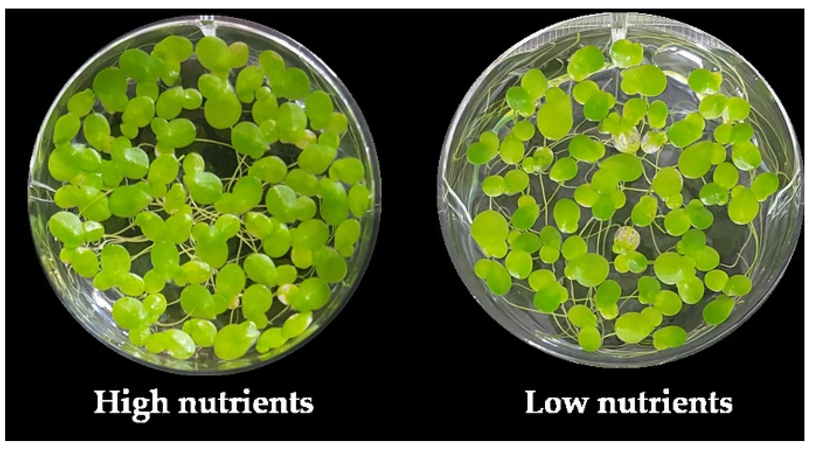
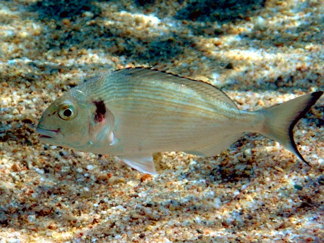
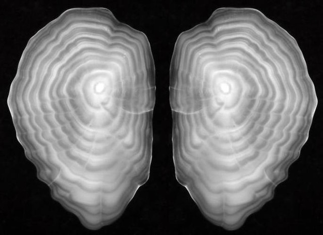

### Environmental stochasticity in IPMs
Vital rate functions can readily accommodate covariates, such as environmental conditions, that help to predict individuals’ vital rates above and beyond the state variable. For example, plant growth may be determined both by its previous size, and the nutrient conditions in its habitat.

In the case, the growth kernal G is then a function fof the state variable of size and nutrients as: $G(z'|z, nutrients)$. Or, if these nutrients vary through time we could then state that time dependence as $G(z'|z, nutrients_t)$

### Example: Temperature dependent growth of gilthead seabream

Heather et al. (2018) used this approach to explore how temperatures in the Mediterranean might affect growth rates of gilthead seabream, an important aquaculture species

 The authors obtained 11 years of growth increments by examining the otoliths of wild  juvenile and adult fish caught between 2008–2011, and water temperature from several locations in the Mediterranean. 

{ width=50% }

Then they fitted a series of mixed effects models to account for intrinsic (e.g. random individual effects) and extrinsic (e.g. water temperature, random year effects) effects on the rate of otolith growth. The best model (selected by AIC) included random effects of fish and year, and fixed effects of otolith size at previous year and mean Mediterranean summer temperature.

They subsequently used otolith annual increment width as a proxy for individual-level growth within specified years, which was then coupled with an allometry model to estimate fish body growth, to project the impacts on growth under climate warming. The authors
found about an ~8% reduction in individual growth with a 1°C increase in mean summer water temperature (Heather et al. 2018).

### General stochastic IPM
Of course, any of the kernels, or even multiple components of the same kernel, could be dependent on environmental covariates that fluctuate through time. More generally, we can note that the kernel is dependent on time varying parameters in the vector, $\theta$, as:

$$n(z', t+1)=\int^U_L K(z',z;\theta(t))n(z,t)dz$$

### Two methods for IPM stochasticity
There are two basic approaches to building an IPM with environmental stochasticity: 
1. Kernel selection, or 
2. Parameter selection

These methods are analogous to those used for matrix population models, where one either chooses from a set of transition matrices at random, or one chooses life history parameters from some relevant distribution. However, for IPMs parameter selection must be followed by constructing the relevant kernel.

### Kernel Selection

If we are starting from data:  for each year in the study, a fitted fixed-effects model gives us a vector of year-specific values for each parameter, and a fitted mixed-effects model gives us a vector of fitted values or posterior modes for each parameter. In either case, we construct a set of kernels using each of the year-specific sets of parameters, and then simulate the model by selecting from the set of kernels at random. 

**Kernel selection process**

 1) Construct set of yearly kernels → 2) Select a kernel at random → 3) Project the population forward one time step, and then repeat from 2).

### Parameter Selection

 If you have characterized the between-year variation in the parameters using mixed-effects models, then you can sample from the fitted distributions and build a unique kernel for each year that you simulate.

**Parameter selection process**
 1) Simulate a parameter vector from fitted distributions → 2) Construct kernel → 3) Project the population forward one time step, then repeat from 1).

### Advantages and disadvantages

**Kernel selection:** 
An IPM using kernel selection runs much faster than one using parameter selection, as all the kernels can be constructed before iterating the model. Parameter estimation is easier for kernel selection as you don’t have to worry about correlations between different demographic processes. These correlations are already “built in” to the year-specific parameter estimates.

**Parameter selection:** 
Parameter selection is a little slower, since for every year simulated we need to both randomly select the kernel parameters, and then construct the kernel. It is unusual to have sufficiently long datasets to characterize some times of important environmental stochasticity, or we may wish to estimate the impacts of future climate conditions, and parameter selection is important in these cases.  If we have functions that describe how parameters vary with environmental variation we can take advantage of long term climate datasets or climate projections

### Examples
Models in which demographic rates are functions of environmental covariates are an important example of parameter selection. for example, Dalgleish et al. (2011) modeled effects of precipitation and temperature on all vital rates of three sage-brush steppe plants, including effects of climate in previous years. Simmonds and Coulson (2015) linked vital rates of Soay sheep on St. Kilda to the NAO (North Atlantic Oscillation) index, based on previous studies of NAO effects. 

### Analysis of stochastic IPMS
Much of the same analysis that we completed for stochastic matrix models can be completed for stochastic IPMS
We can:
1. estimate the long run stochastic growth rate
2. determine how variance or covariance in various model components impacts the growth rate
3. calculate stochasticity sensitivity

### Long run stochastic growth rate, $\lambda_S$
There are four main things to know about $\lambda_S$:

1. it exists,

2. it can be computed by simulation,

3.  it can be approximated, and

4. there is a perturbation theory

Overall, just about any analysis you could do for a density-independent deterministic IPM or matrix model can also be done for a density-independent stochastic IPM.

### $\lambda_S$ does exist

$\lambda_S$ is the long-term growth rate of total population size N(t), exactly as in stochastic matrix models:

$$\lim\limits_{t \to \infty} \frac{1}{t}log(\frac{N(t+1)}{N(t)})=log \lambda_S$$

which exists, if the following assumptions hold:
1.  the parameter vectors $\theta(t)$ in equation must be stationary, ergodic random variables (e.g.  finite-order autoregressive processes)
2. the kernel $K(z',z,\theta)$ is a positive, continuous function of its three arguments (piecewise functions are also okay)
3. the distributions of all model parameters are bounded. (e.g., we may need to truncate Gaussian distributions at 99.99% percentiles)

### We can compute $\lambda_S$
 $\lambda_S$ is equal to the average annual growth rate,

$log(\lambda_S) =E[log(\frac{N(t+1)}{N(t)})]$
where N(t) is total population size at time t. 

### We can approximate $\lambda_S$ using Tuljapurkar’s small fluctuations approximation 

The long run stochastic growth rate can be approximated using the IPM version of Tuljapurkar’s small fluctuations approximation, which is analogous to the approximation for matrix models:
$$log \lambda_S \approx log \lambda_1 - \frac{Var⟨v,K_tw⟩}{2\lambda^2_1}+\sum^\infty_{j=1} c_j,$$ 
where the first term, $\lambda_1$,  is the dominant eigenvalue of the mean kernel $\overline{K}$, in the second term, $K_t$ is equal to  $K(z',z;\theta(t))$, $v$ and $w$ are the left and right eigenvectors of $\overline{K}$ scaled so that $\langle v,w\rangle = 1$, and $K_tw =\int_{Z} K_t(z',z)w(z)dz$.

The small fluctuation approximation is not only useful on its own, it provides some insight into the impact of environmental stochasticity. Most obviously, it demonstrates the importance of covariance amoung the life history components.

### Covariance in life history components

Some recent studies have shown, for stochastic matrix models, that both the  between-year and within-year correlations among matrix entries can have a significant impact on model predictions—it is not enough to correctly  specify the marginal distribution of each matrix entry. The same issue occurs for stochastic IPM models

The second term in our approximation $-\frac{Var\langle v, K_t w \rangle}{2\lambda^2_1}$ indicates that variance in the life history parameters is always going to decrease our growth rates.

We can write this term as:

$$-\frac{1}{2\lambda^2_1}\int\int\int\int \boldsymbol{s}(z'_2, z_2)\boldsymbol{s}(z'_1, z_1)Cov(K_t(z'_2, z_2)K_t(z'_1, z_1))dz_1dz_2dz'_1dz'_2,$$ 

So that, analogous to our work in stochastic matrix models, we can see that the impact of stochasticity in an IPM will be determined both by covariance in the model elements and the sensitivity, $\boldsymbol{s}$ of the mean kernel,  to these variance elements, where we need to integrate over all Z.

### Correlation in environmental fluctuations
The third term of our approximation $c_j$ is the effect of environmental correlations at time-lag j (i.e., between $\theta(t)$ and $\theta(t - j)$). The formula for this term is $$c_j =E\langle v,M_jD^{l-1}M_0w \rangle$$ where $M_t = (K_t -\overline{K})/\lambda_1$ and $D^m = (\overline{K}/\lambda_1)^m -P_0$ where $P_0(z',z) = v(z')w(z)$ for $v,w$ scaled so that $\langle v,w \rangle = 1$ (see Rees and Ellner (2009, Appendix C),  which is a translation from Tuljapurkar (1990) and Tuljapurkar and Haridas (2006) into IPM notation.

#### Stochastic sensitivitivty
To calculate time-varying sensitivity we can use:
$$\frac{\partial log \lambda_S}{\partial \epsilon} = \frac{1}{\lambda_S}\frac{\partial log \lambda_S}{{\partial \epsilon} }=E\left[\frac{\langle v_{t+1}, C_tw_t\rangle}{{\langle v_{t+1}, K_tw_t \rangle}}\right]$$, 
which is an IPM version of the matrix formula from Tuljapurkar (1990). The formula describes a general perturbation of $K_t$ to $K_t + \epsilon C_t$ where $C_t = C(z', z; \theta_t)$ is a sequence of kernels such that the perturbed IPM satisfies the small perturbation requirements.

The terms $v_t$, and $w_t$ are calculated from $t=0$ to large time as:
$$\tilde{w}_{t+1}=K_tw_t, w_{t+1}=\tilde{w}_{t+1}/ \int_Z \tilde{w}_{t+1}(z)dz$$
$$\tilde{v}_{t-1}=v_tK_t = \int_Z v_{z'}K_{t-1}(z',z)dz',$$
$$v_{t-1}=\tilde{v}_{t-1}/ \int_Z \tilde{v}_{z}(z)dz$$. 

However, we note that for IPMs  every possible perturbation to a deterministic model is now tripled. We can examine: 
1. a change in mean
2.  a change in the standard deviation, or
3. do a fractional perturbation (e.g., a 5% higher value each year) that changes both the mean and the standard deviation (Tuljapurkar et al. 2003, 2004). 

Therefore our stochasticity sensitivity equations can be used to generate a giant list of perturbation formulas for changes to kernel entries, demographic functions, and parameter values (see Table 7.2 in Ellne, Rees and Ellner (2009; Appendices E and F))

We also note that the equation for sensitivity isn't informative when the right-hand side is 0, which will be true whenever the fluctuations $C_t$ have zero mean and are independent of the unperturbed kernel. In this case, we need to carry the expansion out to second order in $\epsilon$ for these cases.

### References
Dalgleish, H. J., Koons, D. N., Hooten, M. B., Moffet, C. A., & Adler, P. B. (2011). Climate influences the demography of three dominant sagebrush steppe plants. _Ecology_, _92_(1), 75-85.

Ellner, S. P., & Rees, M. (2007). Stochastic stable population growth in integral projection models: theory and application. _Journal of mathematical biology_, _54_(2), 227-256. https://link.springer.com/content/pdf/10.1007/s00285-006-0044-8.pdf

Heather, F. J., Childs, D. Z., Darnaude, A. M., & Blanchard, J. L. (2018). Using an integral projection model to assess the effect of temperature on the growth of gilthead seabream Sparus aurata. PloS one, 13(5), e0196092.

Levin, S. C., Childs, D. Z., Compagnoni, A., Evers, S., Knight, T. M., & Salguero‐Gómez, R. (2021). ipmr: Flexible implementation of Integral Projection Models in R. _Methods in Ecology and Evolution_, _12_(10), 1826-1834.

Lindell, T., Ehrlén, J., & Dahlgren, J. P. (2022). Weather‐driven demography and population dynamics of an endemic perennial plant during a 34‐year period. _Journal of Ecology_, _110_(3), 582-592.

Rees, M., & Ellner, S. P. (2009). Integral projection models for populations in temporally varying environments. _Ecological Monographs_, _79_(4), 575-594.

Simmonds, E. G., & Coulson, T. (2015). Analysis of phenotypic change in relation to climatic drivers in a population of Soay sheep Ovis aries. _Oikos_, _124_(5), 543-552.

Varga, M., Žuna Pfeiffer, T., Begović, L., Mlinarić, S., Horvatić, J., Miloloža, T., & Štolfa Čamagajevac, I. (2023). Physiological response of nutrient-stressed *Lemna gibba* to pulse colloidal silver treatment. _Plants_, _12_(6), 1367.
