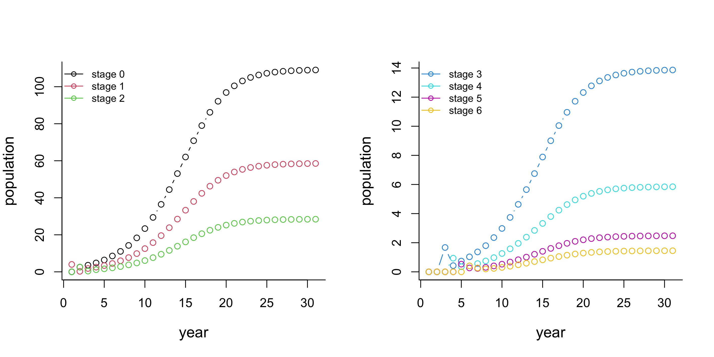

---
output:
  html_document: default
  pdf_document: default
---
## Density-dependence in populations without stage-structure

In the first chapter, we talked about density-dependence in unstructured population models. In general, we can define a model with a differential equation (continuous)
$$\frac{dN}{dt}=Ng(N),$$
or a difference equation (discrete)
$$N_{t+1}=N_t+N_tg(N_t)$$
where the per capita growth rate $g(N)$ depends on the population size/density $N$. For example, when $g(N)=r(1-N/K)$, we get the classic logistic growth model, where the population density has a negative effect on per capita crowth rate.


## Density-dependence in populations with stage-structure

Density-dependent processes occur when the population growth rate is affected by the population density. This is relatively simple in an unstructured model, since we only have one population density and one growth rate to consider. In a stage-structured model, things become more complicated, and here are some questions we need to think about

- There are many vital rates (e.g. fecundity rate (producing offsprings), survival rate (staying in the same stage), growth rate (growing to the next stage)). Does the population density influence only one of these rates, or all of them?
- Are the vital rates of a stage affected by the density of the population in that stage, or the density of total population?
- Is each vital rate affected in the same way, or differently?


### Incorporating density-dependence into a matrix model

There are plenty of ways of incorporating density-dependence into matrix models. Let's start with the simplest case. Consider a two-stage model defined by the matrix
$$\mathbf{A}=\begin{bmatrix}\sigma_1(1-\gamma_1) & f_2\\\sigma_1\gamma_1 & \sigma_2\end{bmatrix},$$
where $\sigma_1$ and $\sigma_2$ are survival rate at each stage, $\gamma_1$ is the growth rate from stage 1 to stage 2, and $f_2$ is the fecundity rate from stage 2 to stage 1. Here we follow the settings in Tuljapurkar and Caswell (1997), but there is no difference between this and using a single variable to represent each transition rate.

Let's assume that vital rates are affected by the total population $N=N_1+N_2$. Here are some possible density-dependent rates:

- _Density-dependent fecundity_: $f_2(N)=f_0e^{-aN}$
- _Density-dependent survival_: $\sigma_i(N)=\sigma_{0,i}e^{-b_iN},\;i\in\{1,2\}$
- _Density-dependent growth_: $\gamma_1(N)=\gamma_0e^{-cN}$
- Combinations of the above rates


### Density-dependence in a Leslie model

Many analysis on density-dependent matrix models starts with the Leslie matrix because of its simplicity (Leslie, 1945). Let's start with a three-stage Leslie model whose population projection matrix $\mathbf{A}$ has the following form
$$\mathbf{A}=\begin{bmatrix}F_0 & F_1 & F_2\\S_0 & 0 & 0\\0 & S_1 & 0\end{bmatrix},$$
where $F_i$ is the fecundity of stage group $i$, and $S_i$ is survival from stage $i-1$ at time $t$ to stage $i$ at time $t+1$ with continuous mortality (Jensen, 1995).

#### Model setup

From the Leslie matrix model, we can obtain the new stage structure directly from the old stage structure via the equation
$$\vec{N}_{t+1}=\mathbf{A}\vec{N}_t,$$
which can be written as
$$\vec{N}_{t+1}=\vec{N}_t+(\mathbf{A}-\mathbf{I})\vec{N}_t,$$
where $\mathbf{I}$ is the $3\times 3$ identity matrix.

You might have noticed that it has a similar form as $N_{t+1}=N_t+rN_t$, the discrete model we discussed in the previous chapter! The transition matrix $\mathbf{A}-\mathbf{I}$ is analogous to the intrinsic rate of increase $r$. We can develop a density-dependent matrix model with the following equation
$$\vec{N}_{t+1}=\vec{N}_t+D(\vec{N}_t)(\mathbf{A}-\mathbf{I})\vec{N}_t,$$
in which $D(N_t)$ is a density-dependent function.

#### Logistic growth in a Leslie matrix model

The simplest form of density-dependence might be the logistic equation $N_{t+1}=N_t+(1-N_t/K)rN_t$, where $K$ denotes the carrying capacity. Hence, a candidate for $D(\vec{N}_t)$ could be
$$D(\vec{N}_t)=1-T_{\vec{N}_t}/K.$$
Here, $T_{\vec{N}_t}$ is the total population at time $t$, or the sum of the elements in the vector $\vec{N}_t$. In other words, the growth rate of each stage group at time $t$ is affected by the total population at that time. However, using such a function for $D(\vec{N}_t)$ has some limitations:

- Jensen (1995) argued that this function is only useful when the initial population size is far less than the carrying capacity. With a relatively small initial abundance compared to the carrying capacity, the stage structure at the carrying capacity is near the stable stage distribution given by the Leslie matrix.
- Charlesworth (1994) also mentioned that from empirical results, usually, the density-dependent components of the demographic parameters respond only to the numbers of individuals in a restricted sub-group of the population, not the total population.

Therefore, we need a more general density-dependent function $D(\vec{N}_t)$. Here we introduce a diagonal matrix with term of the form $1-N(x,t)/(c_xK)$, where $c_x$ is the proportion of stage $x$ in the stable stage distribution, which can be determined from the dominant eigenvector of the Leslie matrix. In our model setup, $D(\vec{N}_t)$ has the following form
$$D(\vec{N}_t)=\begin{bmatrix}1-\frac{N(1,t)}{c_1K} & 0 & 0\\0 & 1-\frac{N(2,t)}{c_2K} & 0\\0 & 0 & 1-\frac{N(3,t)}{c_3K}\end{bmatrix}.$$

Now we will do a little math to show how such a diagonal matrix works in our model:
$$\begin{aligned}\begin{bmatrix}N(0,t+1)\\N(1,t+1)\\N(2,t+1)\end{bmatrix} & =\begin{bmatrix}N(0,t)\\N(1,t)\\N(2,t)\end{bmatrix}+\begin{bmatrix}1-\frac{N(0,t)}{c_0K} & 0 & 0\\0 & 1-\frac{N(1,t)}{c_1K} & 0\\0 & 0 & 1-\frac{N(2,t)}{c_2K}\end{bmatrix}\begin{bmatrix}F_0-1 & F_1 & F_2\\S_0 & -1 & 0\\0 & S_1 & -1\end{bmatrix}\begin{bmatrix}N(0,t)\\N(1,t)\\N(2,t)\end{bmatrix}\\
~ & =\begin{bmatrix}N(0,t)\\N(1,t)\\N(2,t)\end{bmatrix}+\begin{bmatrix}\left(1-\frac{N(0,t)}{c_0K}\right)(F_0-1) & \left(1-\frac{N(0,t)}{c_0K}\right)F_1 & \left(1-\frac{N(0,t)}{c_0K}\right)F_2\\\left(1-\frac{N(1,t)}{c_1K}\right)S_0 & -\left(1-\frac{N(1,t)}{c_1K}\right) & 0\\0 & \left(1-\frac{N(2,t)}{c_2K}\right)S_1 & -\left(1-\frac{N(2,t)}{c_2K}\right)\end{bmatrix}\begin{bmatrix}N(0,t)\\N(1,t)\\N(2,t)\end{bmatrix}\\
~ & =\begin{bmatrix}N(0,t)+\left(1-\frac{N(0,t)}{c_0K}\right)[(F_0-1)N(0,t)+F_1N(1,t)+F_2N(2,t)]\\N(1,t)+\left(1-\frac{N(1,t)}{c_1K}\right)[S_0N(0,t)-N(1,t)]\\N(2,t)+\left(1-\frac{N(2,t)}{c_2K}\right)[S_1N(1,t)-N(2,t)]\end{bmatrix}\end{aligned}$$


#### Matrix representation

We now develop a matrix expression of the model $\vec{N}_{t+1}=\vec{N}_t+D(\vec{N}_t)(\mathbf{A}-\mathbf{I})\vec{N}_t$. The above $D(\vec{N}_t)$ can be written as 
$$D(\vec{N}_t)=\mathbf{I}-\mathbf{K}^{-1}\mathbf{N_t},$$
in which $\mathbf{K}=diag\{c_xK\}$ ($\mathbf{K}^{-1}$ is the inverse of $\mathbf{K}$, which can be easily calculated as $diag\{1/(c_xK)\}$), $\mathbf{N}_t=diag\{N(x,t)\}$. So we have
$$\vec{N}_{t+1}=\vec{N}_t+(\mathbf{I}-\mathbf{K}^{-1}\mathbf{N_t})(\mathbf{A}-\mathbf{I})\vec{N}_t,$$
the form of which is analogous to the discrete-time logistic equation $N_{t+1}=N_t+(1-N_t/K)rN_t$.


#### Application

, [Creative Commons  CC-BY-2.0 license](https://creativecommons.org/licenses/by/2.0/)](white_tailed_deer.jpg)

Let's run a simulation with the data of the George Reserve deer herd (McCullough, 1979), where the carrying capacity was about 220, and the projection matrix $\mathbf{A}$ is
$$\mathbf{A}=\begin{bmatrix}0.7030 & 0.6359 & 0.6389 & 0.5522 & 0.5551 & 0.7661 & 0\\0.713 & 0 & 0 & 0 & 0 & 0 & 0\\0 & 0.645 & 0 & 0 & 0 & 0 & 0\\0 & 0 & 0.648 & 0 & 0 & 0 & 0\\0 & 0 & 0 & 0.560 & 0 & 0 & 0\\0 & 0 & 0 & 0 & 0.563 & 0 & 0\\0 & 0 & 0 & 0 & 0 & 0.777 & 0\end{bmatrix}.$$

Here is the R code simulation for the population over 30 years, with initial population $\vec{N}_0=[0,4,0,0,0,0,0]$.
```r
# Create the Leslie matrix
A.data <- c(0.7030, 0.6359, 0.6389, 0.5522, 0.5551, 0.7661, 0,
            0.713, 0, 0, 0, 0, 0, 0,
            0, 0.645, 0, 0, 0, 0, 0,
            0, 0, 0.648, 0, 0, 0, 0,
            0, 0, 0, 0.560, 0, 0, 0,
            0, 0, 0, 0, 0.563, 0, 0,
            0, 0, 0, 0, 0, 0.777, 0)
A <- matrix(A.data, nrow = 7, ncol = 7, byrow = TRUE)

# Find the real part of the eigenvector corresponding to the dominant eigenvalue
w1 <- Re(eigen(A)$vectors[, 1])

# Calculate the stable stage distribution
ssd <- w1/sum(w1)

# Set up the carrying capacity matrix K
K <- diag(220*ssd, nrow = 7, ncol = 7)

# Create a matrix N to store the population of each stage x at each time t
# row: stage x
# col: time t
N <- matrix(0, nrow = 7, ncol = 31)

# Initial population
N[, 1] <- c(0, 4, 0, 0, 0, 0, 0)

for (t in 1:30) {
  Nt <- diag(N[, t], nrow = 7, ncol = 7)
  N[, t+1] <- N[, t] + (diag(7) - solve(K) %*% Nt) %*% (A - diag(7)) %*% N[, t]
}
```
We obtained the following plots, where we can see that the population of each stage is approaching the carrying capacity of corresponding stage.




### Illustration of current application: Gray wolf population projection

Here we present a research paper in which a density dependent Leslie matrix model was applied to investigate gray wolf population recovery in the Upper Peninsula of Michigan. The authors also implement density dependence using $\vec{N}_{t+1}=\vec{N}_t+D(\vec{N}_t)(\mathbf{A}-\mathbf{I})\vec{N}_t$ but with a much simpler $D(\vec{N}_t)=1-T_{\vec{N}_t}/K$, where $T_{\vec{N}_t}$ is the total population at time $t$. A 10-by-10 Leslie matrix was used as the population projection matrix. It was similar to what we discussed above, except that the element $F_0=0$ (the entry on the first row, first column), ignoring the fecundity in yearling wolfs.

Miller, D.H., Jensen A.L. and Hammill, J.H. (2002) Density dependent matrix model for gray wolf population projection, _Ecological Modelling 151_: 271--278.

, [Creative Commons CC-BY-SA-3.0 license](https://creativecommons.org/licenses/by-sa/3.0/)](gray_wolf.jpg)

#### Snapshot of the study

- The density dependent matrix developed in the paper was simple to apply to field population, as it only requires estimates of survival and fecundity rates. In fact, the authors used the same fecundity rates across all ages (except the yearling), and same adult survival rates.

- A normally distributed random variable that accounts for annual environmental stochasticity was also included in the model in order to generate a 95% confidence interval for the annual wolf population.

- The authors used the model to investigate the number of years it would take the Upper Peninsula wolf population to reach 95% of its estimated carrying capacity. The result showed that on average, the gray wolf population will reach 95% of carrying capacity in about 21 years, as early as 2007.

- There were several years when the wolf population did not fall in the 95% confidence interval as predicted by the model. The authors attributed it to the impact of immigration.

- A sensitivity analysis showed that, for small wolf populations, changes in carrying capacity did not significantly impact the predicted average population size over time as per the density-dependent matrix model. However, as the population size grew larger, the impact of the density-dependent function led to greater differences in projected population size between different carrying capacity values.

- The authors suggested that the model has the potential to be applied to study the growth of wolf populations in regions that are being considered for the reintroduction of gray wolves.


### References

Charlesworth, B. (1994) _Evolution in Age-Structured Populations_. Cambridge University Press.

Jensen, A.L. (1995) Simple density-dependent matrix model for population projection. _Ecological Modelling 77_, 43-48.

Jensen, A.L. (1996) Density-dependent matrix yield equation for optimal harvest of age-structured wildlife populations. _Ecological Modelling 88_, 125-132.

Jensen, A.L. (1997) Matrix population model with density-dependent recruitment for assessment of age-structured wildlife populations. _Bulletin of Mathematical Biology 59_(2), 255-262. 

Leslie, P.H. (1945) On the use of matrices in certain population mathematics. _Biometrika 33_, 183-212.

McCullough, D.R. (1979) _The George Reserve Deer Herd: Population Ecology of a K-selected Species_. University of Michigan Press.

Tuljapurkar, S. and Caswell, H. (1997) _Structured-Population Models in Marine, Terrestrial, and Freshwater Systems_. Springer Science & Business Media.
