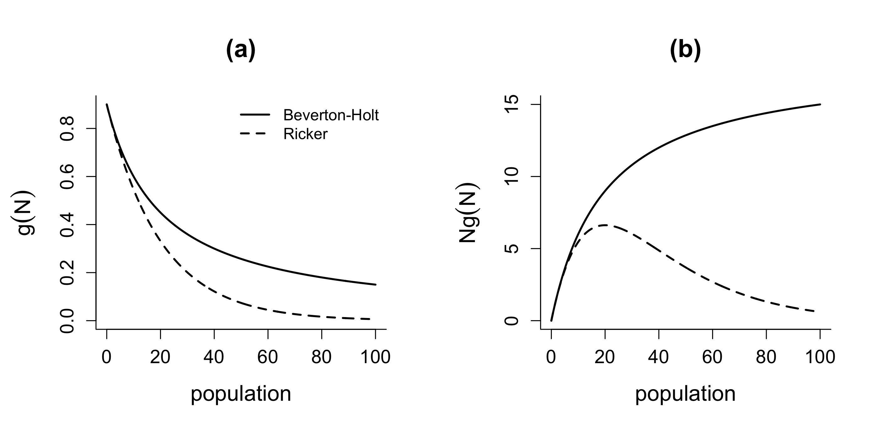
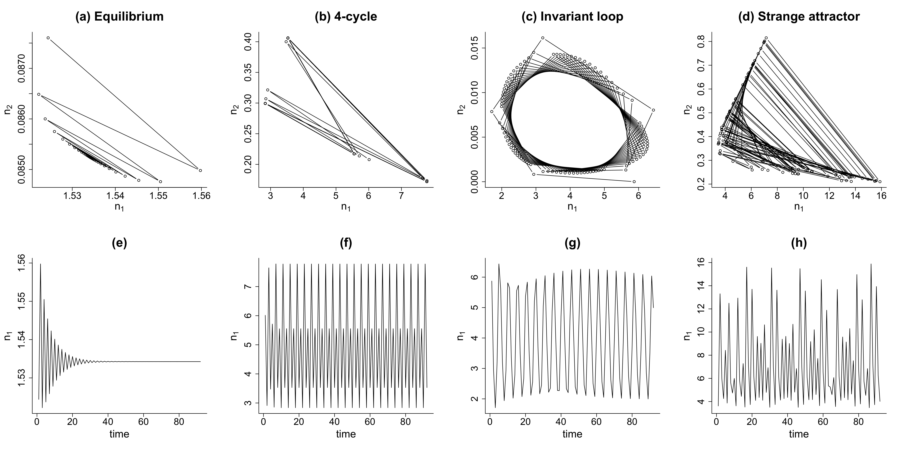

---
output:
  html_document: default
  pdf_document: default
---

## Density-dependence in matrix models

As populations increase in size, they compete for limited resources and become targets of predators. This leads to lower rates of survival and reproduction, which can be represented by linking vital rates to population density. Similar to the unstructured models we discussed in the first chapter, it is necessary to incorporate density dependence into a structured model. However, there are two main factors that make it more difficult to consider density dependence in a structured model (Morris and Doak, 2002):

- In reality, we have much less data for vital-rate estimates in a demographic study as we have in a long-term population census due to the cost of marking and following multiple individuals.

- There are many more variables that are potentially density-dependent, and here are some questions we need to think about:
  - What vital rates are density-dependent?
  - How do those rates change with density?
  - Which classes contribute to the density that each vital rate "feels"?

Typically, we won't compare various density-dependent functions that are fitted to each vital rate by using multiple combinations of classes to measure density. Here, we will introduce two more practical ways.


### Placing a limit on the size of one or more classes

When the focal species is territorial, the most common way to introduce density dependence is by implementing caps (or limits) on population density. A reasonable cap on the territory-holding individuals, usually the breeding adults, can be estimated by dividing the total available area of habitat by the average territory size needed (for breeding). Setting such a cap can make the transition from the pre-reproductive to productive stages density-dependent, even if no other vital rates experience density-dependence.

#### Exmaple on Iberian lynx

Gaona _et al_. (1998) investigated the population dynamics of Iberian lynx in Donana National Park in Spain, and here we present a simplified illustration (Morris and Doak, 2002), in which we track only four stages of female lynx

- cubs (newborn)
- juveniles (one year old)
- floaters (old enough to breed but not in possession of a territory)
- breeders (territory-holding)

,_Almuradiel,_Ciudad_Real,_España,_2021-12-19,_DD_02.jpg), [Creative Commons CC BY-SA-4.0 license](https://creativecommons.org/licenses/by-sa/4.0/)](iberian_lynx.jpg){width=50%}

The projection matrix $\mathbf{A}$ is defined as follows
$$\mathbf{A}=\begin{bmatrix}0 & 0 & 0 & f_4s_4\\s_1 & 0 & 0 & 0\\0 & s_2(1-g) & s_3(1-g) & 0\\0 & s_2g & s_3g & s_4\end{bmatrix},$$
where $s_i$ is the survival rate of stage $i$, $f_4$ is the average number of female cubs produced by a breeder. We let $K$ be the maximum number of territories. $g$ is the probability that a juvenile or a floater will acquire a territory (for breeding) next year, which accounts for density dependence and is defined as follows:
$$g=\frac{K-s_4n_4(t)}{s_2n_2(t)+s_3n_3(t)}.$$
It's not hard to notice that $g$ decreases when $n_2$, $n_3$ and $n_4$ increase. When applying this method, we should also notice the following two points:

- $n_4$ should always be no larger than $K$. So if $n_4(t)>K$, we should let $n_4(t)=K$, and update $n_3(t)$ with $n_3(t)+K-n_4(t)$.
- With the first point, we always have $g\geq 0$. It is still possible that $g>1$, which is achieved when $K-s_4n_4(t)>s_2n_2(t)+s_3n_3(t)$. So we should always update $g$ with $\min\{g,1\}$.

The R code below shows how thr breeder population and the total population change when the maximum number of territories $K$ is introduced:

```r
s1 <- 0.2
s2 <- 0.7
s3 <- 0.7
s4 <- 0.86
# Reproduction of a female breeder is calculated as
# (sex ratio)*(breeding prob)*(avg number of offsprings)
# We change the avg number of offsprings compared to Morris and Doak (2002) for better illustration
f4 <- 0.5*0.6*4
K <- 6

n <- matrix(0, nrow = 4, ncol = 51)
n[, 1] <- c(4, 2, 0, 5)
n_total <- replicate(51, 0)
n_total[1] <- 4+2+0+5

for (t in 1:50) {
  # Force n4 to be at most K
  if (n[4, t] > K) {
    n[4, t] <- K
    n[3, t] <- n[3, t] + (K - n[4, t])
  }
  
  g <- (k - s4*n[4, t])/(s2*n[2, t] + s3*n[3, t])
  
  # Clip g between 0 and 1
  if (g > 1) {
    g <- 1
  }
  
  A.data <- c(0, 0, 0, f4*s4,
              s1, 0, 0, 0,
              0, s2*(1-g), s3*(1-g), 0,
              0, s2*g, s3*g, s4)
  A <- matrix(A.data, nrow = 4, ncol = 4, byrow = TRUE)
  n[, t+1] <- A %*% n[, t]
  n_total[t+1] <- sum(n[, t+1])
}

# Plot the trajectories for the breeder population and the total population
plot(n[4, ], type="b", pch=1, col=1, bty="l", cex.lab=1.2,
     lty=c(1), main = '(a)',
     xlab='year', ylab='population')

plot(n_total, type="b", pch=1, col=1, bty="l", cex.lab=1.2,
     lty=c(1), main = '(b)',
     xlab='year', ylab='population')
```


### Incorporating density-dependent functions for particular vital rates

In an unstructured model, we can define a density-dependent model with a differential equation (continuous)
$$\frac{dN}{dt}=Ng(N),$$
or a difference equation (discrete)
$$N_{t+1}=N_t+N_tg(N_t)$$
where the per capita growth rate $g(N)$ depends on the population density $N$. Two most famous candidates for $g(N)$ are

- Beverton-Holt function: $g(N)=\frac{\alpha}{1+\beta N}$,
- Ricker function: $g(N)=\alpha e^{-\beta N}.$



Similarly, for a stage-structured model, we can also assume that one or more vital rates depend on the number of individuals in one or more stages. Let's start with the simplest case. Consider a two-stage model defined by the matrix
$$\mathbf{A}=\begin{bmatrix}\sigma_1(1-\gamma) & \phi\\\sigma_1\gamma & \sigma_2\end{bmatrix},$$
where $\sigma_1$ and $\sigma_2$ are survival rate at each stage, $\gamma$ is the growth rate from stage 1 to stage 2, and $\phi$ is the fecundity rate from stage 2 to stage 1. Here we follow the settings in Caswell (2001), but there is no difference between this and using a single variable to represent each transition rate.

Let's assume that vital rates are affected by the total population $N=n_1+n_2$. Here are some possible density-dependent vital rates, using the Ricker function:

- _Density-dependent fecundity_: $\phi\to\phi e^{-bN}$
- _Density-dependent survival_: $\sigma_i\to \sigma_i e^{-bN},\ i\in\{1,2\}$
- _Density-dependent growth_: $\gamma\to \gamma e^{-bN}$
- Combinations of the above rates


#### Examples with density-dependent fecundity/growth

Remember that when populations growing according to the discrete logistic equation could show different dynamics (smooth approach, damped oscillations, limit cycle and chaos) with different parameter values? Such phenomena exist in a density-dependent matrix model as well.

We present an example with density-dependent fecundity where $\phi(N)=\phi e^{-N}$, and an example with density-dependent growth where $\gamma(N)=\gamma e^{-N}$. We test different values of $\phi=50,500,1800$ for the density-dependent fecundity model and $\phi=300$ for the density-dependent growth model. Other parameters are $\sigma_1=0.5$, $\sigma_2=0.1$ and $\gamma=0.1$.

```r
n1 <- matrix(0, nrow = 2, ncol = 101)
n2 <- matrix(0, nrow = 2, ncol = 101)
n3 <- matrix(0, nrow = 2, ncol = 101)
n4 <- matrix(0, nrow = 2, ncol = 101)
n1[, 1] <- c(6, 4)
n2[, 1] <- c(6, 4)
n3[, 1] <- c(6, 4)
n4[, 1] <- c(6, 4)

for (t in 1:100) {
  A1 <- matrix(c(0.45, 50*exp(-sum(n1[,t])), 0.05, 0.1),
               nrow = 2, ncol = 2, byrow = TRUE)
  A2 <- matrix(c(0.45, 500*exp(-sum(n2[,t])), 0.05, 0.1),
               nrow = 2, ncol = 2, byrow = TRUE)
  A3 <- matrix(c(0.5*(1-0.1*exp(-sum(n3[,t]))), 300, 
                 0.5*0.1*exp(-sum(n3[,t])), 0.1),
               nrow = 2, ncol = 2, byrow = TRUE)
  A4 <- matrix(c(0.45, 1800*exp(-sum(n4[,t])), 0.05, 0.1),
               nrow = 2, ncol = 2, byrow = TRUE)
  n1[, t+1] <- A1 %*% n1[, t]
  n2[, t+1] <- A2 %*% n2[, t]
  n3[, t+1] <- A3 %*% n3[, t]
  n4[, t+1] <- A4 %*% n4[, t]
}

# Plot
plot(n1[1, 10:101], n1[2, 10:101], type="b", pch=1, col=1,
     bty="l", cex.lab=1.2, lty=1, main = '(a) Equilibrium',
     xlab=expression(n[1]), ylab=expression(n[2]))

plot(n1[1, 10:101], type="l", pch=1, col=1, bty="l", cex.lab=1.2,
     lty=1, main = '(b)',
     xlab='time', ylab=expression(n[1]))

plot(n2[1, 10:101], n2[2, 10:101], type="b", pch=1, col=1,
     bty="l", cex.lab=1.2, lty=1, main = '(c) 4-cycle',
     xlab=expression(n[1]), ylab=expression(n[2]))

plot(n2[1, 10:101], type="l", pch=1, col=1, bty="l", cex.lab=1.2,
     lty=1, main = '(d)',
     xlab='time', ylab=expression(n[1]))

plot(n3[1, 10:101], n3[2, 10:101], type="b", pch=1, col=1,
     bty="l", cex.lab=1.2, lty=1, main = '(e) Invariant loop',
     xlab=expression(n[1]), ylab=expression(n[2]))

plot(n3[1, 10:101], type="l", pch=1, col=1, bty="l", cex.lab=1.2,
     lty=1, main = '(f)',
     xlab='time', ylab=expression(n[1]))

plot(n4[1, 10:101], n4[2, 10:101], type="b", pch=1, col=1,
     bty="l", cex.lab=1.2, lty=1, main = '(g) Strange attractor',
     xlab=expression(n[1]), ylab=expression(n[2]))

plot(n4[1, 10:101], type="l", pch=1, col=1, bty="l", cex.lab=1.2,
     lty=1, main = '(h)',
     xlab='time', ylab=expression(n[1]))
```

{width=75%}


### Illustration of current application: Lake sturgeon population

Here we present a recent study on lake sturgeon population with density-dependent effects:

Burchfield, J.D., McLaren, B.E., and McLeod D.T. (2022). Sensitivity analysis of a lake sturgeon population with early life stage density-dependent effects, _Canadian Journal of Fisheries and Aquatic Sciences_, _79_(11), 1992-2005.

.jpg), Public domain](lake_sturgeon.jpg)

The authors composed a Lefkovitch projection matrix (Lefkovitch, 1965) with six stages: age-0, juvenile, early subadult, late subadult, early adult and late adult, with the following projection matrix
$$\mathbf{A}=\begin{bmatrix}0 & 0 & 0 & S_3G_3f_4 & S_4(1-G_4)f_4+S_4G_4f_5 & S_5(1-G_5)f_5\\S_0G_0 & S_1(1-G_1) & 0 & 0 & 0 & 0\\0 & S_1G_1 & S_2(1-G_2) & 0 & 0 & 0\\0 & 0 & S_2G_2 & S_3(1-G_3) & 0 & 0\\0 & 0 & 0 & S_3G_3 & S_4(1-G_4) & 0\\0 & 0 & 0 & 0 & S_4G_4 & S_5(1-G_5)\end{bmatrix},$$
where $S_i$ is the survival rate at stage $i$, $G_i$ is the transition rate from stage $i$ to stage $i+1$, and $f_i$ is the fecundity rate (only for adults). Density dependence is introduced with a Ricker function on $G_0$
$$G_0=\exp\left[r\left(1-\frac{S_0n_0+S_1n_1}{K_j}\right)\right],$$
where $K_j$ is the juvenile carrying capacity. Here is a sample simulation code (with parameter values presented in the paper).

```r
n <- matrix(0, nrow = 6, ncol = 151)
n[, 1] <- c(0, 0, 0, 0, 10, 0)
S <- c(2.665/100, 65.55/100, 77.45/100,
       77.45/100, 94.8/100, 94.8/100)
D <- c(1, 7, 8, 8, 24, 22)
f <- c(0, 0, 0, 0, 13166, 31656)
K1 <- 9280

for (t in 1:150) {
  G0 <- exp(2.3*(1-(S[1]*n[1,t]+S[2]*n[2,t])/K1))
  G1 <- growth(S[2], D[2])
  G2 <- growth(S[3], D[3])
  G3 <- growth(S[4], D[4])
  G4 <- growth(S[5], D[5])
  G5 <- growth(S[6], D[6])
  A <- matrix(c(0, 0, 0, S[4]*G3*f[5], S[5]*(1-G4)*f[5]+S[5]*G4*f[6], S[6]*(1-G5)*f[6],
                S[1]*G0, S[2]*(1-G1), 0, 0, 0, 0,
                0, S[2]*G1, S[3]*(1-G2), 0, 0, 0,
                0, 0, S[3]*G2, S[4]*(1-G3), 0, 0,
                0, 0, 0, S[4]*G3, S[5]*(1-G4), 0,
                0, 0, 0, 0, S[5]*G4, S[6]*(1-G5)),
              nrow = 6, ncol = 6, byrow = TRUE)
  n[, t+1] <- A %*% n[, t]
}

# Plot population trajectories of early and late adults
plot(n[5, ], type="l", pch=1, col=1,
     bty="l", cex.lab=1.2, lty=1,
     xlab='years', ylab='population', ylim=c(0,35))
lines(n[6, ], type="l", lty=2)
legend(x = "topright", bty="n",
       legend = c('Early adult', 'Late adult'),
       col=c(1,1), lty=c(1,2), cex=0.8)
```


#### Snapshot of the study

- In this study, density dependence is limited to the juvenile stage. The adult population stabilizes at an equilibrium proportional to the juvenile carrying capacity. The authors also argued that varying juvenile carrying capacity in the model affects the equilibrium abundance of adults in a slow process.

- The authors emphasized the importance of including a density-dependent factor in the modeling of the lake sturgeon's early life stages because it restricts the population's unlimited exponential growth. This highlights the need for caution when using density-dependent models to estimate the time it will take for the population to recover and increase.


### References

Caswell, H. (2001). _Matrix Population Models: Construction, Analysis, and Interpretation_. 2nd ed. Sinauer Associates, Sunderland, MA. 

Gaona, P., Ferreras, P., and Delibes, M. (1998). Dynamics and viability of a metapopulation of the endangered Iberian lynx (Lynx pardinus). _Ecological Monographs_, _68_(3), 349-370.

Lefkovitch, L.P. (1965). The study of population growth in organisms grouped by stages. _Biometrics_, _21_, 1–18.

Leslie, P.H. (1945). On the use of matrices in certain population mathematics. _Biometrika 33_, 183-212.

Morris, W.F. and Doak, D.F. (2002). _Quantitative Conservation Biology_. Sinauer, Sunderland, MA.
