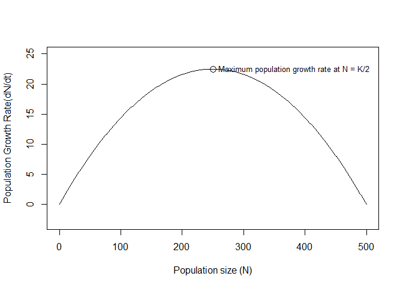
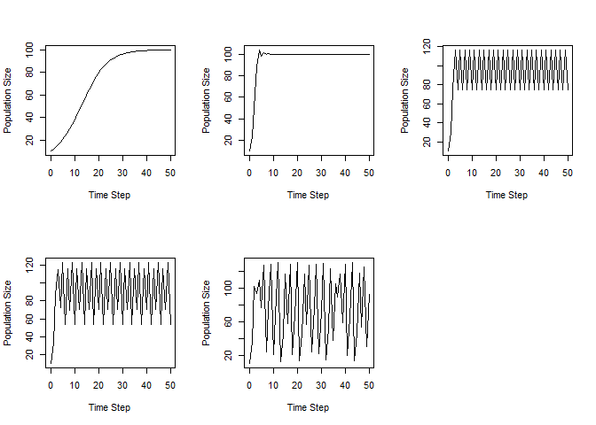
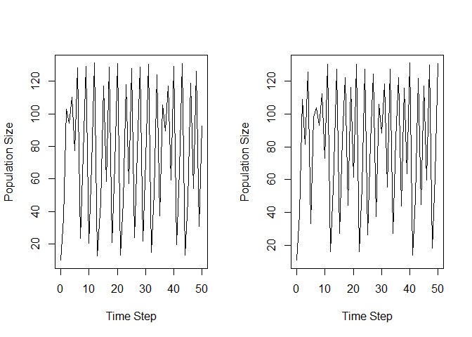
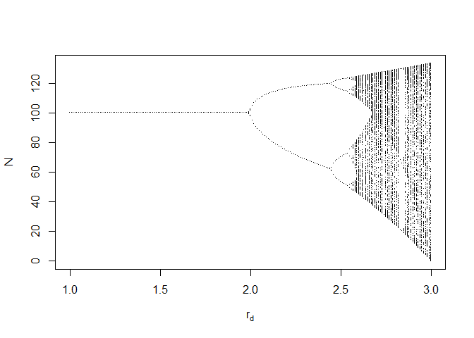
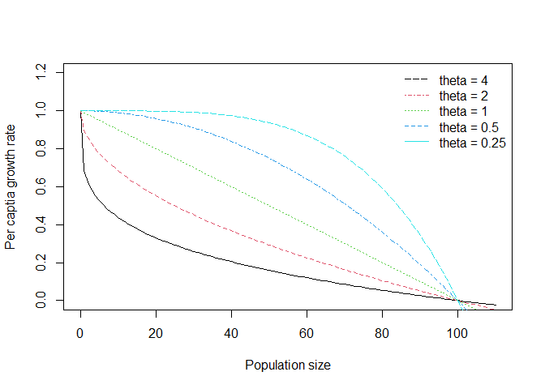
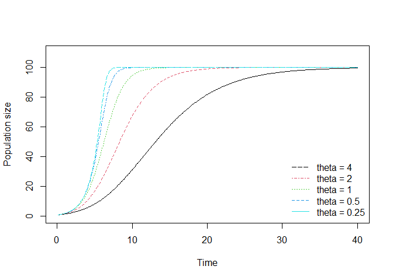
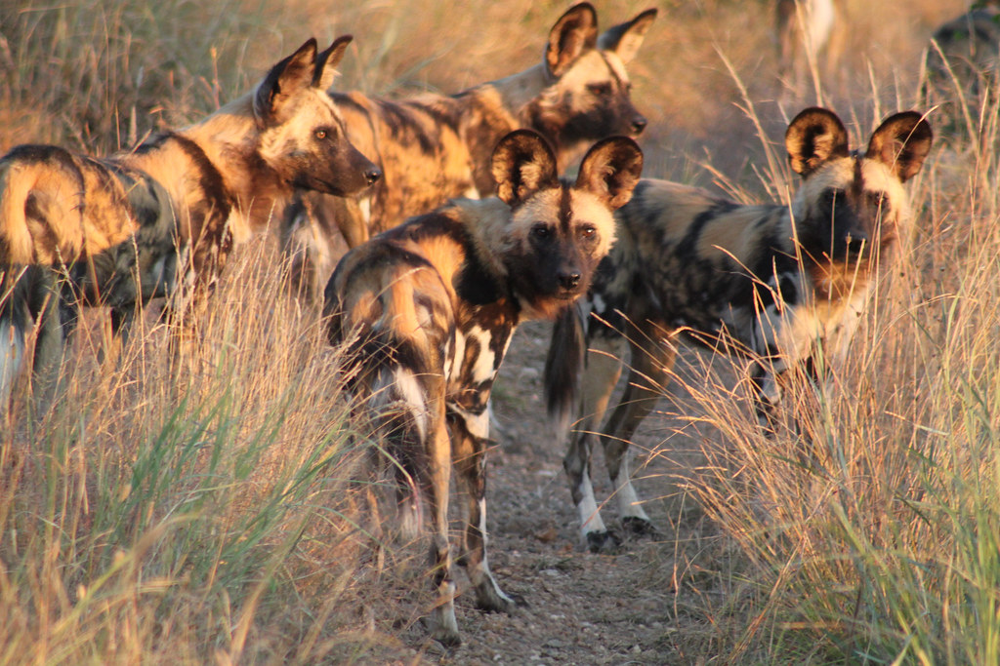
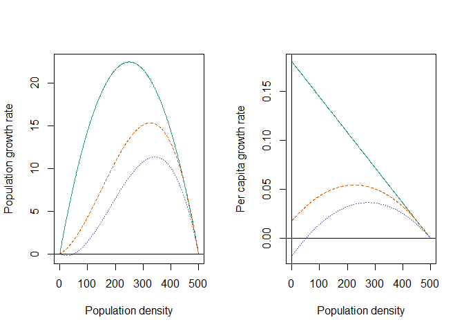

## Density dependence

Density-dependent population models are used to describe population dynamics in which the growth or decline of a population is influenced by the population's own density.

### Continuous logistic growth

A population growth model may be defined as continuous population growth model if the individuals of a population show continuous breeding season. 

####  Negative density dependence

* The previously discussed scenario where population growth is unregulated does not always happen in reality. In fact, in a population that has already been established, resources begin to become scarce, and competition starts to play a role. As a result, the population growth will be regulated by increasing density. This is called **negative density dependence**.

* Increasing population size gives rise to:

  + shortages in food or other limiting resources

  + greater intraspecific aggression

  + increased predation risks
  
  + greater risks of disease outbreak

* Negative density dependence decreases population growth at high density and increases it at low density

<!-- -->  
The constrast between exponential and logistic growth. In expoential growth, the per capita growth rate stays constant. In logistic growth, the per capita growth rate decreases with population density (adapted from Mills, 2013)

##### "K": carrying capacity

* **Definition**: Population density at which per capita growth rate is zero

* **Note**: Do not think of carrying capacity as the maximum population size observed. A population can exceed K temporarily.

The carrying capacity is considered to be an equilibrium. This equilibrium happens because, when population density is greater than K, mortality exceeds reproduction and the population will decrease to K; when density is less than K, reproduction exceeds mortality and the population increases toward K.

(*insert the duckweed example on carrying capacity*)

With all these concepts, now we should look at the logistic population model.

##### Logistic growth model

Recall that with exponential growth, per capita growth rate is:

$$ r = \frac{dN}{dtN} $$

Of all the ways that the per capita growth rate could decrease with increasing population density, we consider the simplest scenario in which this relationship is linear. Now we have:

$$ \frac{dN}{dtN} = r_0(1-\frac{N}{K})$$

where $1-\frac{N}{K}$ describes the negative effects an increasing population density has on the per capita growth rate.

Re-arrange the above equation and we have the **continuous logistic growth model**:

$$ \frac{dN}{dt} = r \frac{K-N}{K} N $$

* $dN/dt$: The net number of new individuals in a population over a unit of time (also called recruitment or yield)

* $r$: Intrinsic growth rate

* $N$: Population size

* $K$: Carrying capacity

* $K-N$: How many more individuals can be added to the population before it hits carrying capacity

* $K-N/K$: The fraction of the carrying capacity that has not yet been “used up"

##### Maximum sustained yield

The **maximum sustained yield** is achieved at $N=K/2$, when the recruitment ($dN/dt$) of new individuals is maximized.

* At low population density, although growth is essentially exponential, the small number of breeders means that few individuals are born so that the overall $dN/dt$ is small

* At high population density (near $K$), $dN/dt$ is also small because negative density dependence is reducing the per capita growth rate

<!-- -->  
Recruitment for a population growing with logistic growth ($r=0.18$) and a carrying capacity of 500. Recruitment is maximized when $N=K/2$.

#### Stability

The **stability** of a system is a measure of how much it tends to stay the same, in spite of external disturbances or changes in the state of the system.

To find the equilibrium point of a logistic growth model, consider the following example (figure below):

* We have a population that has a carrying capacity $K=500$ and intrinsic growth rate $r=0.18$.

* When the population growth rate $dN/dt$, which is zero at equilibrium, becomes positive or negative in response to a small change in N. If this change results in a shrinking of that change back towards the equilibrium, that demonstrates stability. On the other hand, if this change results in
growth and a bigger step, that demonstrates instability.

<!-- -->
Population growth rate, $dN=dt$, as a function of $N$. Data points are chosen arbitrarily for analysis. Arrows are pointing to the stable equilibrium point at carrying capacity (adapted from Stevens, 2009)

* When the population number is at 100 (point b) or 200 (point c), the population will grow, moving along the x-axis, until population growth rate slows so much that it comes to rest where $N=K=500$

* When the population number is at 550 (point e), $dN/dt$ is negative, so $N$ shrinks back down to $N=K=500$

* When population number is at 0 (point a) or 500 (point d), the population growth rate is at zero so that the density will not change

From the above analysis, we can conclude that: A logistic population growth model is a system with stability, and carrying capacity $K$ is the stable equilibrium point. Any disturbance may cause the population size $N$ to deviate from it.

### Discrete logistic growth

For many populations, reproduction and mortality occur at very particular periods of the year (in discrete intervals of time).

#### Discrete logistic equation

To model discrete logistic population growth, we start from recalling our model of geometric growth for a single time step:

$$ N_{t+1} = \lambda N_t$$

We can decompose $\lambda$ into two parts to illustrate that this year's population density $N_t+1$ is equal to the previous year's population, $N_t$, plus a proportional change, $r_dN_t$:

$$N_{t+1} = \lambda N_t = N_t(1+r_d) = N_t+r_dN_t$$

Now we can try to incorporate density dependence into that proportional change $r_dN_t$. We use $\alpha$ to represent this negative effect on population growth. As a result, $r_d(1- \alpha N_t)$ becomes the new per capita growth increment rate.

And our population growth equation becomes:

$$N_{t+1} = N_t+r_d(1- \alpha N_t)N_t$$

A common alternative representation uses $1/ \alpha$ symbolized as K, the carrying capacity. And we have an equation that describes **discrete logistic growth**:

$$ N_{t+1} = N_t+r_d(1- \frac{N_t}{K})N_t = N_t+r(1-\frac {N_t}{K})N_t $$

* From the equation, we can see that the population abundance at time $t+1$ depend on the abundance at time t. This time lag makes sense for many populations, where birth and death rates respond to the population's density at some time in the past, instead of current density.

#### Chaos

Populations growing with absolutely no stochasticity could show dynamics that bounce, or cycle, or become entirely unpredictable.

 
Let's look at the following example:

We have a population that has an initial population density of $N=10$, and carrying capacity $K=100$. With different values of $r$, we can see very different population growth trajectories.

<!-- -->
Chaotic dynamics arise from deterministic discrete logistic growth (adapted from Mills, 2013)

When $r$ is close to zero, we have a steady simple asymptotic approach to K (Fig. a). As $r$ increases, we see the population overshoot the carrying capacity and exhibit **damped oscillations** (Fig. b). At $r=2.2$, we see a stable limit cycle of two points (Fig. c). As $r$ increases further, the number of points increases to a four-point limit cycle (e.g., at $r=2.5$, Fig. d), then an eight-point cycle, a 16-point limit cycle, and so on. As rd increases further, however, stable limit cycles shift into chaos (Fig. e).

 
**Chaos** is a non-repeating, deterministic fluctuating trajectory, that is bounded, and sensitive to initial conditions.

How does chaos happen?

* The discrete logistic model has a built in delay, or time lag, of one time step, because the growth increment makes a single leap of one time step. Therefore, the negative effects of the actions of individuals (e.g., resource consumption) are felt by the offspring of those individuals, rather than the individuals themselves

* Note that chaos is different from stochasticity or randomness. If you start with exactly the same initial conditions under chaotic dynamics, you will get exactly the same population trajectories every time

Chaos is **very sensitive to initial conditions**. Slightly changing the initial population number $N_0$ would result in very distinct results.

* Here we start with two populations that have initial size of 10 and 11 (all other parameters remain the same). As shown on the graph below, we see completely different trajectories for population growth.

<!-- -->
Chaotic dynamics with different initial conditions (adapted from Mills, 2012).

**Bifurcation Graph**
We can also demonstrate the chaotic dynamics using a bifurcation plot, which examines $N$ as a function of $r_d$. As $r_d$ increases the number of $N$ will continue to double, growing geometrically. Eventually, we reach a point when there becomes an infinite number of unique points.

<!-- -->
Figure 1.6 Illustration of the long term dynamics of discrete logistic population growth. (Stevens, 2009)

**Biological significance of chaos in population growth**

Chaos brings more complexity into predicting population growth, especially for species with relatively large $r_d$ value. For example, for temperate-zone insects in particular, even if the natural world was 100 % predictable, the population dynamics could still in some circumstances be indistinguishable from chaos (Mays, 1975).

### Other types of density denpendent population models

The linear decline in per-capital growth rate with density modeled above is not necessarily general. In fact, most species exhibit **nonlinear** declines in growth rate under negative density dependence.

#### Concave and convex density dependences

* **Concave density dependence**: Per-capita population growth rate declines rapidly at low density, and then flattens out as carrying capacity is approached. This could happen due to resource preemption, where a small of individuals at low population density sequester large amounts of resources, causing subsequent population growth to slow down. For example, larger tropical seagrass arriving at sites would preempy available space to prevent subsequent individuals from competing for these resources (Moreira-Saporiti et al., 2021)

* **Convex density dependence**: Per-capita population growth rate exhibit strong density dependence only near K. This could be related to territoriality. For example, dickcissel birds (*Spiza americana*) need a minimum territory size of approximately 0.9 acres. If male density is greater than this, some males will be forced into territories that contain less suitable vegetation and they are found to be less active in finding mates and building nests. As a result, the per capita growth rate will decline more rapidly compared to before (Zimmerman, 1971)

#### Theta-Ricker model

A varity of alternative equations exist to model concave or convex relationships. A simple model we introduce here is the Theta-Ricker model. By varying $\theta$, we can change the linear density dependence of the simple logistic model to curvi-linear density dependence.

$$ N_{t+1} = N_t e^{r_0[1-(N_t/K)^\theta]} $$

* The effects of $\theta$ on density dependence also control the shape of relation between growth rate and population size, as seen in the following figure:

<!-- -->
Per capital growth rate vs. population size with different theta values

* When $\theta$>1, this weakens density dependence at low N, so the population grows faster than logistic, all else being equal (concave). When $\theta$<1, this strengthens density dependence at low N, causing the population to grow more slowly than logistic, all else being equal (convex):

<!-- -->
Population size vs. time with different theta values

#### Positive density dependence

In many cases, cooperation or facilitation leads to mutually positive interactions among members of a population

**Positive density dependence** occurs when vital rates or populations increase as density increases

##### Allee effect

Allee initially noticed that goldfish grew faster in waters which had previously contained other goldfish, than in waters that had not contained them. He further experimented with a number of different species and showed that larger group size or some degree of crowding may stimulate reproduction, prolong survival in adverse conditions (through resistance to desiccation or by social thermoregulation), and enhance protection from toxic reagents (Allee & Bowen, 1932).

**The Allee effect**

* Demonstrates that there is a positive correlation between population density and individual fitness

* Occurs at very low population sizes (growth rate is reduced when population is too small)

**Example**

* African wild dogs usually live in a pack of 6-20 individuals

* Increasing pack size can:

  + increase the likelihood of a successful kill in a given hunt
  
  + provide a better predator defense
  
  + help babysit pups (packs with 10 or more adults raised three times as many yearlings compared to packs with 9 or fewer adults)
  

To plot population growth rate as a function of abundance:

$$ \frac{dN}{dt} = rN(\frac{N-a}{K})(1-\frac{N}{K})$$
where a is the critical point of the population, below which the population growth rate (or recruitment) becomes negative, and the population is driven towards extinction.

##### Weak and strong Allee effects

* **Weak Allee effects**: A weak Allee effect is where the population growth rate is small but positive for small N. The population does not contain a critical population size or density under which the growth rate becomes negative

* **Strong Allee effects**: A strong Allee effect describes a population that can grow at intermediate population densities but declines when the number of organisms is either too small or too large

* **Allee effect population threshold**: A population size below which the per capita growth rate is negative and the population declines towards extinction. Populations that are subject to Allee effects can collapse and become extinct if their population size falls below the critical threshold

<!-- -->  
No allee effects (green line), weak allee effects (red line), and strong allee affects (blue line, $a=50$) acting on a population that has an intrinsic population growth rate $r=0.18$ and carrying capacity $K=500$

##### Stability in Allee effects

From previous sections we learned that carrying capacity $K$ is a stable equilibrium point in a negative density-dependent logistic growth model (no Allee effects). The results will stay the same when we introduce allee effects into our population (strong or weak).

However, when allee effects are strong, a critical size occurs where the growth function $dN/dt$ intersects the horizontal line at zero. This is an unstable equilibrium. Populations with abundance greater than this value will increase to carrying capacity; populations with abundance less than this value will decline to extinction.

### Illustration of current application: research paper review

Title: Density-dependent growth in brown trout: Effects of introducing wild and hatchery fish (Bohlin et al., 2002).

#### Research questions

* What is the underlining density dependence mechanism in wild brown trout?

* To what extent will the release of domesticated brown trout induce density-dependent effects on wild brown trout populations?

#### Research snapshot

* Density can affect growth in both underyearlings and older brown trout. These effects were very similar regardless of what treatment groups these competitors belong to (whether they are wild or hatchery-reared)

* Wild resident brown trout showed restricted movement in small streams; while hatchery trout tended to move more when introduced into the wild

* Wild resident brown trout showed an prior residence advantage over hatchery-reared brown trout. Hatchery-reared brown trout ate less and were less efficient in consuming novel prey, despite their larger body size. These differences disappeared after a few weeks in the wild

#### Conclusions

* Competition originating from increasing population density is not only limited to underyearlings brown trout. Density-dependent growth is the main density-dependent response in yearling trout

* Stocking of hatchery fish can exert similar negative density effects on wild individuals if released into the wild

### References:
Allee, W. C., & Bowen, E. (1932). Studies in animal aggregations: Mass protection against colloidal silver among goldfishes. *The Journal of Experimental Zoology 61* (2), 185–207. https://doi.org/10.1002/jez.1400610202.

Bohlin, T., Sundström, L., Johnsson, J., Höjesjö, J., & Pettersson, J. (2002). Density-dependent growth in brown trout: Effects of introducing wild and hatchery fish. *Journal of Animal Ecology 71*(4), 683–92. https://doi.org/10.1046/j.1365-2656.2002.00631.x.

Courchamp, F., Luděk, B., & Gascoigne, J. (2008). *Allee effects in ecology and conservation*. Oxford Biology. Oxford; Oxford University Press.

Drake, J., & Kramer, A. (2011). Allee effects. *Nature Education Knowledge*. https://www.nature.com/scitable/knowledge/library/allee-effects-19699394/.

May, Robert M. (1975). Biological populations obeying difference equations: stable points, stable cycles, and chaos. *Journal of Theoretical Biology 51*(2), 511–24. https://doi.org/10.1016/0022-5193(75)90078-8.

Mills, L. S. (2013). *Conservation of wildlife populations: demography, genetics, and management*. 2nd ed. Chichester, West Sussex; Wiley-Blackwell.

Moreira-Saporiti, A., Bejarano, S., Viana, I., Belshe, E., Mtolera M., & Teichberg, M. (2021). Local victory: Assessing interspecific competition in seagrass from a trait-based perspective. *Frontiers in Plant Science 12*, 709257–57. https://doi.org/10.3389/fpls.2021.709257.

Stevens, M., Henry H. (2009). *A primer of ecology with R. Use R!* Dordrecht: Springer.

Zimmerman, John L. (1971). The territory and its density dependent effect in *Spiza americana*. *The Auk 88*(3), 591–612.
