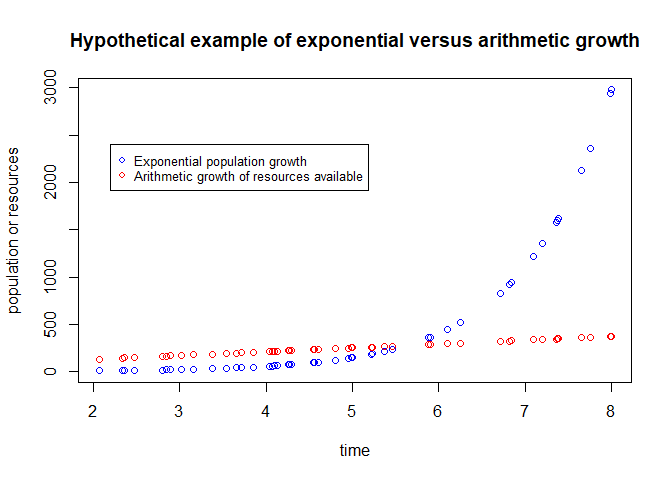
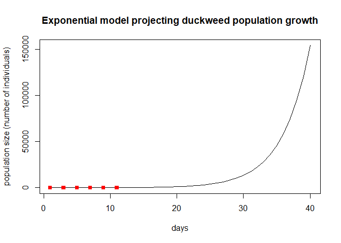
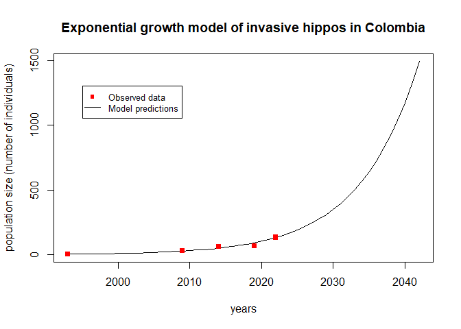

# **Module 1: Unstructured Population Models**

## Introduction

This module covers the most simple models to predict the dynamics of populations, such as **exponential models**. Next, **stochasticity**, or random effects, is approached as affecting population dynamics. Then, **density-dependency** is introduced as a phenomena that takes place when the amount of individuals present in a given population interferes with the growth rate of that population. Lastly, you will learn techniques to compare models to data and perform **model assessment**.   

## Learning outcomes

* Develop practical skills to independently run a model using your own data based on relevant theory and codes
* Assess the results of population models to analyze a problem of your interest
* Distinguish and compare several models and select the most appropriate model according to the life history of organisms and available data 

### What is a population model?

A population model consists of mathematical equations (eg., exponential and logistic) which represent patterns of growth, reduction, or stabilization of a given population.

### Basic types of population models

* **Unstructured population model**: This model does not distinguish individuals counted as part of a given population.

* **Structured population model**: In this type of model, individuals are categorized (eg., by age) and then counted.

* **Density-independent model**: In more simple population models, the amount of individuals present at a given time do not interfere with reproduction success.

* **Density-dependent model**: This model considers that the growth rate of a given population depends on the amount of individuals living at a given time.

## Simple models of population dynamics

### Historical facts

In 1798, Thomas Malthus published *An Essay on the Principle of Population* (Malthus, 1798). This work distinguished arithmetic and geometric growth, with human populations characterized by a geometric (or exponential; the difference between them will be covered soon) growth while food resources were restricted to an arithmetic pattern of growth.

, [Creative Commons  CC-BY-SA-3.0 license](https://creativecommons.org/licenses/by-sa/3.0/)](https://raw.github.com/kcudding/kcudding.github.io/main/teach/malthus.png) 

Let's plot an illustration to differentiate both types of growth:

```r
# Generate random numbers from an uniform distribution (runif(n, min, max))
x <- runif(50,2,8)

# Plot hypothetical exponential and linear growth patterns
plot(x,exp(x), lty=1, col = "blue", main="Hypothetical example of exponential versus arithmetic growth", xlab="time", 
     ylab="population or resources")
points(x,50+(40*x),col="red")
legend(2.2, 2400, legend=c("Exponential population growth", "Arithmetic growth of resources available"),
       col=c("blue", "red"), cex=0.8, pch=c(21,1))
```

<!-- -->

* The main difference between these two types of growth is that an arithmetic growth is characterized by the addition or subtraction of a fixed value (eg. we added "50" in our linear growth example above, which could represent agricultural yields, for instance).

* Meanwhile, geometric and exponential growths are multiplicative processes in which a fixed rate of change is applied to population sizes at all time steps. 

### When are simple population models used in biological analyses?

Now let's see when simple models such as the exponential growth model are used in biology. Are there real situations where an uncontrolled growth can be understood through such models? In some situations, we can disregard factors which limit the growth of populations, such as resource availability, interactions between species, and relocation of individuals. Here are some examples:

* **Experimental settings**: In lab conditions, we remove as many factors as possible which could potentially interfere with the growth of our model species, so that we can focus on understanding the effects of our selected explanatory variables during experiments. In our lab, we work with duckweeds, a group of small aquatic plant species. In the photos below, you can see the difference between natural and lab conditions. In lab settings, duckweeds can achieve unlimited growth which can be modelled by exponential growth models. This is because a single species is selected and sterilized, eliminating potential sources of disease and all of the competition naturally seen between duckweed species (different sizes of fronds - leaf-like shapes - represent different duckweed species), and with other species, such as algae. In labs, other factors are also controlled to provide optimal conditions, such as light, nutrition, and temperature.

 

* **Expanding invasive species**: Following the introduction of an invasive species, its spread is enabled by an exponential population growth (Shigesada & Kawasaki, 1997) due to the availability of resources and/or absence of natural enemies. Spotted knapweeds (*Centaurea nigra*), for example, were accidentally introduced to North America in the 1980s with agricultural seeds and soil discarded from ship ballast from Eurasia. This species is considered problematic because it quickly replaces livestock pasture and reduces biodiversity in affected sites (Minnesota Department of Agriculture, 2023). A modelling study considering the life history of knapweeds found that exponential growth following the introduction of invading populations can be observed for about 2 years (Jacobs & Sheley, 1998). Thus, exponential models are useful for modelling the behaviour of invading species. 

, [Creative Commons CC-BY-SA-2.0 license](https://creativecommons.org/licenses/by-sa/2.0/)](https://raw.github.com/kcudding/kcudding.github.io/main/teach/knapweed.jpg)

* **Management of species at risk of extinction**: Well-managed species will have little limitation to growth due to abundant resources and small population sizes, resulting in exponential growth rates. This was observed following management strategies to recover endangered crane populations in both North America and Japan. Whooping cranes (*Grus americana*) are the largest North American birds which became severely endangered with a population of 21 birds in 1952, as well as the red-crowned crane of Hokkaido (*Grus japonensis*) in Japan, with 33 individuals at this same year. Since then, management efforts such as federal protection and creating wildlife refuges ensured an exponential growth of bird populations, which by 2020 achieved 506 individuals in North America and 1,900 in Japan. The much faster rate at which Japanese cranes are growing is attributed to an additional management strategy consisting of artificially feeding birds during periods of food scarcity which was not implemented in North America (Gronewold, 2021).

, [Creative Commons CC-BY-2.0 license](https://creativecommons.org/licenses/by/2.0/); (right) © Peter Batty, [Red-crowned cranes calling](https://www.flickr.com/photos/ebatty/50772105027), [Creative Commons CC BY-NC-SA 2.0 license](https://creativecommons.org/licenses/by-nc-sa/2.0/)](https://raw.github.com/kcudding/kcudding.github.io/main/teach/cranes.png)

### Mathematical representation of population growth patterns

* Total population considers:
* Births (B)
* Deaths (D)
* Relocations (immigrations [I] and emigrations [E])

* Mathematical representation:
$$N(tomorrow) = N(today) + B - D + I - E$$ 

Where:
N(tomorrow): number of individuals in the future (also called "abundance")
N(today): present number of individuals
B: births
D: deaths
I: immigration
E: emigration


### Geometric growth

#### What is geometric growth?

Geometric growth is a multiplicative process. Simple singled-cell organisms have reproduction processes which result in a geometric population growth: 1 cell divides resulting in 2 cells, 2 cells divide resulting in 4, etc. In this case, the rate of change is equivalent to 2 (each cell divides into two each time). Geometric growth occurs in a discrete time scale, which means that reproduction events occur periodically in time. Annual plants, for example, can be modelled using geometric growth models.

#### Mathematical equation to predict future population sizes

If we assume that the number of births and and deaths is proportional to the current population size, and our population is isolated, we can write:

$$N_{(t+1)}=N_{t}(b_{t}-d_{t})$$

Where:
N(t+1): number of individuals in the future
Nt: number of individuals at time t
bt: per capita birth rate
dt: per capita death rate

#### Working with generation times: Net reproductive rate

R0 (pronounced as "R-naught") is the net reproductive rate which represents the average offspring per individual within a given generation:

$$R_{0}=b_{t}-d_{t}$$

Thus, future population sizes can be calculated by:

$$N_{(t+1)}=N_{t}*R_0$$


```r
# Let's practice: considering that an initial population of 100 individuals and a net 
# reproductive rate of 1.5, what will be the total population size 
# in 4 generations?

Ninitial <- 1000
R0 <- 1.2

# The net reproductive rate is multiplied several times to represent each of the 4 generations:

Nfuture <- (Ninitial*R0)*R0*R0*R0
Nfuture
```

```
## [1] 2073.6
```

Thus, for calculating population sizes at any generation, we have: 

$$N_{t}=N_{0}*(R_0)^t$$

#### From generation time to calendar time: Lambda ($\lambda$) geometric growth rate

If we assume birth rates and death rates are constant through time, we are left with:

$$N_{t+1}=N_{t}*(b-d)$$

We can rename this net rate, $\lambda$, to obtain 

$$N_{t+1}=N_{t}*\lambda$$

Lambda ($\lambda$) is the rate of population change in units of time. The abundance in the next time step is a proportion of the current abundance. 

* $\lambda$ = 1: stationary (no changes in population growth)

* $\lambda$ 1: population is growing

* $\lambda$ < 1: population is shrinking

#### $\lambda$ and proportional population changes

```r
lambda=1.45

#We can calculate how much a population will change in the next time step (eg., next year):
percentage_of_change=(lambda-1)*100
```

```
## [1] 45
```

#### $\lambda$ for calculating future population size

The abundance of a population depends on the current population and on the $\lambda$ rate:

$$N_{t+1}=N_{t}\lambda$$

Where:
N(t+1): population size in the future time
Nt: current population size
$\lambda$: lambda growth rate (discrete or geometric)

#### Obtaining $\lambda$ from population sizes at different time points

Rearranging this last equation, we have:

$$\lambda=N_{t+1}/N_{t}$$

* Example using an annual plant

```r
# We take note of the population growth of a given annual plant at different time periods:
year1 <- 74
year0 <- 35

# Applying the equation above we get the lambda growth rate over the first year period:
lambda <- year1/year0
lambda
```

```
## [1] 2.114286
```

#### Simplifying the future population growth calculation

For several time steps with growth occurring at the same $\lambda$ rate, $\lambda$ would be continuously multiplied by itself (in the same fashion as R0), so we have:

$$N_{t}=N_{0}\lambda^t$$ 

#### Missing data for certain time periods: Average $\lambda$ calculation

When we do not have data for calculating all $\lambda$ over several time periods, we can rearrange the equation we just saw and consider the latest time period available and the first time period:

$$\lambda=(N_{t}/N_{0})^{1/t}$$  


```r
# Here are population numbers for a given plant species at year 2 and year 0:
year2 <- 173
year0 <- 35

# The average yearly lambda is:
lambda <- (year2/year0)^(1/2)
```

### Exponential growth

#### What is exponential growth

For populations which do not reproduce seasonally, an irrestricted growth can be projected using the exponential growth model. Instead of the $\lambda$ rate, the **instantaneous per capita growth rate (r)** is used to represent a constant percentage increase over a continuous time scale. This rate is also useful to compare populations with different intervals of growth.

#### How to calculate the exponential growth rate

Using calculus, very small changes in abundance over time can be obtained by the derivative:

$$dN/dt=rN$$ 
Where:
dN = very small change in abundance
dt = very small change in time
N = present abundance
r = per capita growth rate

#### Abundance over time in a logarithmic scale

If represented in a logarithmic scale, the curve line becomes a straight line, and the slope of the line corresponds to r.

#### Converting between $\lambda$ and r

The natural logarithm of $\lambda$ corresponds to r:

$$r=ln\lambda$$ 
or

$$\lambda=e^r$$ 

While $\lambda$ values greater than 1 represent growing populations, r values greater than 0 correspond to population increases in size.

#### Example using duckweeds

Remember our duckweeds? Due to their fast and asexual growth, they are good model species for population ecology studies. Duckweed population growth can be calculated in a number of ways, such as counting individual fronds (leaf like shape) or measuring the dry weight of specimens. Try to count how many individuals are found in each date in the picture below. Any round-shaped protuberance can be considered as a separate individual.

 


```r
# Let's create a dataframe using the duckweed population counts we have just obtained 
# from the picture above:
duckweed <- data.frame(day=(c(1,3,5,7,9,11)),pop_size=(c(9,12,23,45,68,103)))

# Now, let's calculate the average daily $\lambda$:
lambda <- (duckweed[6, "pop_size"]/duckweed[1, "pop_size"])^(1/(duckweed[6, "day"]-duckweed[1, "day"]))
```

The average daily lambda is 1.28.


```r
# And the r
r<-log(lambda)
```

The intrinsic rate of increase is 0.24. This means that our duckweed populations are growing at an average daily rate of 24.38%.


```r
# And here we simulate the growth of duckweeds over a 40-day period
N0 <- duckweed$pop_size[1]; t <- 1:40
cont.mat <- sapply(r, function(ri) N0 * exp(ri * t))
matplot(t, cont.mat, type = "l", col = 1, 
        main="Exponential model projecting duckweed population growth", 
     xlab="days", ylab="population size (number of individuals)")
points(duckweed$day, duckweed$pop_size,pch=15,col="red")
legend(1995, 1300, legend=c("Observed data", "Model predictions"),
       col=c("red", "black"), cex=0.8, lty= c(NA,1), pch=c(15,NA))
```

<!-- -->

#### Simplifying the exponential growth calculation

Due to the ability to replace $\lambda$ for r and vice-versa, we have:

$$N_{t}=N_{0}e^{rt}$$ 

#### Doubling time
If we need to know how much time it would take for a population to achieve twice as much its initial size, we replace N(final)/N(initial) with 2 in our exponential growth equation. We then take the natural logarithm from both sides of the equation to solve, resulting in:

$$t_{double}=0.69/r$$

```r
# We can use this equation to calculate the doubling time for our experimental duckweeds:
double <- 0.69/r
```

The doubling time for our duckweeds is 2.83 days.  

#### Illustration of current application

Ecosystem effects of the world’s largest invasive animal (Shurin et al., 2020). This research paper discusses population dynamics of invasive hippos in Colombia.


##### Snapshot of the study

* An invasive population of hippopotamus (*Hippopotamus amphibus*) is showing an exponential growth in Colombia

* These large mammals were brought from Africa to the famous drug trafficker Carlos Scobar's private zoo about 25 years ago

* Following Scobar's death, the then abandoned animals started spreading in the region, going from 4 to 65 individuals in 25 years

* Hippos are considered as ecosystem engineers because they modify ecosystems by grazing on land and defecating in water bodies, thereby fertilizing aquatic systems

* The growth of this invasive population appears to be in an exponential phase, with numbers achieving thousands in the following decades if no control measures are taken or without density-dependent regulation (to be introduced in the following module)

* This study analyzed aquatic and terrestrial areas populated by hippos to conclude that this invasive species is substantially changing the environment by relocating nutrients from the soil to the water, resulting in cyanobacteria blooms. Continued unrestricted hippo population growth can then lead to water resource damage.

* Constrains to management: Actions to manage this invasive species are complicated by the social-ecological mismatch between the scientific consensus on the ecosystem threats posed by this invasion and the public perception of the presence of hippos as being positive (eg., animal used for touristic purposes)

, [Creative Commons CC-BY-SA-2.0 license](https://creativecommons.org/licenses/by-sa/2.0/)](https://raw.github.com/kcudding/kcudding.github.io/main/teach/hippo2.jpg)

##### Calculating the population growth of invasive hippos


```r
# First, let's create a data frame containing dates and respective population counts 
# as in Shurin (2020). We added additional records obtained from news outlets:
hippo <- data.frame(year=c(1993, 2009, 2014, 2019, 2022),pop_size=(c(4, 28, 60, 65, 133)))

# source for 2009: Romero (2009)
# source for 2014: Kremer (2014)
# source for 2022: Varona (2022)

plot(hippo$year, hippo$pop_size, type="o", pch=15, col="red", 
     main="Invasive hippo population growth over time in Colombia", 
     xlab="years", ylab="population size (number of individuals)")
```

<!-- -->


```r
# Now, let's calculate the average yearly $\lambda$:
lambda <- (hippo[5, "pop_size"]/hippo[1, "pop_size"])^(1/(hippo[5, "year"]-hippo[1, "year"]))
```

The average yearly lambda is 1.13.


```r
# By taking the natural logarithm, we convert $\lambda$ to r
r<-log(lambda)
```

The intrinsic rate of increase is 0.12. This means that this invasive hippo population is growing at an average yearly rate of 12.08"%.


```r
# To predict population sizes, we first set our initial population size
initial<-hippo$pop_size[1]

# And we create an empty vector in which we will later include population sizes for the 
# next 50 years
pred.pop.expon<-vector("numeric", 50)

# Our modelling starts with initially observed population sizes
pred.pop.expon[1]<-initial

# And we add a function to calculate population sizes according to our previously 
# estimated growth rates
for(i in 2:50){
  pred.pop.expon[i]<-pred.pop.expon[i-1]*lambda
  }

# Adding a dataframe to include our predictions
hippo.model <- data.frame(year=c(1993:(1993+49)),pop_size=pred.pop.expon)

# And plotting predicitons and observed data
plot(hippo.model$year, hippo.model$pop_size,type="l",
     main="Exponential growth model of invasive hippos in Colombia", 
     xlab="years", ylab="population size (number of individuals)")
points(hippo$year, hippo$pop_size,pch=15,col="red")
legend(1995, 1300, legend=c("oObserved data", "Model predictions"),
       col=c("red", "black"), cex=0.8, lty= c(NA,1), pch=c(15,NA))
```

<!-- -->

This illustration demonstrates the utility of the exponential growth model for studying invading populations. Why do you think hippos are showing this uncontrolled growth?

##### Hippo invasion in Colombia: take-aways and future developments

* The research found an annual per capita growth rate of 0.11 x yr^-1 for invasive hippos, which is comparable to population growth rates in the native range and indicates a potential for quick spread of this invasive species in the next decades. The growth rate we obtained above is slightly different because we took into account additional recent demography records. The lack of predators in both native and invasive ranges (Sinclair, Mduma, & Brashares, 2003; Castelblanco-Martínez et al., 2021) is a key factor enabling uncontrolled hippo population growth.

* As a next step, refining population growth studies to include **stage structure** and **age at maturity** could help identifying useful management strategies, as there may be life history traits which are more relevant to population growth than others. For example, the population structure of hippos appears to be an important factor when predicting future invasion scenarios, as "half of those hippos are calves and juveniles, implying their reproductive rate will increase in the next three years" (Varona, 2022). You will learn about structured population models in the upcoming modules.

### References
Castelblanco-Martínez, D. N., Moreno-Arias, R. A., Velasco, J. A., Moreno-Bernal, J. W., Restrepo, S., Noguera-Urbano, E. A., ... & Jiménez, G. (2021). A hippo in the room: Predicting the persistence and dispersion of an invasive mega-vertebrate in Colombia, South America. *Biological Conservation, 253*, 108923.

Dyer, R. (2009). Biological data analysis using R (Doctoral dissertation, Ph. D thesis. Department of Biology, Center for the Study of Biological Complexity, Virginia Commonwealth Univ).

Gronewold, N. (2021). Comparative Conservation Strategy Efficacy for Grus japonensis and Grus americana: A Post-Policy Implementation Assessment. *Journal of International Wildlife Law & Policy, 24*(3-4), 224-250.

Jacobs, J. S., & Sheley, R. L. (1998). Observation: life history of spotted knapweed. *Rangeland Ecology & Management/Journal of Range Management Archives, 51*(6), 665-673.

Kremer, W. (2014, June 25). Pablo Escobar's hippos: A growing problem. *BBC News*. https://www.bbc.com/news/magazine-27905743 

Malthus, T. R. (1798). *An essay on the principle of population*. The Works of Thomas Robert Malthus, London, Pickering & Chatto Publishers, 1, 1-139.

Mills, L.S. (2012). *Conservation of wildlife populations*: Demography, genetics, and management. Wiley- Blackwell.

NBCUniversal News Group. (2014, July 1). Pablo Escobar's hippos are running wild in Colombia. *NBCNews.com*.  https://www.nbcnews.com/news/latin-america/pablo-escobars-hippos-are-running-wild-colombia-n145446 

Romero, S. (2009, September 10). Colombia confronts drug lord's legacy: Hippos. *The New York Times*. https://www.nytimes.com/2009/09/11/world/americas/11hippo.html 

Shigesada, N. & Kawasaki, K. (1997) Biological Invasions: Theory and Practice (Oxford Univ. Press, Oxford).

Shurin, J. B., Aranguren-Riaño, N., Duque Negro, D., Echeverri Lopez, D., Jones, N. T., Laverde‐R, O., ... & Pedroza Ramos, A. (2020). Ecosystem effects of the world’s largest invasive animal. *Ecology, 101*(5), e02991.

Sinclair, A. R., Mduma, S., & Brashares, J. S. (2003). Patterns of predation in a diverse predator–prey system. *Nature, 425*(6955), 288-290.

Spotted knapweed. (2023). Minnesota Department of Agriculture. https://www.mda.state.mn.us/plants/pestmanagement/weedcontrol/noxiouslist/spottedknapweed 

Stevens, M.H. (2009). *A primer of ecology with R*. Springer.

Varona , A. O. (2022, November 18). Hippos in Colombia: What to do with them? | Graduate and Postdoctoral Studies | *Rice University*. https://graduate.rice.edu/news/current-news/hippos-colombia-what-do-them 
