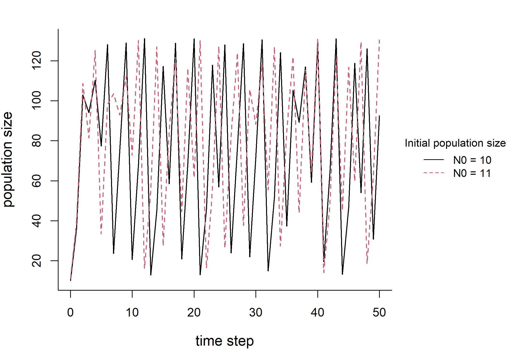

---
title: OER authorship as a project-based graduate course
author:
  - Kim Cuddington\inst{1}
  - Debora Andrade-Pereira\inst{1}
  - Eddie Wu\inst{1}
  - Zitao He2\inst{2}
institute:
  - \inst{1}Department of Biology, University of Waterloo
  - \inst{2}Department of Applied Math, University of Waterloo
date: 08/03/23 
output: 
  beamer_presentation:
    theme: Singapore
header-includes:
 - \definecolor{darkred}{rgb}{0,0.8,0}
---

###
**Intro**

1. brief review course-based research/projects for undergraduate and graduate classes

  2. OER creation as a course-based project
  
**Project description**

3. Our project: OER creation in a biology grad course
  
**What we learned**

  4. Lessons so far

**Inspiration** 

Trust, T., Maloy, R. W., & Edwards, S. (2022). College student engagement in OER design projects: Impacts on attitudes, motivation, and learning. _Active Learning in Higher Education_, 14697874221081454.

# Course-based research 
- whole classes of students address a research question that is of interest to other scientists or community members (Auchincloss et al. 2014).
- engage students in active learning through real-world meaningful outcomes. 

- examples of course-based research at undergraduate and graduate level 

https://taylorinstitute.ucalgary.ca/sites/default/files/Resources/Course-Design/CURE-Examples-2019.pdf

https://serc.carleton.edu/curenet/collection.html

### Key features of course-based research 
-   **offer opportunities for students to make discoveries that are of interest to stakeholders outside the classroom (e.g., the broader scientific community).**
-   students' work is iterative, meaning that students must trouble-shoot, problem-solve, and repeat aspects of their work for the research to progress.
-   offers opportunities for students to communicate their research results to those stakeholders.
-   new research questions and directions are generated each term and the course is unlikely to look the same from year to year.
-   students may engage in a range of science practices such as collecting and analyzing data, building and defending arguments, and collaborating with one another and more experienced scientists. 

### Advantages of course-based research  (see Dolan 2016)
- were developed at an undergraduate level to allow scaling of the usual mentor-based research experiences to the large enrollments typical in some STEM programs such as biology
-  increased self-efficacy in scientific work
-  increased motivation because of the involvement with a real research problem,
-  iteration and productive failure: students learn by trying, failing, and trying again

### Course-based research or projects for graduate classes
- not much documentation at the graduate level, more examples of OER course projects
- e.g.

Jacobsen, M., McDermott, M., Brown, B., Eaton, S. E., & Simmons, M. (2018). Graduate students' research-based learning experiences in an online Master of Education program. _Journal of University Teaching & Learning Practice_, _15_(4), 4.

Zapata, G. C. (2020). Sprinting to the finish line: The benefits and challenges of book sprints in OER faculty-graduate student collaborations. _International Review of Research in Open and Distributed Learning_, _21_(2), 1-17.

### How does a project-based course differ from a typical graduate course in biology
- typically two types of courses: 
	- reading or literature review (reception/analysis of content)
	- techniques (e.g., stats) (application of skills)

- project-based course will require both these elements, and in addition:
	- **selection of content**
	- other skills not specific to the course (e.g., data collection and cleaning)

# Project: OER creation

###  Using OER creation as a course-project
- Shifting students’ roles from consumers to curators and creators of OERs (Trust et al. 2022)
	- increased motivation, 
	- improved attitudes about learning, 
	- aided the achievement of course learning objectives, and 
	- supported the development of other valuable skills

###  Ebook OER creation 

# BIOL 652 OER project
 
### BIOL 652 project: Create an OER resource on structured population modelling
- the first author (instructor) proposed a course project of creating an OER resource 
- could benefit other biology graduate students and early career professionals anywhere on the globe, 
- would be a permanent record of scholarship, 
-  might provide incentive for students to more thoroughly engage with the material.

### BIOL 652 Course design

**Relevance**
- the OER nature of the product means that the students are producing educational products rather than simply receiving information
- public nature of the material, and its potential use by others may serve as incentive to produce high quality work

**Iteration**
- opportunity for formative comments from instructor and peers 
- present outline of topic area in slide presentation
- incorporate input in revision to online text version of content
- final round of revision following review of text materials by instructor and "lead" on that content section

**Ownership**
- one student acts as project lead on each major content section, provides outline, divides material among other students, and provides feedback on written sections

**Exemplar**
- the instructor completed assignments at the same time as the students, which students suggest was helpful for both coding and learning pedagogical techniques

### Specific output

- an online e-text (see draft at https://www.ecotheory.ca/teach/BIOL652.html)
- with embedded R code and examples

### Connecting Theory, Research, and Application
  
{width=80%}

\note{

In our educational material, we are developing sections dedicated to illustrating how a recent publication has applied population ecology theory to tackle ecological problems such as biological invasions or extinction risk

  

These sections are composed by a short description of the publication, an illustration of the concerned organism, codes using published population data and equations to create models, and plots providing model projections for that given population

}

### Applying Theory to Understand Big Problems

  * The case of invasive hippos in Colombia

\note{

One of our examples describes how an exponential growth of invasive hippo populations in South America is threatening aquatic systems due to the overload of organic matter they bring. 

}

### Improving Learning Through Case Studies

* The case of invasive lionfish in Mexico

{ width=90%}

\note{Everything you want

Another example focused on invasive lion fish, which threatens the biodiversity of invaded areas, shows that the number of lion fish living at the same time controls the population sizes for this species, which has implications for management actions

  

Reading recent publications and developing a section in our educational material where we summarize methods and main findings can help improve our learning in the following ways:

  

- Better understand concepts and equations by applying models to real-world data

- Recognize the importance of ecological theory to understand and manage current problems (extinction risk, biological invasions, etc.)

- Become familiar with relevant literature

}
# Lessons

### Perceived difficulties: Jan 2023 - Now
- Overwhelmed by multiple skills/requirements
	- the course topic, population modelling, requires programming, mathematical and statistical skills in addition to conceptual and quantitative content
	- combining all this with an additional task of formatting materials for OER presentation
- completing assignments which involve teaching others requires reading and summarizing far more literature than an ordinary course with curated materials.

### Perceived benefits: Jan 2023 - Now
-  the curation of the OER materials on github using markdown format seems an important additional training component that directly relates to needed skills in open science and file versioning

-  the development of additional teaching skills, such as the need to identify with learners that are less familiar with the topics in order to simplify and organize the materials

Brown, B., Jacobsen, M., Roberts, V., Hurrell, C., Neutzling, N., & Travers-Hayward, M. Open Educational Practices Create Conditions for Developing Research Skills in Graduate Education. _Online learning and teaching from kindergarten to graduate school_, 457.

### Coding skills developed from the OER experience

#### Graphic skills

* Graphs and figures are provided in many section for demonstrating some important concepts.

* The process of re-creating the graphs through code deepens the understanding of the material.

* Better formatting and visualization for the audience.

{width=48%} {width=48%}

### Coding skills developed from the OER experience

#### RMarkdown skills

* Compile the .md file into different formats for demonstration and presentation.

* Different sections of each module are usually divided among the authors. 
* Version control is necessary and important.

* Bibliography and citation using RMarkdown and BibTex file.

# Summary
- this OER project course may have added benefits in developing professional skills related to teaching, literature review, and open science practices, beyond the stated learning objective of developing mastery in population modelling
- however, there is a workload cost associated with these benefits

### Would I do this again? Instructor

#### Yes! But....
- I would include a smaller section of material

- I would scaffold by:
	- provide an example set of OER materials that are appropriate for course(for example, relevant intro material)
	- have a second set of partially completed materials that students populate
	- have the students complete the final portion of the material with no template

### Would I do this again? Students

