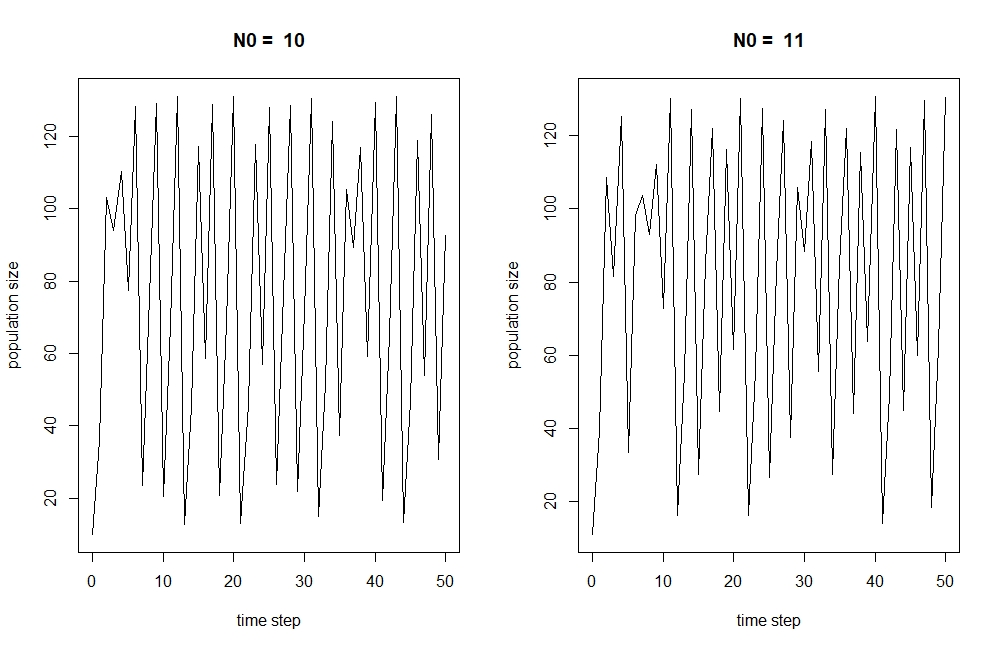
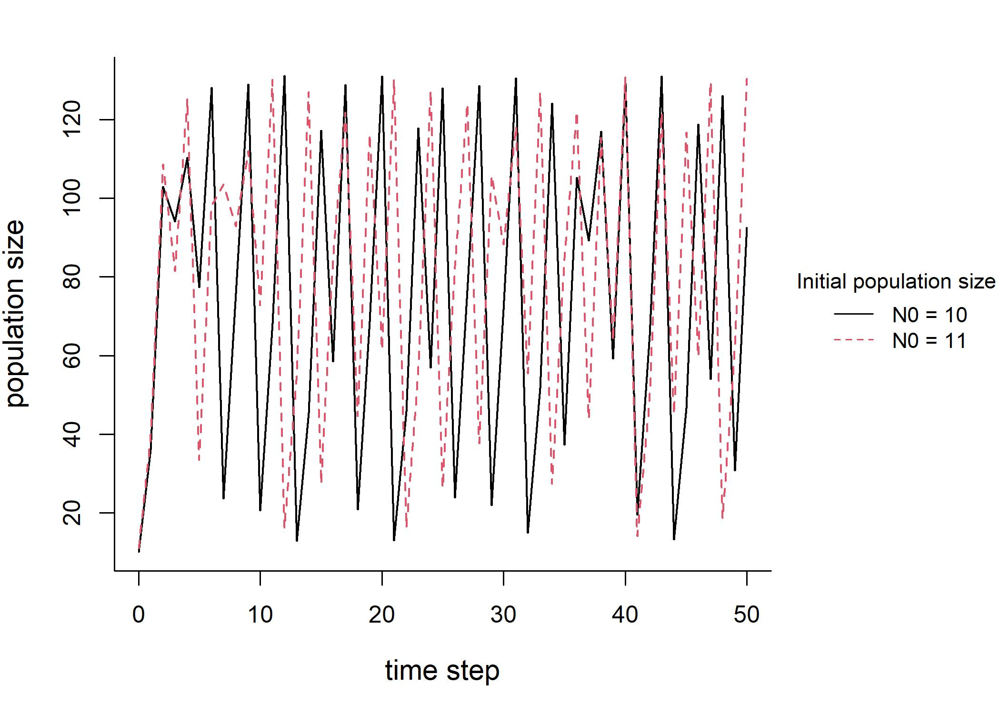

```{r setup, include=FALSE}
knitr::opts_chunk$set(echo = FALSE)
```

### Coding skills developed from the OER experience

#### Graphic skills

* Graphs and figures are provided in many section for demonstrating some important concepts.

* The process of re-creating the graphs through code deepens the understanding of the material.

* Better formatting and visualization for the audience.

{width=50%} {width=50%}

#### RMarkdown skills

* Compile the .md file into different formats for demonstration and presentation.

* Different sections of each module are usually divided among the authors. Version control is necessary and important.

* Bibliography and citation using RMarkdown and BibTex file.

