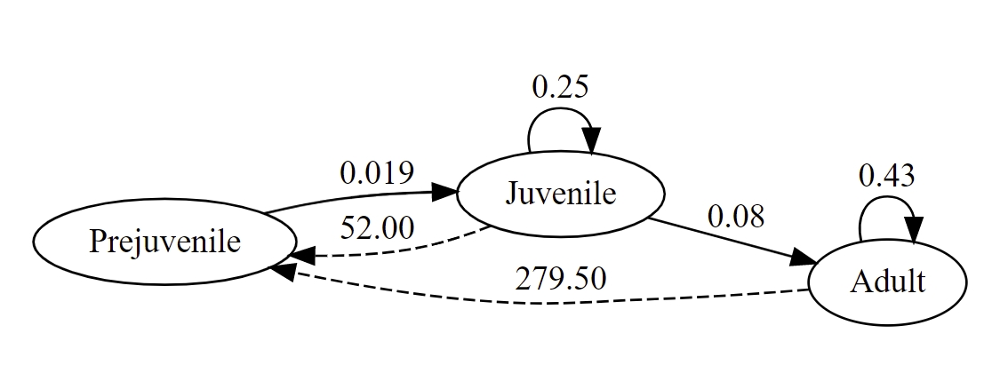
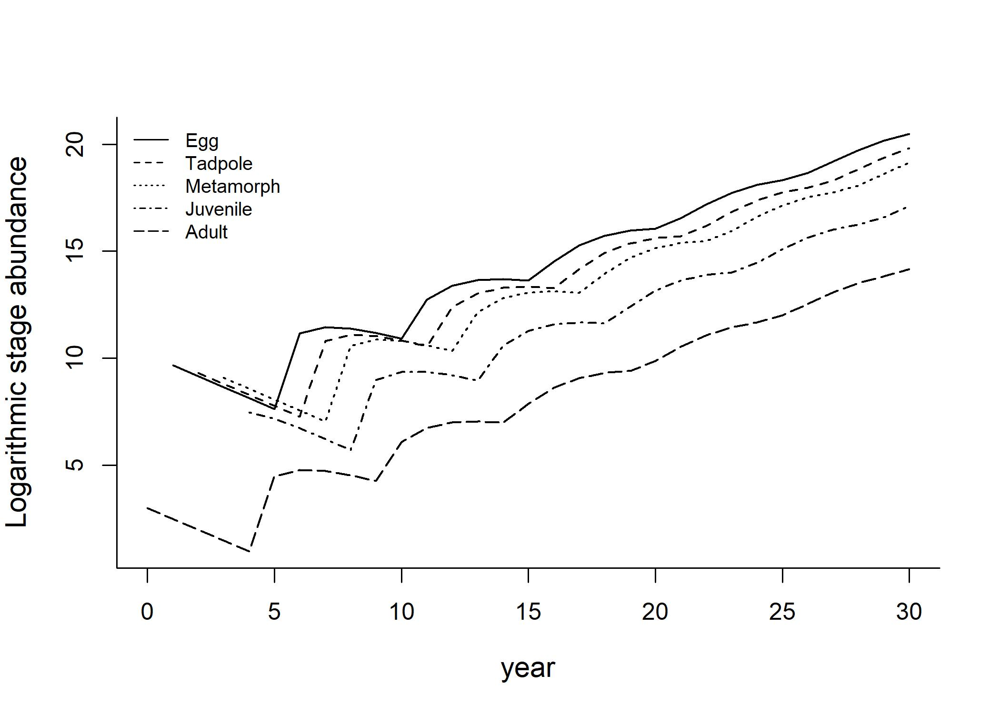

# Structured population models

## Introduction to population structure

So far, we have limited our prediction of wild populations by assuming that all individuals in a population are identical. However, many plants and animals have distinct age or stage structure in their populations. In fact, ecologists care about these particular parts of a population as much as they do the population as a whole. To understand and predict population growth, we cannot avoid discussing the dynamics of these particular ages and stages.

### Different population structures

In the same population, individuals can have markedly different dynamics depending on their age. This is called **age structure**. For example, Coulson et al. (2001) found that individual susceptibility to changing environmental conditions differs between Soay sheep of different ages. Young and old individuals are more severely affected by adverse weather conditions than adults of prime reproductive age.

, [Creative Commons CC BY-SA 2.0 License](https://creativecommons.org/licenses/by-sa/2.0/)](soay.jpg)\

While for many species (especially for amphibians, fish, and insects), differences in vital rates in wild populations often depend on developmental or morphological stages, rather than ages. This is referred to as **stage structure**. For example, common frogs can be divided into three stages according to their developmental status: Pre-juvenile, juvenile, and adults. The vital rates within each stage are relatively constant. (Biek et al., 2002)

**Size structure** is another commonly used category. For many fish species, age and body size (fork length) is highly correlated. Since fish length is much easier to measure and obtain, it is common to categorize fish into different size groups when building a population matrix.


### Life tables

A **life table** is a record of survival and reproductive rates in a population, broken out by age, size, or developmental stage.

Consider the same common frog example we discussed above:

* Common frogs can be divided into three stages according to their developmental status: Pre-juvenile, juvenile, and adults. We can record the demographic vital rates and transition probabilities (the probability of surviving and successfully transitioning to the next developmental stage) for each stage in a table:


Table: Demographic vital rates and tansition probabilities for different common frog developmental stages (data from Biek et al., 2002)

|Stages       | Survival | Transition | Reproduction |
|:------------|:--------:|:----------:|:------------:|
|Pre-juvenile |    0     |   0.019    |      0       |
|Juvenile     |   0.25   |    0.08    |      52      |
|Adult        |   0.43   |     0      |    279.5     |


#### Methods to construct life tables:

**Cohort-based approach**

The cohort analysis follows all individuals born during a time period, determining the ages that they die and their birth rates as they age. Life tables constructed from the segment-based method are often called horizontal or cohort life tables. Cohort life tables allow researchers to observe the changes in the survival and mortality rates of a population over time. However, it is usually very challenging to follow a cohort from birth to death of the last individual.

**Segment-based approach**

The segment-based approach looks at the births and deaths of all the individuals in the population during some slice of time. Life tables constructed from the segment-based method are often called vertical or period life tables. It is often used when studying populations of animals that are difficult to track over time.

* In summary, both are useful tools to study population dynamics. Vertical life tables provide an accurate representation of a population's mortality rate and survivorship at a specific point in time; while cohort life tables provide a more detailed understanding of how a population's mortality rate and survivorship change over time.

### Life history stage diagram

From the life table in the previous section, we can create a life history diagram to represent the vital rates in different population stages.

* In a life history diagram, different stages are represented by different circles, Self-pointing arrows refer to the probability of remaining in the current stage (survival); forward-points arrows refer to the probability of transitioning to the next stage (transition); backward-pointing arrows refer to the fecundity value (reproduction).




### Use matrix to represent population dynamics

Compared to life tables and life history diagrams, population matrices are more versatile and practical tools for presenting how structure affects wildlife population dynamics.

A handy way to decipher the biological meaning of any matrix element is to label the rows and columns of the matrix with the consecutive stages of the target organism. Each element gives the transition from the current column number to the current row number.

* For example, $a_{i,j}$ represents the number of individuals contributed on average by each individual in class j this year to class i next year.

Consider the following matrix, common frog has three stages, pre-juvenile, juvenile, and adult. The time step is 1 year.

* The first row ($a_{1,2} = 52, a_{1,3} = 279.5$) represents reproduction from each stage to the next year.

* The diagonal ($a_{2,2} = 0.25, a_{3,3} = 0.43$) represents the proportion of individuals in a stage that will survive and still be in the same stage next year.

* The sub-diagonal ($a_{2,1} = 0.019, a_{3,2} = 0.08$) represents the proportion surviving and advancing to the next stage.


Table: Anatomy of a female-based projection matrix for common fog (adapted from Biek et al., 2002)

|             | Pre-juvenile| Juvenile|  Adult|
|:------------|------------:|--------:|------:|
|Pre-juvenile |        0.000|    52.00| 279.50|
|Juvenile     |        0.019|     0.25|   0.00|
|Adult        |        0.000|     0.08|   0.43|
Anatomy of a female-based projection matrix for common fog (adapted from Biek et al., 2002)

#### Leslie Matrix - for age structure

* The Leslie Matrix is a discrete, age-structured model of population growth. In a Leslie model, the population is divided into groups based on age classes. The (i,j)th cell in the matrix indicates how many individuals will be in the age class i at the next time step for each individual in stage j. (Leslie, 1945; Leslie, 1948)

* In a Leslie Matrix, an individual can only survive and transition to the next stage, or die, so everything below the first row and not on the subdiagonal of the matrix must be zero.


\begin{bmatrix}
f_0 & f_1 & f_2 & \cdots & f_{m-1}& f_{m} \\
s_0 & 0 & 0 & \cdots & 0 & 0 \\
0 & s_1 & 0 & \cdots & 0 & 0 \\
0 & 0 & s_2 & \cdots & 0 & 0 \\
\vdots & \vdots & \vdots & \ddots & \vdots & \vdots \\
0 & 0 & 0 & \cdots & s_{m-1} & 0 \\
\end{bmatrix}

A leslie matrix consists of $m+1$ rows and $m+1$ columns. $f$ represents the reproductive rate of that age class in the population, $s$ represents the probability for surviving and transitioning to the next age class.

#### Lefkovitch Matrix - for stage/size structure

* The use of Lefkovitch matrix is usually associated with stage structure (or size structure), rather than age structure. (Lefkovitch, 1965)

* Unlike age-structured population models, animals can remain in some stages or size groups for multiple time steps. Therefore, a Lefkovitch matrix appears to be a more accurate representation of these population models.


## Projecting a population matrix through time

### How to project a matrix

Once the matrix model is filled with vital rates it can be projected through time, keeping track of both total population size and numbers of individuals in each stage.

To determine the population size vector next year $n(t+1)$, multiply the matrix $M$ of vital rates by the vector of individuals at current time $n(t)$:

$$n(t+1) = M*n(t)$$

Projecting the matrix through time requires you to understand the fundemantals of matrix math. If you are unfamiliar with how to conduct matrix multlipcation, please check out [this tutorial](https://www.khanacademy.org/math/precalculus/x9e81a4f98389efdf:matrices/x9e81a4f98389efdf:multiplying-matrices-by-matrices/a/multiplying-matrices).


**Example:**

Consider the population model of common frog we have been discussing. The population can be divided into three developmental stages, and the vital rates are reported in the matrix in the previous section. In 2010, the population consists of **70 pre-juveniles, 20 juveniles, and 10 adults** (initial population), what is the population number for each stage in 2011 (one time step later)?

By multiplying the number of frogs times the matrix of mean vital rates, we project the population forward for a year.

* The matrix $\times$ Population vector in 2010 = Population vector in 2011


$$
\begin{bmatrix}0&52&279.5 \\0.019&0.25&0 \\0&0.08&0.43 \\\end{bmatrix} \times \begin{bmatrix}70 \\20 \\10 \\\end{bmatrix} = 
 \begin{bmatrix}
  (0 \times 70) + (52 \times 50) + (279.5 \times 10) \\
  (0.019 \times 70) + (0.25 \times 50) + (0 \times 10)  \\
  (0 \times 70) + (0.08 \times 50) + (0.43 \times 10) \\
 \end{bmatrix} = 
\begin{bmatrix}3835 \\6 \\6 \\\end{bmatrix}
$$
Projecting the population number of common frog through time (adapted from Mills, 2013).


### Stable age/stage distribution

A property of a stage structured population is that, if all the vital rates in the projection matrix remain constant, the population stage structure will approach a stable stage distribution, in which the relative number of individuals in each stage, and the population growth rate $\lambda$ will be constant.

Consider the same common frog example. With constant vital rates, we project the population for 14 year:


```r
years <- 14
# Create an empty matrix to store the population projection results
N.project <- matrix(0, nrow = 3, ncol = years+1)
# Add the initial population for each stage
N.project[,1] <- c(70,20,10)

# Use a for loop to iterate through the time steps
for (i in 1:years) {
  N.project[, i+1] <- X %*% N.project[,i]
}
```
With the population abundance in each stage, we can calculate the stage distribution in 2023:

```r
# Calculate the stage distribution for 2023
s.2023 <- sum(N.project[,14])
# Pre-juvenile:
N.project[1,14]/s.2023
```

```
[1] 0.9813586
```

```r
# Juvenile:
N.project[2,14]/s.2023
```

```
[1] 0.01713166
```

```r
# Adult:
N.project[3,14]/s.2023
```

```
[1] 0.001509782
```

Similarly, we can calculate the stage distribution in 2024:

```r
# Calculate the stage distribution for 2024
s.2024 <- sum(N.project[,15])
# Pre-juvenile:
N.project[1,15]/s.2024
```

```
[1] 0.9813508
```

```r
# Juvenile:
N.project[2,15]/s.2024
```

```
[1] 0.0171394
```

```r
# Adult:
N.project[3,15]/s.2024
```

```
[1] 0.001509771
```

We can see that the relative proportion of individuals in each stage class stays the same. The stage structure at SSD is:

$$
\begin{bmatrix}
98.1\% \\
1.7\%\\
0.2\% \\
\end{bmatrix}
$$
This result can also be demonstrated by plotting the log number of individuals in each stage class versus time:


At SSD, the population growth rate $\lambda$ also stays constant. See the calculations below for $\lambda$ at year 14 and 15:


```r
# The population growth rate from year 2022-2023 is:
sum(N.project[,14])/sum(N.project[,13])
```

```
[1] 1.338596
```

```r
# The population growth rate from year 2023-2024 is:
sum(N.project[,15])/sum(N.project[,14])
```

```
[1] 1.337779
```


### Eigenanalysis

The asymptotic matrix properties (stage age distribution, population growth rate $\lambda$, and reproductive value) can also be calculated analytically using matrix math, instead of approximating these values by projecting an initial population vector out many time steps.

#### Annual population growth rate at SSD

The asymptotic annual growth rate or finite rate of increase is the dominant eigenvalue of the transition matrix.


```r
# Run the eigenanalysis
eigs.X <- eigen(X)

# Find the index position of the largest absolute value of the eigenvalues
dom.pos <- which.max(eigs.X[["values"]])

# Extract the dominant eigenvalue and retain only its real part
lambda <- Re(eigs.X[["values"]][dom.pos])
lambda
```

```
[1] 1.338048
```

<br>

#### Stable stage distribution

The stage stage distribution is associated with the right eigenvector $w_1$. The distribution is defined as:

$$
\frac{w_1}{\sum^{s}_{i=1}{w_1}}
$$
where $s$ is the number of stages.


```r
# Extract w, keeping just the real part, and divide it by its sum to get the stable stage distribution
w <- Re(eigs.X[["vectors"]][, dom.pos])
ssd <- w/sum(w)
round(ssd, 3)
```

```
[1] 0.981 0.017 0.002
```

<br>

#### Reproductive value

The reproductive value gives us one measure of the importance of an individual in each stage. Reproductive value is the expected contribution of each individual to present and future reproduction.

We can find each stage's reproductive value by solving for the dominant left
eigenvector $v$, where

$$
vA = \lambda v
$$

Since this vector $v$ is proportional to the reproductive values. We have the follow definition for reproductive value:

$$
\frac{v_1}{\sum^{s}_{i=1}{v_1}}
$$


```r
# Performing eigenanalysis on the transpose of the projection matrix
M <- eigen(t(X))

# Get the left eigenvalues and eigenvectors
v <- Re(M$vectors[, which.max(Re(M$values))])

# Extract just the dominant left eigenvector; we then scale it, so the stage 1 has a reproductive value of 1.0
RV <- v/v[1]
RV
```

```
[1]   1.00000  70.42358 307.80308
```


## Illustratin of current application

This literature example demonstrates how the use of stage-structured population models can be applied to solving real-life ecological management problems.

**Problem**: There is an invasive guttural toad (*Sclerophrys gutturalis*) population in Cape Town. With limited budget and efforts, and prior knowledge that the vital rates of this species are likely to differ significantly among developmental stages, we would like to know what is the most efficient way to remove invasive codes (what stage should we target)?


**Step 1:**

The first step is to create a stage-structured population model to project the population dynamics. From Vimercati et al. (2017), we obtain the life history stage diagram and population projection matrix (Note that in our example, the density effects and spatial effects presented in the original literature have been removed to simplify the model.).


<br>
$$
\begin{bmatrix}
0 & 0 & 0 & 0 & 780 \\
0.7 & 0 & 0 & 0 & 0 \\
0 & 0.8 & 0 & 0 & 0 \\
0 & 0 & 0.5 & 0.15 & 0 \\
0 & 0 & 0 & 0.05 & 0.6 \\
\end{bmatrix}
$$
<br>
With an initial population of 20 adults (when the species was first recorded in a single pond of Cape Town), we project the model for 30 time steps to simulate the population dynamics from 2001 to 2030.





**Step 2:**

Knowing the population dynamics, the researchers ran different management simulations by altering the mortality rate of different stages to simulate the removal efforts targeted at these different stages. They then calculated the efficiency for each strategy, as well as projected population size at the end of the management to see which one is the most efficient method to control toad population. The methodology is complicated thus not discussed in details here. (Vimercati et al., 2021)


Table: Management removal strategy, population size at the end of management and efficacy obtained by simulating different strategies with a stage-structured model for the invasive population of guttural toad, *Sclerophrys gutturalis*, in Cape Town. (values are taken from Vimercati et al., 2021)

|Management removal strategy | Population size at the end of management | Strategy efficacy |
|:---------------------------|:----------------------------------------:|:-----------------:|
|No removal                  |                   2973                   |         0         |
|Adult removal               |                   2197                   |        776        |
|Pre-metamorphic removal     |                   3318                   |       -345        |
|Successfully eradication    |                    0                     |       2973        |


**Step 3:**

From the results, Vimercati et al.(2021) concluded that removing only adults can maximize the reduction of population size and it is the most effective strategy. Pre-metamorphic stages (egg and tadpole) should not be targeted when making removal plans, as it is likely to cause opposite effects.


# References

