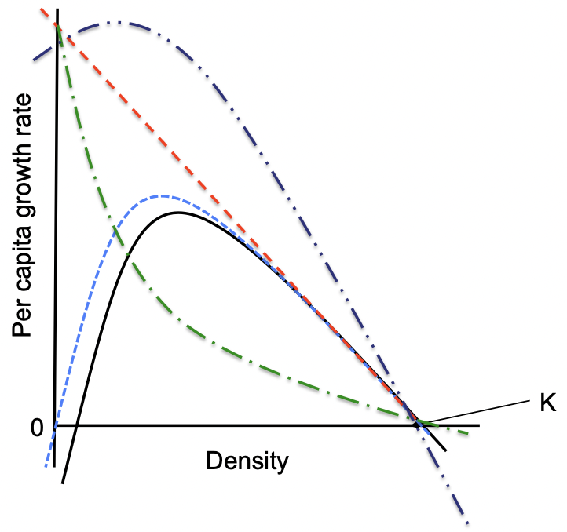

### Outline
1. Intro to model selection
	1. Motivating example with Harrison data
	2. How does model selection differ from model fitting?

2. Intro to likelihood
	1. Difference between probability and likelihood
	2. maximum likelihood 
	3. example with coin toss?
	4. Least squares and max like are the same for normal distribution: example with regression
	5. ??How does likelihood differ from R2?

3. Model comparison with AIC
	1. Comparing 3 different models with max like
	2. Example of overfitting
	3. Simplicity and AIC
	4. ??Likelihood ratio test?


### 1. How do we tell which model to use for our data?
- If we have several candidate models and no *a priori* reason to assume one is better than the others, we can use data to determine which is best.

- For example, you may have reason to believe your population has density dependent growth rates, but we introduced a couple of density-dependent models, which one should we choose?

### Which model is most likely given my data?

{width=80%}

### Model selection with the Bay Checkerspot data
- data from Harrison's famous paper testing whether there were multiple populations or a single population
- number of females estimated using mark recapture over 20 years

| { width=50% }  { width=30% }

Harrison at al. (1991)           Wikipedia Commons (CC BY-SA 3.0)

### Probably negative density dependence
- plot natural logarithm of $\lambda$, 
- expect a negative slope with density if there is density dependence
- check without outlier 

{ width=70% }

### Probability of the data: What we just did there
- looked at the probability of the **data** given the null hypothesis of zero slope
- frequentist hypothesis testing
- very unlikely (low probability)

|             |   Estimate| Std. Error|   t value| $Pr(>\lvert t \rvert)$|
|:------------|----------:|----------:|---------:|------------------:|
|(Intercept)            |     0.75|        0.3|    2.46|               0.02|
|slope |     0.00|        0.0|   -3.06|               0.01|


		RSE: 1.039 on 22 degrees of freedom
		Multiple R-squared:  0.2992,	
		Adjusted R-squared:  0.2674 
		F-statistic: 9.393 on 1 and 22 DF,  
		p-value: 0.005672
		
### Model selection: how likely is this model?
- look at the problem in the opposite direction: we have the data
- how likely is it that each one of our models could have generated this data?
- that is, can we determine which model of negative density dependence is best?

density independent model: $log(N_{t+1}/N_t)=r$  

logistic model:$log(N_{t+1}/N_t)=r(1-N_t/K)$

theta logistic model:$log(N_{t+1}/N_t)=r(1-(N_t/K)^\theta)$

### 2. Likelihood
-   The probability of obtaining the observed data, given a particular set of parameter values (q) for a particular model
   $$L(q|data,model)$$ 
-   is read as the “likelihood of the parameter values q given the collected data and specified model x"
  
### Probability and Likelihood

- the likelihood of a given hypothesis (model) is proportional to the probability of obtaining the data given the hypothesis
$$L (model|data) = c * P(data|model)$$
- and since likelihood is used to compare models, we don't need to worry about the constant


### Calculating Likelihood  for Datasets
$$L(\phi|X)=P(X|\phi)=\prod g(x_i|\phi),$$

where $g(x_i|\phi)$ is the appropriate probability density function

### But actually... use log-likelihood 
- easier to calculate 
- less likely to result in computer rounding errors

Log-likelihood
$$ln[ \, L(\phi|X) ] \,=\sum ln [ \,g(x_i|\phi) ] \,$$

### Example: use likelihood to find mean and variance of data
-   given a set of data, determine if the data came from a normal distribution with a given mean (5) and variance (4)
-   assume independent observations, so likelihood is the product of their individual probabilities
``` R   		
X = c(0,4,5,7,8,2,2,4,4)
like1=prod(dnorm(X,mean=5,sd=2))
```
     > like2 
	 [1] 4.443365e-12
- compare to another parameter value (mean = 6)
``` R  
like2=prod(dnorm(X,mean=6,sd=2))
```
	> like2
	[1] 1.072149e-11
- this value is less likely

### Maximum likelihood estimate (MLE)
-   The parameter(s) values that make the likelihood as large as possible
-   Note: because likelihoods are often very small numbers, normally use the logarithm of the likelihood or log-likelihood to compare between models

### Likelihood: finding mean and variance of data	
- but of course, probably better to use log likelihood so
- Using a related definition of likelihood as the –sum of the log transform of individual probabilities given a mean 5 and variance 2:
``` R
X = c(0,4,5,7,8,2,2,4,4) 
like1=-sum(dnorm(X,mean=5,sd=2,log=T))
like2=-sum(dnorm(X,mean=6,sd=2,log=T))
```
	> like1
	[1] 21.88377
	> like2
	[1] 25.25877
	
### Likelihood: example
- try some other possibilities, all assuming normal error:
```R
#varying the mean
means = seq(0,10,by=.1)
mean.likes =
  sapply(means,function(y) sum(dnorm(x=X,m
  =y,sd=2, log=T)))
```
{ width=50% }

### Maximum log likelihood
-   The probability of obtaining the observed data given a particular set of parameter values for a particular model

### Likelihood surface

### 3. Model comparison
### Comparing 3 different models with max like
| model          | # parameters | ln $L_{max}$ |   |
|----------------|----------------------|----------|---|
| exponential    | 2                    | -41.3    |   |
| logistic       | 3                    | -37.8    |   |
| theta-logistic | 4                    | -37.1    |   |

### Wait.....

• if a model has n data points and n parameters (one for each data point), then the residual variance will be ZERO

• Would this be a still better model???

• Is a model with more parameters, functions, entities, etc. more likely to be “true”?

(more explanatory, accurate, predictive, representative of reality?)
