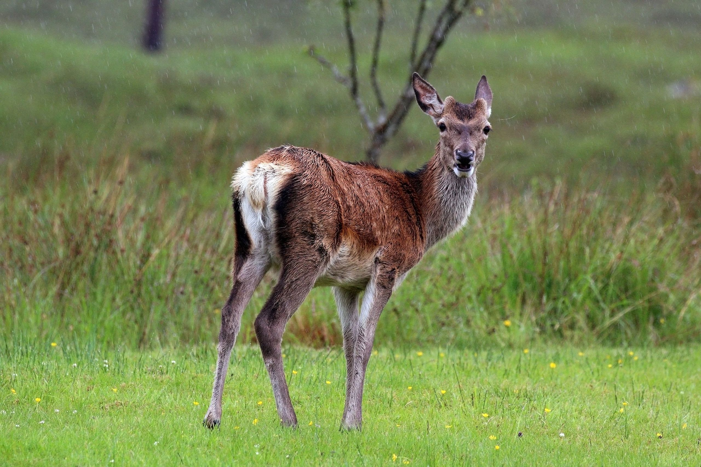

## Population dynamics and stochasticity
### Deterministic vs. stochastic factors
- **Deterministic factors** are predictable, such as predation, competition, etc.
- **Stochastic factors** are unpredictable

### Basic forms of stochasticity and definitions
#### Demographic stochasticity

**Demographic stochasticity** refers to chance events of individual mortality and reproduction (inevitable deviation in mean birth and death rates) (Lande *et al*., 2003). 

- Only significant in small populations
- *Example* 1: Flipping a coin 10,000 times, one will get approximately 5,000 times heads; flipping the same coin 100 times, there could be some deviations from the expected 50:50; flipping the same coin 10 times, it is not suprising that one only gets 2 heads. The probability of getting head is approaching 0.5 as the number of trials increases.


```r
# toss a coin
toss10 <- sample(c(0,1), size = 10, prob = c(0.5,0.5), replace = TRUE)
toss100 <- sample(c(0,1), size = 100, prob = c(0.5,0.5), replace = TRUE)
toss10k <- sample(c(0,1), size = 10000, prob = c(0.5,0.5), replace = TRUE)
results <- data.frame(c(sum(toss10), 10-sum(toss10)),
                      c(sum(toss100), 100-sum(toss100)),
                      c(sum(toss10k), 10000-sum(toss10k)))
colnames(results) <- c("10 tosses", "100 tosses", "10,000 tosses")
rownames(results) <- c("heads", "tails")
results
```

```
##       10 tosses 100 tosses 10,000 tosses
## heads         7         52          5051
## tails         3         48          4949
```
- *Example 2*: The expected sex ratio for a newborn is 50:50. When there 3 new births, we cannot have 50% males and 50% females. Unbalanced sex ratio will influence future birth rate, especially in a small population. Similarly, a death rate of 0.2 does not mean after a year an animal is 0.8 alive--it either survives or dies. When the population size is large, we may use the product of the total populatiom and a mean birth/death rate to estimate the number of births/deaths. However, such estimation is not accurate when the population size is small.

#### Environmental stochasticity

**Environmental stochasticity** often refers to temporal fluctuations in the probability of mortality and reproduction (unpredictable catastrophes) (Lande *et al*., 2003)

- Often driven directly or indirectly by weather
- *Example*: Climate factors have a strong influence on the ecology of red deer on Rum (Albon *et al*., 1987). Real-world data between 1971 and 1991 has shown that the changes in red deer population size correlates strongly with annual rainfall (Benton *et al*., 1995).



#### Sampling error

**Sampling error** (or sampling variance) is the measurement error in estimates of population size or density. Some researchers categorized it as a basic form of stochasticity (Lande *et al*., 2003), while some distinguished it from deterministic and stochastic factors (Mills, 2007).

### Implications of variation in population growth
- An obvious outcome is that future population size outcomes become more uncertain and more variable.
- A less intuitive outcome is that the likelihood of any particular population size at time $t$ in the future becomes more skewed (most populations being relatively small, with a tiny fraction being huge). We will discuss it soon.

### Stochastic effects to population growth rates
#### Arithmetic mean vs. geometric mean
- Let $\lambda_A$ and $\lambda_G$ denote the arithmetic and geometric mean, respectively,
	$$\lambda_A=\frac{1}{k}\sum_{i=1}^k\lambda_i,$$
	$$\lambda_G=\left(\prod_{i=1}^k\lambda_i\right)^{\frac{1}{k}}.$$
- *Example*: Consider $N_{t}=\lambda_tN_{t-1}$, where $N_t$ is the population at time $t$, and during each time interval $(t-1,t)$ the growth rate is $\lambda_t$. Assume $\lambda_t=1.55$ or $\lambda_t=0.55$ with the same probability. Assuming that the population grows at a constant arithmetic mean rate $\lambda_A=(1.55+0.55)/2=1.05$, the population at $t=16$ is
	$$N_{16}=1.05^{16}N_0=2.18N_0.$$
	Instead, if we assume that the growth rate alternated between $1.55$ and $0.55$, the population at $t=16$ becomes
	$$N_{16}=1.55^8\times0.55^8N_0=[(1.55\times0.55)^{1/2}]^{16}N_0=0.28N_0,$$
	which indicates that the variation in population growth leads to a likely decline for the population, even though the (arithmetic) average growth rate is larger than 1 (Mills, 2007). Here, the geometric mean growth rate is $\lambda_G=(1.55\times0.55)^{1/2}\approx 0.9233$.

```r
N0 <- 1
lambda <- matrix(rbinom(1600, 1, 0.5), ncol = 16)
lambda[lambda==1] <- 1.55
lambda[lambda==0] <- 0.55
# lambda is a 100-by-16 matrix
# each row represents a possible population change in 16 years
outcome <- N0*apply(lambda, 1, prod)
par(mfrow=c(1,2))
boxplot(outcome, main = "Boxplot with outliers", 
        ylab = "Final population size")
boxplot(outcome, outline = FALSE, main = "Boxplot without outliers")
```


- *Conversion between $\lambda$ and $r$*: Recall that $r=\ln\lambda$, so
	$$\ln(\lambda_1\lambda_2\cdots\lambda_k)=\ln\lambda_1+\ln\lambda_2+\cdots+\ln\lambda_k=r_1+r_2+\cdots+r_k,$$
	which gives
	$$\ln(\lambda_1\lambda_2\cdots\lambda_k)^{1/k}=\frac{1}{k}\ln(\lambda_1\lambda_2\cdots\lambda_k)=\frac{1}{k}(r_1+r_2+\cdots+r_k),$$
	and thus $$\ln\lambda_G=r_A.$$
- *Variation around $\lambda$*: Increasing the variance of the growth rates ($\sigma_\lambda^2$) makes the geometric mean growth rate less than the arithmetic mean. Let $\lambda_t=\lambda_A+\epsilon_t$, where $\epsilon_t$ is the deviation of $\lambda_t$ from the arithmetic mean $\lambda_A$ with zero mean. Using Taylor expansion, one could obtain
	$$\begin{aligned}\ln\lambda_t & =\ln\lambda_A+\ln(1+\epsilon_t/\lambda_A)\\~ & =\ln\lambda_A+
		\epsilon_t/\lambda_A-(\epsilon_t/\lambda_A)^2/2+O(\epsilon_t^3).\end{aligned}$$
	Hence, taking the expectation of both sides gives
	$$r_A=E(\ln\lambda_t)\cong\ln\lambda_A-\frac{E[(\lambda_t-\lambda_A)^2]}{2\lambda_A^2}=\ln\lambda_A-\frac{\sigma_\lambda^2}{2\lambda_A^2},$$
	which further gives
	$$\lambda_G\cong\exp\left(\ln\lambda_A-\frac{\sigma_\lambda^2}{2\lambda_A^2}\right).$$
	In fact, the geometric mean is **always no larger** than the arithmetic mean (and they are equal if and only if every term is the same).

#### Temporal autocorrelation
- Above examples assume that $r_t$ does not depend on previous growth rates, nor will it influence subsequent growth rates. The autocorrelation describes the relationship between $r_t$ and $r_{t+\tau}$, its value at a time lag $\tau$. One way to incorporate teporal autocorrelation is to:
	$$r_{t+\tau}=r_A+\rho(r_{t}-r_A)+\epsilon_{t+\tau},$$
	where $\rho$ is the coefficient of lag-$\tau$ autocorrelation, and $\epsilon_t\sim N(0,\sigma_\epsilon^2)$ is white noise with zero mean and constant variance. An example would be the case $\tau=1$ (lag-1 autocorrelation), where $r_{t+1}=r_A+\rho(r_t-r_A)+\epsilon_{t+1}$. When $\rho=0$, $r_{t+1}=r_A+\epsilon_{t+1}$ and there is no temporal autocorrelation.

### Estimating population growth rates
#### Process error

**Process error** results from variation in true population size due to biotic or abiotic processes (Ahrestani *et al*., 2013).

- Environmental and demographic stochasticity are examples of process errors
- When only process error exists, the population at each time $t$, $N_t$, is known and accurate. The growth rate $\lambda_t$ is a random variable. For example, a geometric model with only process error can be described as
	$$\begin{aligned}N_{t+1} & =\lambda_tN_t,\\\lambda_t & \sim N(\bar\lambda,\sigma_p^2),\end{aligned}$$
	where $\lambda_t$ follows a normal distribution with mean $\bar\lambda$ and variance $\sigma_p^2$.
- Since the population at each time $t$, $N_t$, is known and accurate, we can calculate the estimated growth rate using geometric mean
	$$\hat\lambda=\left(\prod_{i=1}^t\frac{N_{i}}{N_{i-1}}\right)^{\frac{1}{t}},$$
	or equivalently,
	$$\hat r=\frac{1}{t}\sum_{i=1}^t\ln\frac{N_i}{N_{i-1}}.$$
- We can see that the estimated growth rate is only related to the initial and the final population size, as all the terms between them can be cancelled out. In other words,
	$$\hat\lambda=\left(\frac{N_t}{N_0}\right)^{\frac{1}{t}}$$
	and
	$$\hat r=\frac{\ln N_t-\ln N_0}{t}.$$

#### Observation error

**Observation error** results from variation in the methodology used to obtain the population size (Ahrestani *et al*., 2013).

- Examples of observation error include difficulty in counting animals, which might due to lack of technical expertise, insufficient funding, etc.
- When only observation error exists, the growth rate is accurate. A possible geometric model with only observation error can be described as
	$$\begin{aligned}\ln N_t & =\ln N_0+rt+\eta_t,\\\eta_t & \sim N(0,\sigma_o^2),\end{aligned}$$
	where $\eta_t$ follows a normal distribution with mean 0 and variance $\sigma_o^2$. Here we ignore the subscript of $r$ as we assume the growth rate is some constant. We could also convert the above equation to
	$$N_{t+1}=\lambda^tN_te^{\eta_t},$$
	where $e^{\eta_t}>0$ so that the population is always non-negative.
- The equation $\ln N_t=\ln N_0+rt+\eta_t$ is in the form of a linear model in which $\ln N_t$ is the response variable and $t$ is the predictor variable. Using simple linear regression, the slope of the fitted function is the estimated $r$. Moreover, the $y$-intercept is the estimated $\ln N_0$.

### Paper discussion
Drever, M. C., Clark, R. G., Derksen, C., Slattery, S. M., Toose, P. and Nudds, T. D. (2012) Population vulnerability to climate change linked to timing of breeding in boreal ducks, _Global Change Biology_, **18**:480--492.

#### Snapshot of the study
- The authors examined how snow cover duration feected population dynamics of duck species breeding in the western boreal forest of North America, 1973--2007.

### References
Ahrestani, F., Hebblewhite, M. and Post, E. (2013) The importance of observation versus process error in analyses of global ungulate populations. *Sci Rep*, **3**:3125.

Albon, S. D., Clutton-Brock, T. H. and Guinness, F. E. (1987) Early development and population dynamics in red deer. II. Density-independent effects and cohort variation, *J. Anim. Ecol.*, **56**: 69--81.

Benton, T. G., Grant, A. and Clutton-Brock, T. H. (1995) Does environmental stochasticity matter? Analysis of red deer life-histories on Rum, *Evolutionary Ecology*, **9**:559--574.

Beverton, R. and Holt, S. J. (1957) *On the Dynamics of Exploited Fish Populations*. Ministry of Agriculture, Fisheries and Food, London, UK.

Case, T. (2000) *An Illustrated Guide to Theoretical Ecology*, Oxford University Press.

Lande, R., Engen, S. and Saether, B. (2003) *Stochastic Population Dynamics in Ecology and Conservation*, Oxford Series in Ecology and Evolution.

Mills, L. S. (2007) *Conservation of Wildlife Populations: Demography, Genetics, and Management*, Wiley-Blackwell Publishing.
