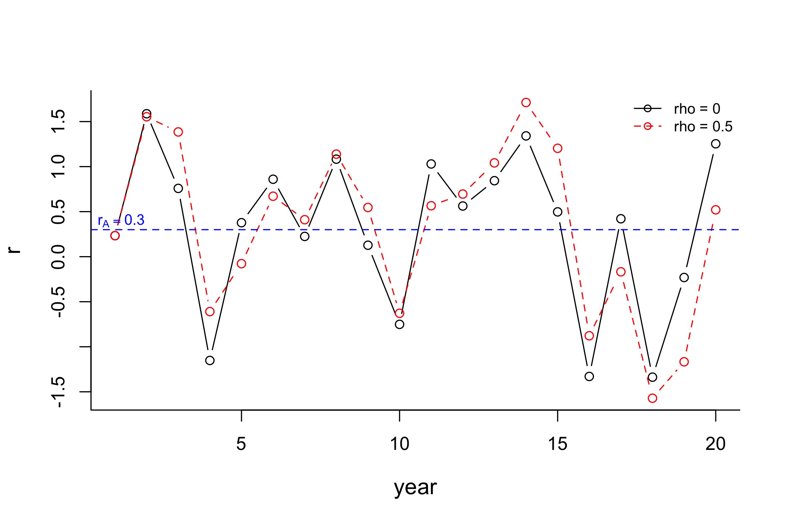

## Population dynamics and stochasticity

We have studied different population models in previous sections. However, these models are still relatively "naive", since population change in the real world will never be constant. In this section, we will add randomness, or stochasticity, to the population models.

### Why are changes in population variable?

- **Sample variance** or **observation error**: measurement error in estimates of population size or density
- **Process variance**: variation acually affecting numbers in count data over time
  - **Deterministic factors**: predictable internal drivers, such as density dependence, predation and competition.
  - **Stochastic factors**: unpredictable random fluctuations. Some fluctuations might in fact be driven by deterministic factors (and thus might be predictable with more complete information), but they can be more easily treated as stochastic factors.

### Basic forms of stochasticity

There are two main forms of stochastic process variance: demographic and environmental stochasticities.

**Demographic stochasticity** refers to chance events of individual mortality and reproduction, such as inevitable deviation in mean birth and death rates (Lande et al., 2003). Demographic stochasticity is only significant in small populations, and we will explain this in three examples.

- *Example 1*: Flipping a coin 10,000 times, one will get approximately 5,000 times heads; flipping the same coin 100 times, there could be some deviations from the expected 50:50; flipping the same coin 10 times, it is not suprising that one only gets 2 heads. The probability of getting head is approaching 0.5 as the number of trials increases.

- *Example 2*: The expected sex ratio for a newborn is 50:50. When there are 3 new births, we cannot have 50% males and 50% females. Unbalanced sex ratio will influence future birth rate, especially in a small population.

- *Example 3*: A death rate of 0.2 does not mean after a year an animal is 0.8 alive--it either survives or dies. When the population size is large, we may use the product of the total populatiom and a mean birth/death rate to estimate the number of births/deaths. However, such estimation is not accurate when the population size is small (a difference of two deaths might not seem to be a big issue in a population of size 1000, but will be significant in a population of size 20).


**Environmental stochasticity** often refers to temporal fluctuations in the probability of mortality and reproduction (Lande et al., 2003), which is often driven directly or indirectly by weather (e.g. unpredictable catastrophes).

- *Example 1*: Climate factors have a strong influence on the ecology of red deer in Scotland (Albon et al., 1987). Real-world data between 1971 and 1991 has shown that the changes in red deer population size correlates strongly with annual rainfall (Benton et al., 1995)

_young_stag.jpg), [Creative Commons  CC-BY-SA-4.0 license](https://creativecommons.org/licenses/by-sa/4.0/)](red_deer.jpeg)

- *Example 2*: Cold-blooded insects like mosquitoes thrive in hot and humid weather, which results in the seasonality of many vector-borne diseases, such as malaria and dengue. There is massive research on modelling the mosquito population dynamics and how they affect the transmission of those diseases. For an example, refer to Beck-Johnson et al. (2013)


### Implications of variation in population growth

- An obvious outcome is that future population size outcomes become more uncertain and more variable

- A less intuitive outcome is that the likelihood of any particular population size at time $t$ in the future becomes more skewed. Specifically, most populations being relatively small, with a tiny fraction being huge. In fact, the realized population growth rate $(N_t/N_s)^{1/(t-s)}$ will be smaller when the growth rates vary. Why?

To answer this question, we need to understand two important concepts: arithmetic and geometric means.

#### Arithmetic mean vs. geometric mean

Let $\lambda_A$ and $\lambda_G$ denote the arithmetic and geometric mean, respectively. We have the following definitions:
$$\lambda_A=\frac{1}{k}\sum_{i=1}^k\lambda_i,$$
$$\lambda_G=\left(\prod_{i=1}^k\lambda_i\right)^{\frac{1}{k}}.$$

- *Example*: Consider $N_{t}=\lambda_tN_{t-1}$, where $N_t$ is the population at time $t$, and during each time interval $(t-1,t)$ the growth rate is $\lambda_t$. Assume $\lambda_t=1.55$ or $\lambda_t=0.55$ with the same probability. Assuming that the population grows at a constant arithmetic mean rate $\lambda_A=(1.55+0.55)/2=1.05$, the population at $t=16$ is
$$N_{16}=1.05^{16}N_0=2.18N_0.$$
Instead, if we assume that the growth rate alternated between $1.55$ and $0.55$, the population at $t=16$ becomes
$$N_{16}=1.55^8\times0.55^8N_0=[(1.55\times0.55)^{1/2}]^{16}N_0=0.28N_0,$$
which indicates that the variation in population growth leads to a likely decline for the population, even though the (arithmetic) average growth rate is larger than 1 (Mills, 2007). In fact, the geometric mean growth rate is $\lambda_G=(1.55\times0.55)^{1/2}\approx 0.9233$.

#### Converting between $\lambda$ and $r$

Recall that the natural logarithm of the growth rate, $r=\ln\lambda$. It would be helpful to know the conversion between the arithmetic mean of $r$ and the geometric mean of $\lambda$. Note that
$$\ln(\lambda_1\lambda_2\cdots\lambda_k)=\ln\lambda_1+\ln\lambda_2+\cdots+\ln\lambda_k=r_1+r_2+\cdots+r_k,$$
which gives
$$\ln(\lambda_1\lambda_2\cdots\lambda_k)^{1/k}=\frac{1}{k}\ln(\lambda_1\lambda_2\cdots\lambda_k)=\frac{1}{k}(r_1+r_2+\cdots+r_k),$$
and thus
$$\ln\lambda_G=r_A.$$

Remember we mentioned earlier that highly variable growth rates will more likely result in a smaller final population? Now we have the knowledge to show this! Let $\lambda_t=\lambda_A+\epsilon_t$, where $\epsilon_t$ is the deviation of $\lambda_t$ from the arithmetic mean $\lambda_A$ with zero mean. Using the Taylor expansion of $\ln(1+x)$, one could obtain
$$\begin{aligned}\ln\lambda_t & =\ln\lambda_A+\ln(1+\epsilon_t/\lambda_A)\\~ & =\ln\lambda_A+
		\epsilon_t/\lambda_A-(\epsilon_t/\lambda_A)^2/2+O(\epsilon_t^3),\end{aligned}$$
where $O(\epsilon_t^3)$ denotes the higher order terms. Hence, taking the expectation of both sides gives
$$r_A=E(\ln\lambda_t)\cong\ln\lambda_A-\frac{E[(\lambda_t-\lambda_A)^2]}{2\lambda_A^2}=\ln\lambda_A-\frac{\sigma_\lambda^2}{2\lambda_A^2},$$
which further gives
$$\lambda_G\cong\exp\left(\ln\lambda_A-\frac{\sigma_\lambda^2}{2\lambda_A^2}\right).$$
As we can see, when the variance of growth rates $\sigma_\lambda^2$ gets larger, geometric mean growth rate $\lambda_G$ gets smaller. In fact, the geometric mean is **never larger** than the arithmetic mean (and they are equal if and only if every term is the same).

#### Temporal autocorrelation

The examples above assume that $r_t$ does not depend on previous growth rates, nor will it influence subsequent growth rates. This assumption may not be very realistic. Here we introduce the idea of temporal autocorrelation, which describes the relationship between $r_t$ and $r_{t+\tau}$, its value at a time lag $\tau$. One way to incorporate temporal autocorrelation is to:
$$r_{t+\tau}=r_A+\rho(r_{t}-r_A)+\epsilon_{t+\tau},$$
where $\rho$ is the coefficient of lag-$\tau$ autocorrelation, and $\epsilon_t\sim N(0,\sigma_\epsilon^2)$ is white noise with zero mean and constant variance. An example would be the case $\tau=1$ (lag-1 autocorrelation), where $r_{t+1}=r_A+\rho(r_t-r_A)+\epsilon_{t+1}$. When $\rho=0$, $r_{t+1}=r_A+\epsilon_{t+1}$ and there is no temporal autocorrelation. Here we present examples of exponential growth rates with zero autocorrelation and positive lag-1 autocorrelation.

```r
# We assume that the mean exponential growth rate r_A = 0.3,
# and the noise term epsilon_t is a standard normal random variable,
# We look at a time period of 20 years
rA <- 0.3
e <- rnorm(20, mean = 0, sd = 1)
r <- data.frame(year = 1:20, zero = rA + e)
```
```r
# Calculate exponential growth rates with positive lag-1 autocorrelation
# We compare different coefficients rho = 0.2, 0.5, 0.8
pos1 = replicate(20, rA + e[1])
for (i in 2:20) {
  pos1[i] <- r[i,'zero'] + 0.2*(pos1[i-1] - rA)
}
r$pos1 <- pos1

pos2 = replicate(20, rA + e[1])
for (i in 2:20) {
  pos2[i] <- r[i,'zero'] + 0.5*(pos2[i-1] - rA)
}
r$pos2 <- pos2

pos3 = replicate(20, rA + e[1])
for (i in 2:20) {
  pos3[i] <- r[i,'zero'] + 0.8*(pos3[i-1] - rA)
}
r$pos3 <- pos3
```



### Estimating population growth rates in the presence of process/observation error

Now we move on to an important section, where we try to estimate the growth rate from data, assuming some very simple models. But first, let's talk about different types of errors we might encounter.

**Process error** results from variation in true population size due to biotic or abiotic processes (Ahrestani *et al*., 2013). Environmental and demographic stochasticities are examples of process errors.

When only process error exists, the population at each time $t$, $N_t$, is known and accurate. The growth rate $\lambda_t$ is a random variable. For example, a geometric model with only process error can be described as
$$\begin{aligned}N_{t+1} & =\lambda_tN_t,\\\lambda_t & \sim N(\bar\lambda,\sigma_p^2),\end{aligned}$$
where $\lambda_t$ follows a normal distribution with mean $\bar\lambda$ and variance $\sigma_p^2$.

Since the population at each time $t$, $N_t$, is known and accurate, we can calculate the estimated growth rate using geometric mean
$$\hat\lambda=\left(\prod_{i=1}^t\frac{N_{i}}{N_{i-1}}\right)^{\frac{1}{t}},$$
or equivalently,
$$\hat r=\frac{1}{t}\sum_{i=1}^t\ln\frac{N_i}{N_{i-1}}.$$

We can notice that the estimated growth rate is only related to the initial and the final population size, as all the terms between them can be cancelled out. In other words,
$$\hat\lambda=\left(\frac{N_t}{N_0}\right)^{\frac{1}{t}}$$
and
$$\hat r=\frac{\ln N_t-\ln N_0}{t}.$$

Here is a toy example: suppose we observe the following number of fish in a lake during the first 8 years. Assuming a geometric model, what is the average growth rate?
	
```r
# Create a dataframe
N <- data.frame(year = 0:8,
                size = c(100, 120, 98, 152, 298, 302, 383, 575, 728))

# Calculate annual growth rates
lambda <- replicate(8, 0)
for (i in 1:8) {
  lambda[i] <- N[i+1,'size']/N[i,'size']
}

# Calculate the geometric mean growth rate
lambda_avg <- prod(lambda)^(1/8)
# The average growth rate is 1.2816, which is the same as (728/100)^(1/8)

# Calculate the theoretical population size, assuming geometric growth
N$pred <- 100*lambda_avg^N$year
```


**Observation error**, or as we mentioned earlier, sample variation, results from variation in the methodology used to obtain the population size (Ahrestani *et al*., 2013).

When only observation error exists, the growth rate is accurate. A possible geometric model with only observation error can be described as
$$\begin{aligned}\ln N_t & =\ln N_0+rt+\eta_t,\\\eta_t & \sim N(0,\sigma_o^2),\end{aligned}$$
where $\eta_t$ follows a normal distribution with mean 0 and variance $\sigma_o^2$. Here we ignore the subscript of $r$ as we assume the growth rate is some constant. We could also convert the above equation to
$$N_{t+1}=\lambda^tN_te^{\eta_t},$$
where $e^{\eta_t}>0$ so that the population is always non-negative.

The equation $\ln N_t=\ln N_0+rt+\eta_t$ is in the form of a linear model in which $\ln N_t$ is the response variable and $t$ is the predictor variable. Using a simple linear regression, the slope of the fitted function is the estimated $r$. Moreover, the $y$-intercept is the estimated $\ln N_0$. Here we provide another toy example with the same data as the previous example on process error:

```r
# Create a dataframe, and calculate the log-transformed population sizes
N <- data.frame(year = 0:8,
                size = c(100, 120, 98, 152, 298, 302, 383, 575, 728))
N$log <- log(N$size)

# Run a linear regression with log-transformed population sizes as response variables
# and year as predictor variables
lm1 <- lm(log~year, data = N)
# After running the regression, we obtain the following coefficients:
# (Intercept) 4.40771
# year        0.26756
```


### References
Ahrestani, F., Hebblewhite, M. and Post, E. (2013). The importance of observation versus process error in analyses of global ungulate populations. *Sci Rep 3*, 3125.

Albon, S. D., Clutton-Brock, T. H. and Guinness, F. E. (1987). Early development and population dynamics in red deer. II. Density-independent effects and cohort variation, *J. Anim. Ecol. 56*, 69-81.

Beck-Johnson, L. M., Nelson, W. A., Paaijmans, K. P., Read, A. F., Thomas, M. B. and Bjonstad, O. N. (2013). The effect of temperature on *Anopheles mosquito* population dynamics and the potential for malaria transmission. *PLoS ONE 8*(11), e79276.

Benton, T. G., Grant, A. and Clutton-Brock, T. H. (1995). Does environmental stochasticity matter? Analysis of red deer life-histories on Rum, *Evolutionary Ecology 9*, 559-574.

Beverton, R. and Holt, S. J. (1957). *On the dynamics of exploited fish populations*. Ministry of Agriculture, Fisheries and Food, London, UK.

Case, T. (2000). *An illustrated guide to theoretical ecology*, Oxford University Press.

Humbert, J.-Y., Mills, L.S., Horne, J.S. and Dennis, B. (2009) A better way to estimate population trend. _Oikos_, **118**:1487--1498.

Lande, R., Engen, S. and Saether, B. (2003). *Stochastic population dynamics in ecology and conservation*. Oxford Series in Ecology and Evolution.

Mills, L. S. (2012) *Conservation of wildlife populations: Demography, genetics, and management*, Wiley-Blackwell Publishing.

Stetz, J. B., Kendall, K. C. and Servheen, C. (2010) Evaluation of Bear Rub Surveys to Monitor Grizzly Bear Population Trends. *Journal of Wildlife Management 74*(4), 860--870.
