---
title: 'What are models for and <br>can we use them more effectively?'

author: "Kim Cuddington (https://ecotheory.ca)"
date: "16/05/2022"
output: 
  ioslides_presentation: 
    keep_md: yes
smaller: true
css: quantbiotalk.css
---
<style>
.forceBreak { -webkit-column-break-after: always; break-after: column; }
</style>
<style>
p.caption {
  font-size: 0.6em;
}
</style>
<style>#margins > p {margin-top: -50px;} </style>
<style>#margins2 > p {margin-top: -50px;} </style>
<style>
p.comment {
background-color: #F2D4D7;
padding: 10px;
border: 1px solid black;
margin-left: 25px;
border-radius: 5px;
font-style: italic;
color: black;
}

</style>


```{r setup, include=FALSE}
library(knitr)
knitr::opts_chunk$set(echo = FALSE)
```
```{css echo = FALSE}
body {line-height: .8;}
h2 {margin-bottom: -50px;}
```
## Co-authors
Warren Currie (https:)
Debora
Laura

## Plan 
  + Epistemology: a brief and idiosyncratic overview
  + Mechanism and novel conditions
  + How can we use models more effectively
    - machine learning models: big data and mechanism (Maxent)
    - mathematical models: mining models for data collection directions? (Laubiemier)
    - statistical models: using mathematical models to understand alternative mechanisms (Quinte)
 

# Epistemology: How do we gain knowledge
<div class="notes">
This is my *note*.

- It can contain markdown
- like this list

</div>


## Gaining knowledge in science
- reality
- data: a biased subset of reality
- opinion: what we believe about reality

<span style="color:red">$\rightarrow$<bold>Science</bold></span>: an attitude linking belief and data, whereby we do not, 
at least in principle, maintain beliefs that are not supported by data 

## Scientific Theory
- We may refer to beliefs supported by data, or which at least
do not always contradict data, as **theories**

- We will like theories to have a few other properties such as: 
    - logical consistency
    - coherence with other scientific theories

## Where do models fit in? 

- Model: a representation of reality

- A structure that: 
    - embodies some of our beliefs about reality <font size="4"><br>e.g., predators negatively impact 
prey populations $\frac{dN}{dt}=f(N)-g(N,P)$</br></font>
    - mimics some aspect of data <font size="4"><br>e.g., linear regression $y_i=\beta_0+\beta_1x_i+\epsilon$</br></font>
    - combines these two components (e.g., makes a statement about the expected pattern of data in light of theory)<font size="4"><br>predator consumption rate can be described as a type II functional response: $\frac{g(N,P)}{P}=\frac{aN}{N+N_0}$</font> 

## Types of models  {.columns-2}


- conceptual (e.g., a statement)
<br/><br/> 

- physical (e.g., lab experiment)
<br/><br/> 

- mathematical (e.g., ODE)
<br/>

- data-driven (e.g., regression)
<br/><br/>

- computational (e.g., IBM)


<p class="forceBreak"></p>
    
    
    
<font size="4"> "predators can positively impact prey"</font>
<br/>
<br/>
```{r pressure, echo=FALSE, fig.align = 'left', fig.cap="Bell & Cuddington 2018", out.width = '35%'}
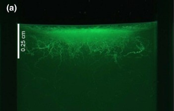
```
 $\frac{dN}{dt}=f(N,E)+g(N,P,E)$


 $E(y_i)=β_0+f(x_i)+\epsilon$ 
<br/><br/>


```{r p2, echo=FALSE, fig.align = 'left', fig.cap="Cuddington & Yodzis 1999", out.width = '25%'}
knitr::include_graphics("euclidIBM.png")
```
## Characteristics of models 
- trade off precision, generality and realism (Levins 1966).
- a model is more specific than a theory
- is not possible to include all details of a system and still have a useful tool (e.g., a one-to-one scale map of a city may include all details but is useless as a guide to finding your hotel), so models are of course not the same as reality (even really complex ones)

<font size="4"><p class="comment">"We actually made a map of the country, on the scale of a mile to the mile!"</br>"Have you used it much?" I enquired.</br>"It has never been spread out, yet," said Mein Herr,<br> "the farmers objected: they said it would cover the whole country, and shut out the sunlight! So we now use the country itself, as its own map, and I assure you it does nearly as well.<br/><br/>
Lewis Carroll - The Complete Illustrated Works. Gramercy Books, New York (1982)</font>
</p>

## Main characteristic of models {.flexbox .vcenter} 

-models are always false in some aspects of their representation theory or data
<br/><br/><br/>
<div align="center">
<font size="7">Theory $\neq$ Model $\neq$ Reality </font></div>


## Complex models are not necessarily better: Math and computation
- "if we put more details in, it will be a better reflection of reality"
- think about the map example: complexity is not necessarily helpful for explanation
- complexity is also a bugbear for exploring model assumptions <br/>(e.g., Valle et al. (2009) found that alternate modeling assumptions in the forest stand simulation model SYMFOR can account for 66–97% of the variancein predicted stand dynamics. Authors note that it may be very difficult to do the same analysis for exceedingly complex models).

## Complex models are not necessarily better: Data
- complexity is not necessarily helpful for prediction either


<div style="float: left; width: 50%;">
- complex models are prone overfitting

<font size="4"><p class="comment">"With four parameters I can fit an elephant, and with five I can make him wiggle his trunk."<br/><br/>
    John von Neumann
</p></font>

- don't be impressed when a complex model fits a data set well. With enough parameters, you can fit any data set
</div>

<div style="float: right; width: 50%;">
```{r p4, echo=FALSE, fig.align = 'center',  out.width = '65%'}
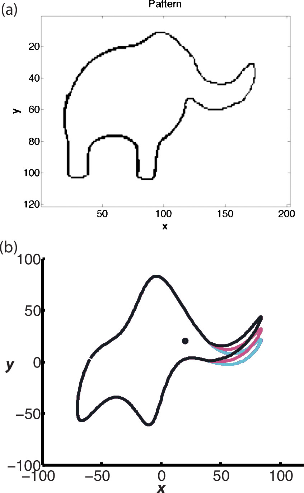
```
<font size="2"><div align="center">[Mayer et al. (2010)](https://doi.org/10.1007/s10530-021-02645-x)</div></font>`</div>

## Overfitting
- but it fits right?? 
- no not really: overfitting occurs when data-driven model tries to cover all the data points  in the dataset
- as a result, the model starts caching noise and inaccuracies present in the dataset
- when your model fits your data perfectly, it is unlikely to fit new data well

```{r p3, echo=FALSE,fig.align = 'center', out.width = '80%'}
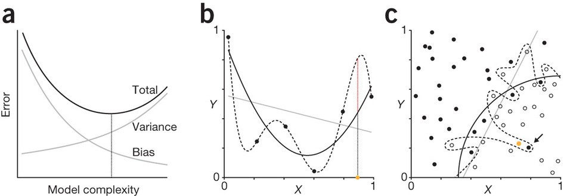

```
<font size="2"><div align="center">[Lever et al. (2016)](https://www.nature.com/articles/nmeth.3968)</div></font>


# <span style="color:red">$\rightarrow$</span>Complex models $\neq$ accurate prediction


## Simplicity is not necessarily better: Data
- "if we make it simple, we will capture general principles/effects"
- for data-driven models, underfit happens when your model is not complicated enough
- underfitting introduces bias, such that there is systematic deviation from the true underlying estimator

## Simplicity is not necessarily better: Math and computation

- for mechanistic models, simplified descriptions may omit important contingencies
- may also omit time-varying variables, signficiant effects of environmental stochasticity etc
- mathematical or computational models may also have signficant analysis/implementation issues and no mechanism, in which case the simplicity is self-defeating

<font size="4"><p class="comment">“There are two ways of doing calculations in theoretical physics”, he said. <br/>“One way, and this is the way I prefer, is to have a clear physical picture of the process that you are calculating. The other way is to have a precise and self-consistent mathematical formalism. You have neither.” <br/><br/>Enrico Fermi speaking to Freeman Dyson about pseudoscalar meson theory </p></font>

<font size="2"><div align="center">[Dyson (2004)](https://www.nature.com/articles/427297a)</div></font>

# <span style="color:red">$\rightarrow$</span>Simple models $\neq$ general principles

## Why do we need models then?

1. Explanation 
2. Prediction


while we attempt to make do without it, both of these functions require mechanism (also called process), particularly for<br/><br/>
<div align="center">
<span style="color:red"><font size="7">Prediction under novel conditions</font></span></div>
<br/>
<color:black>which absolutely requires mechanism


# The role of mechanism in modelling

## What is mechanism?
- "a natural or established process by which something takes place or is brought about" <br/>OED
- answers the "how" question
- explains the patterns in data by identifying the cause

a "mechanistic model", because it includes priori knowledge of ecological processes (rather than patterns)

- e.g., 

## All models can include phenomological or mechanistic components or both
- and in general it is a spectrum rather than a dichotmy

- particularly true for models at large scale, we will often code small-scale mechanisms as phenomenlogical components (i.e., when modelling forest stand dynamics, we will not include a mechanistic description of photosynthesis and evapotranspiration)


## Data-driven models by themselves, are generally not mechanistic <br>
- I'm including here standard statistical models (both frequentist and Bayesian), as well as machine learning models
- we might look for a relationship

Because these models arebased on causal mechanisms rather than correla-tion, our confidence in extrapolating beyondknown data is enhanced. Of course, there isalways uncertainty about how an ecologicalprocess will interact with novel global changeconditions. 

However, underconditions of global change, models based on thepast behaviour of a system may not be suitablefor projection forward (Williams et al. 2007,Lawler et al. 2010).

## ??Models without mechanism provide no useful explanatory information


Predators negatively impact their prey 

- how?

- fear dynamics?
- benefitting competitors

- when, always?
- is that true for generalist predators and specialists?
- what about predators that eat prey competitors?
- 
- what about predators that modify the environment?

Without mechanism, we can't answer these questions, and that's a problem, since if we get the answer wrong, we might take an action that has the opposite of the desired effect

## Math is not magic: Mathmatical models are not necessarily mechanistic

- starting from $\frac{dN}{dt}=f(N)-g(N,P)$ is no different than starting from $y_i=\beta_0 + f(x_i)+\epsilon$ in terms of mechanism

- mechanism requires an explanation or idea about the predators negatively impact net prey population growth rate (what is g(N, P)?)

-we can leave g(N,P) to be a mere description of phenomena, or we can examine natural data closely, devise experiments, or reason logically to develop ideas about mechanism (e.g., Holling REF)

## Mathmatical models and mechanism
- once the function is specificed, the model can also suggest expected behaviour for given conditions within the domain of application (this is a two-species model!, well it might work okay for agricultural fields), or to make guesses outside of this domain (true, but the interaction strength between these two species is really large compared to everything else) 

- one advantage tho, the model can include a variety of functional forms that pertain to different mechanisms... we have to stop forgetting this!!

i.e., Lotka-Volterra pred-prey model ($\frac{dN}{dt}=rN-aNP$), Rosenzweig-McArthur pred-prey model ($\frac{dN}{dt}=rN(1-\frac{N}{K})-\frac{aNP}{N+N_0}$)

-yes, these model are false

## Claim 1: Mathematical models need to focus on mechanism rather than classification

- more generally, mathematical models often tend to appeal to classifications of species interactions, a platonic ideal if you will, which more or may not exist </br>
e.g., a "predator-prey" model

- these models have dubious explanatory value outside of the examplar classification system, 

- "predator-prey" model supposes there is a class of predator-prey interactions that have general properities accross species, systems and time that are related to the outcome of the interaction (-/+)

- as I will discuss, the net effect of pairwise species interactions is not fixed. 
- Nor indeed is the a fixed net effect of the interaction of a species with its environment or community etc, 

## 

$\leftarrow$ this is the first reason I don't think this is a helpful approaoch missing from machine learning approaches, their oversimplified assumptions and extremely specific nature prohibit the universal predictions achievable by machine learning." Baker et al. (2018). Mechanistic models versus machine learning, a fight worth fighting for the biological community? Biology Letters, 14(5), 20170660. https://doi.org/10.1098/rsbl.2017.0660

Any attempt by machine learning technologies to predict individual patient outcomes from past observations using a patient database is potentially able to identify which of existing treatments is most adequate, but intrinsically unable to suggest new treatment protocols or to provide accurate predictions for new treatments. In the literature, this aspect is referred as the ‘inductive capability’ of the learning algorithms (from past data, one can identify patterns happening in the data). This is vastly different from the deductive capability of mechanistic models, in which the combination of logical (mechanistic) principles enables extrapolation to predictions about behaviours not present in the original data [4]. In short, mechanistic models can provide insights and understanding into the mechanistic functions of treatments, and these are necessary to overcome the limitations of machine learning predictions

I haven't seen an example of "universal predictions achievable by machine learning" in ecology but I am certainly of the mind that both approaches are useful IN THEIR DOMAIN OF APPLICATION

## Mecahnsitic mathematical models

- simplified mathematical formulations of causal mechanisms
- , and developing and/or using analytical tools to determine whether the range of possible input –output behaviours predicted by the model, and hence the causal hypotheses, are consistent with experimental observations.

# Other have the opposite view
"While mechanistic models provide the causality

## Example: Rusty crayfish and endangered Hine's emerald
- instead of classifying phenomena, we should to focus on incorporating mechanisms, which **may** generalize accross species, systems and time e.g., $\frac{dN}{dt}=f(N,E)+g(N,P,E)$ where g(N,P,E) could be positive or negative

(e.g., invasive rusty crayfish eat endangered Hine's emerald dragonfly larvae)

```{r, out.width = "50%",fig.align = 'center'}
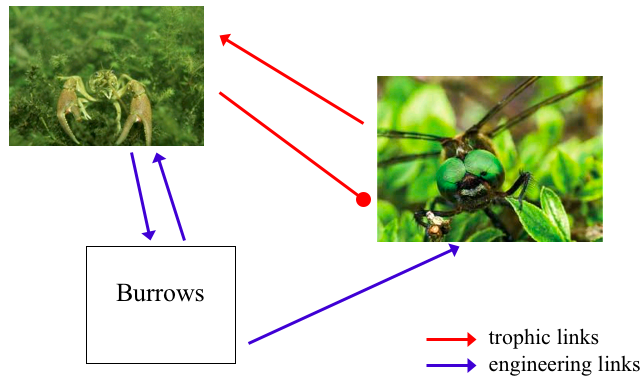
```

## Models without mechanism cannot reliably extrapolate to novel conditions


## Data-driven models usually lack mechanism
- statistical and machine-learning models can only make predictions that relate to patterns within the data supplied


```{r, warning=FALSE}
library(DiagrammeR)
mermaid("
graph TD
  A(Explanation)
  B(Prediction)
  C(Predict under novel conditions)

  
  A-->C
  B-->C
  
 style B fill:#B6E6E6;
 style C fill:#B6E6E6;

",width="100%",height="100%")

#subgraph <-transform_to_subgraph_ws(thdat[A,B])


```

<div class="columns-2">


</div>


# can we use data-driven models to develop mechanistic explanations?
## Maxent algorithm
<div style="float: left; width: 80%;">
- a machine learning method, which iteratively builds multiple models. It has two main components:

1. Entropy: the model is calibrated to find the distribution that is most spread out, or closest to uniform throughout the study region.

2. Constraints: the rules that constrain the predicted distribution. These rules are based on the values of the environmental variables (called features) of the locations where the species has been observed. 

</div>
<div style="float: right; width: 20%;">

```{r, out.width = "40%",fig.align = 'right'}
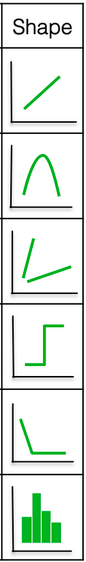
```

</div>
## Maxent modelling for giant hogweed distribution

- use experimental data to suggest candidate predictors: may require cold stratification, refer moist sites

- intial Maxent model to find strong candidates and eliminate correlated predictors (normally we would leave these in and assume that the penalization would takec are of correlation)

```{r, out.width = "100%",fig.align = 'center'}
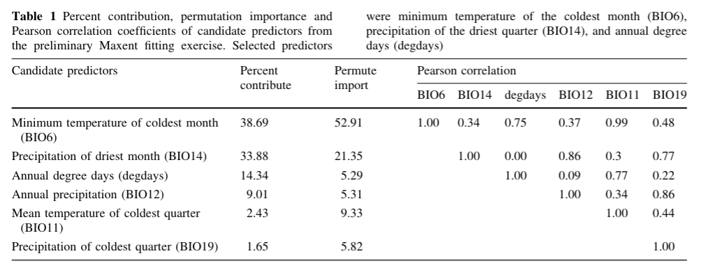
```

## Develop data-driven models, with an eye to mechanism
- constraint Maxent functions to forms that mimic standard ecothermic relationships (again, these are data-based)
- train on a global dataset, test in inside and outside of training data range

## Data-driven models which suggest mechanism {#margins} 
- final set of simple maxent models, and related statistical model.... 

```{r, out.width = "80%",fig.align = 'center'}
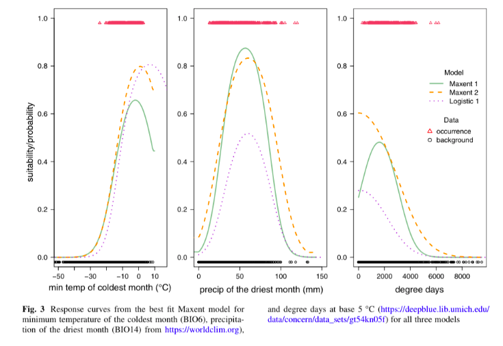
```
<font size="2"><div align="center">[Cuddington et al. (2022)](https://doi.org/10.1007/s10530-021-02645-x)</div></font>`

## Let's use data-driven modelling to identify mechanism
- giant hogweed: the beginnings of a mechanistic model: 
    - requirements for cold seed stratification temperatures to break dormancy
    - with development delays above this range 
- does require constraints, previous experiment, and some logical connections


# can we use mechanistic models to better understand data?

## Regime shifts in bistable systems {#margins2}
- a "sudden" change in state, e.g., Scheffer (2001) $\frac{dx}{dt}=\frac{hx^\rho}{x^\rho+c}-b x+a$
- lake system moves from
    phytoplankton-dominated, eutrophic green water state to
    macrophyte-dominated, oligotrophic state
```{r, out.width = "70%",fig.align='center'}
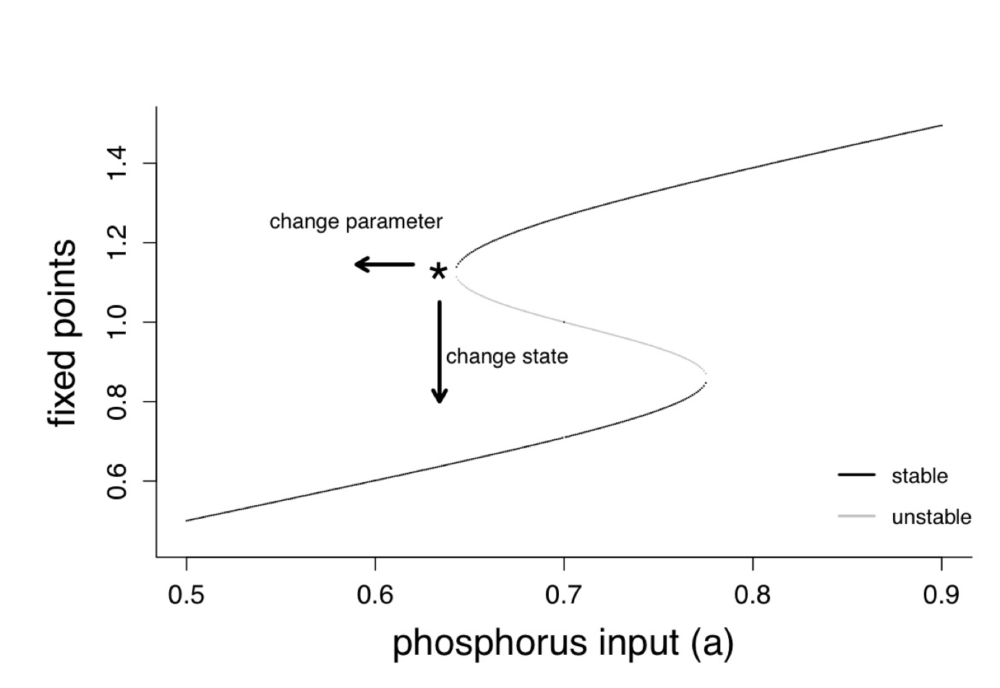
```
<font size="2"><div align="center">[Francis et al. (2021)](https://www.nature.com/articles/s41559-020-01365-0)</div></font>`

## Two ways to get a regime shift
1. Erode stability of one eq'm, or 
2. Push system to second stable basin with a disturbance

```{r, out.width = "50%",fig.show='hold',fig.align='default'}
include_graphics(c("schefferschematic.png", "schefferdisturb.png"))
```
## Wait... is that all the mechanistic model predicts?
-asymptotic vs transient dynamics predicted by models


```{r, out.width = "70%",fig.align = 'center'}
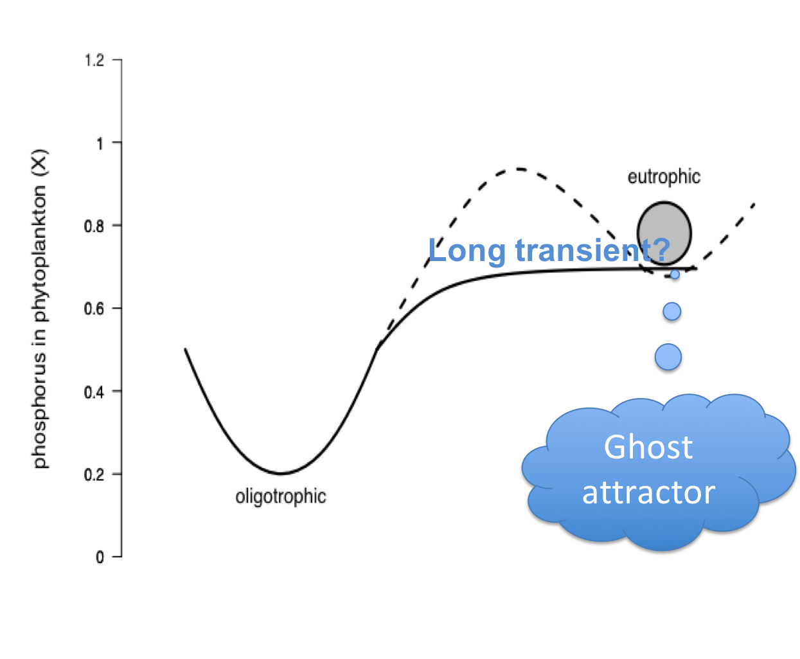
```

## Bay of Quinte
- history of being increasingly eutrophic
- phosophorus controls inplemented 1978
- invaded by zebra mussels in 1994
- meostrophic following this

```{r, out.width = "40%",fig.cap="Bay of Quinte before and after mussel invasion", fig.show='hold',fig.align='default'}
include_graphics(c("turbid.png", "clear.png"))
```

## Standard explanation: Disturbance shift to new stable state 

"In the mid-1990s, zebra and quagga mussels (Dreissena spp.) invaded the area, **dramatically changing the water clarity because of the filter-feeding capacity.**"
<br/>

<font size="4">Bay of Quinte remedial action plant (2017)</font>


## Long transients in a regime shift model
-long transients can be a quite common prediction
```{r, out.width = "70%",fig.align = 'center'}
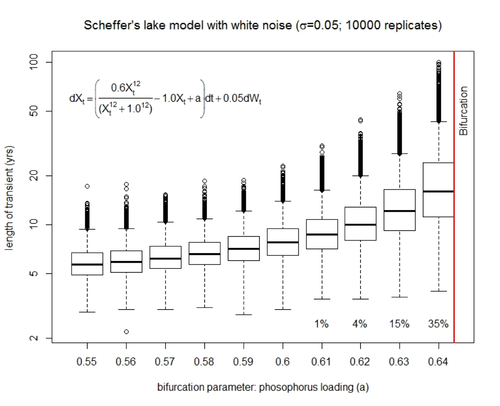
```
<font size="2"><div align="center">[Currie & Cuddington, in prep]()</div></font>`
</div>

## Alternative explanations for change in Bay of Quinte
- all of which arise from the SAME mechanistic model

  1. a regime shift to a 2nd stable state cause by the disturbance of the zebra mussel invasions
  2. a long transient following the erosion of the the stability of the eutrophic state because of a lingering ghost attractor
  3. there was just a slow change in phosphorus (i.e. the system does not have bistable dynamics)

## Examine alternatives using data-driven models:  
- Linear breakpoint analysis <font size="3">$E(y_i)=β_0+break_i+x_i$</font>
- Nonlinear analysis: Use generalized additive model (GAM: <font size="3">$E(y_i)=β_0+f(x_i)$</font>), and examine the first derivative of fitted smooth to find periods of rapid change

<div style="float: left; width: 40%;">
<font size="2">Simulated data from Scheffer model (2001) where the high turbidity state, which is the initial condition, is no longer stable, showing the timeseries (points), fitted GAM model (black line) and 95% credible interval (green lines) for three different levels of additive noise (a-c), then taking the first derivative (d-f) of fitted GAM (black line), with simultaneous confidence intervals (green lines). Where the derivative significantly deviates from zero, we have a period of rapid change. </font></div>

<div style="float: right; width: 60%;">
```{r, out.width = "90%", fig.align = 'center'}
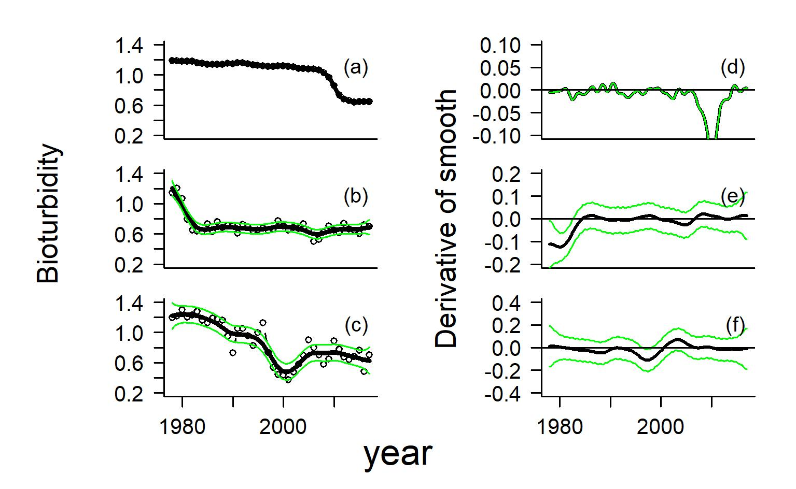
```
<font size="2"><div align="center">[Currie & Cuddington, in prep]()</div></font>`
</div>


## 1. examine the dynamics of a mechanistic driver<br/> (phosphorus)

<div style="float: left; width: 20%;">
- rapid response to management in the 70s 
- slow change after that
</div>

<div style="float: right; width: 45%;">
```{r, out.width = "100%", fig.align = 'center'}
include_graphics(c("TPgamApr08.jpeg"))
```
</div>

<div style="float: right; width: 35%;">
```{r, out.width = "60%", fig.align = 'center'}
include_graphics(c("TPbreak.jpeg"))
```


<font size="2"><div align="right">[Currie & Cuddington, in prep]()</div></font>`
</div>

## 2. examine the dynamics of the disturbance <br/>(zebra mussels) 
<div style="float: left; width: 30%;">

- mussel veligers first detected in 1994
- very low densities
</div>
<div style="float: right; width: 70%;">
```{r, out.width = "80%", fig.align = 'center'}
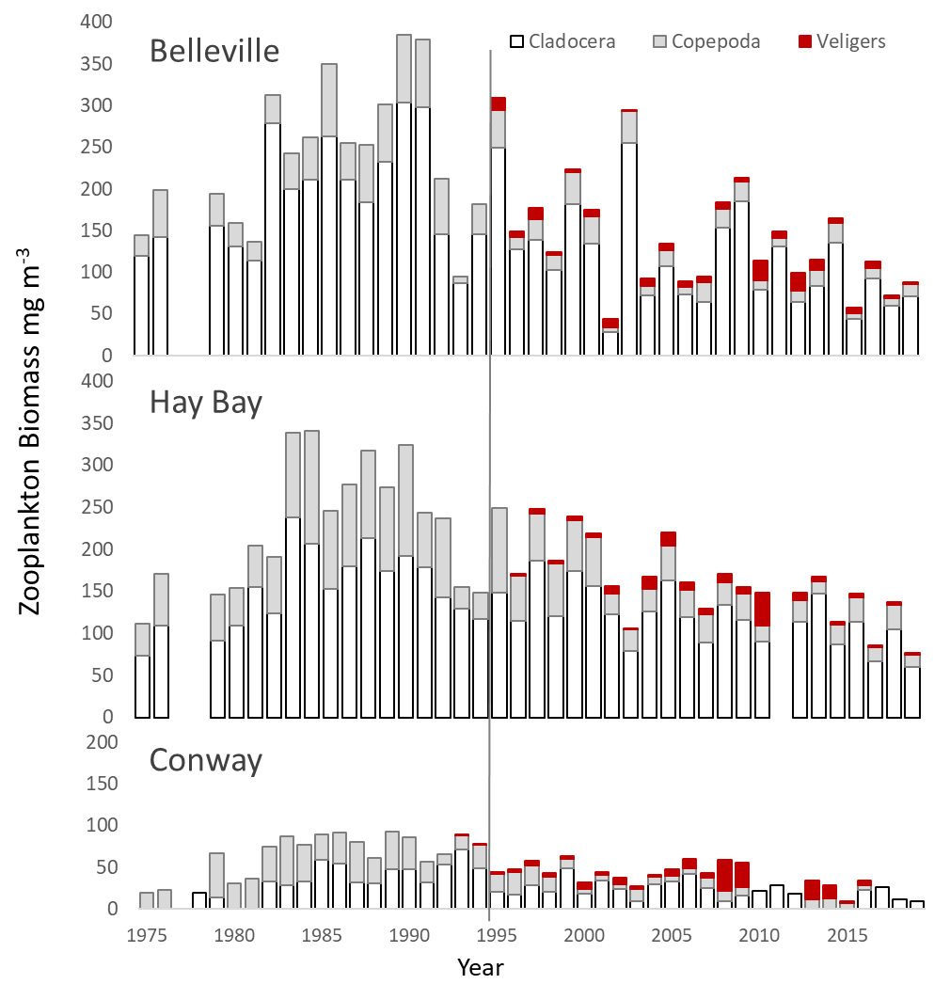
```
<font size="2"><div align="center">[Currie & Cuddington, in prep]()</div></font>`
</div>

## 3. examine the dynamics of the response <br/>(water clarity) {#margins}
<div style="float: left; width: 40%;">
- linear breakpoint model <font size="2">$E(light_{i,s}) = \beta_s+break period_{i,s} + year_{i,s} + TP_i$</font>
- response to phosphorus controls in the 70s  at Belleville
- maybe rapid change after mussels at Hay Bay?

</div>
<div style="float: right; width: 60%;">
```{r, out.width = "50%",fig.show='hold',fig.align='center'}
include_graphics(c("lightbreakwgt.jpeg" ))
```
<font size="2"><div align="center">[Currie & Cuddington, in prep]()</div></font>`


## 3. examine the dynamics of the response <br/>(water clarity)
<div style="float: left; width: 40%;">

- nonlinear analysis : <font size="2">$E(light_{i,s})=β_s+f(year_{i,s})+f(TP_i)$</font>
- suggests rapid change at Belleville and Hay Bay
- rapid change magnitude becomes pretty small when we control for concurvity in phosphorus impacts

</div>
<div style="float: right; width: 60%;">
```{r, out.width = "70%",fig.show='hold',fig.align='center'}
include_graphics(c("lightgamApr11.jpeg", "gamresidlightApr05.jpeg" ))
```
<font size="2"><div align="center">[Currie & Cuddington, in prep]()</div></font>`


## Conclusion: Probably just slow change and a small disturbance

- however, it could be the system DOES have bistable dynamics but either
1. the parameter values are in a regime such that there is no sudden change
2. the parameter values DO allow sudden change, but there is a long transient before that change

- in either case, Zebra mussels only likely to contribute as a small scale disturbance


## Lessons for using models from the Quinte project

1. there are all kinds of dynamic behaviours predicted by even very simple mechanistic models (e.g., transients can be very long)
3. it is going to be tough to determine mechanism in light of this variety of behaviour...but we NEED to because of management question
4. support analysis with a variety of data-driven models at different temporal and spatial scales


## Laubmimer

# can we use physical models to better understand theory?


## Prediction based on explanation: Mechanistic models

-often mathematical, but need not be so.

# Case studies in connecting theory and data
## Moving from theory to prediction?
```{r, warning=FALSE}
library(DiagrammeR)
mermaid("
graph LR
  A(observe)
  B(theorize)
  C(make predictions)
  D(collect data)
  E(test prediction 1)
  G(test prediction 2)
  H(test predition 3)
  F(modify or reject current theory)
  I(accept current theory)
  
  A-->B
  B-->C
  C-->D
  D-->E
  D-->G
  D-->H
  E-->|Reject| F
  G-->|Reject|F
  H-->|accept|I
  F-->C

 style B fill:#B6E6E6;
 style C fill:#B6E6E6;
 style F fill:#B6E6E6;
 style I fill:#B6E6E6;
")

#subgraph <-transform_to_subgraph_ws(thdat[A,B])

```

##
 Environmental stochasticity or varia-
tion in parameter values might lead to amplification of disturbances [24] or differences in expected
dynamics. For example, varying parameter values in a differential equation model can determine
whether a monotonic or oscillating approach to a stable equilibrium is expected (Box 1). There-
fore, uncertainty in parameter values will lead to uncertainty about which dynamic behaviors
are most likely. 


## Open Science

- providing data, source code and dynamic documents to make work completely reproducible 
- Note this document and figures provided at https:/github.com/quantitative-biology/talk


```{r, out.width = "60%", fig.align = 'center'}
include_graphics("https://imgs.xkcd.com/comics/how_it_works.png")
```
<font size="2"><div align="center">https://xkcd.com/385/ </div></font>


## Acknowledgements


## Funding

The Quinite project is funded by the Department of Fisheries and Oceans Canada. The Hines Emerald dragonfly project was funded by NSERC and Faculty of Science, University of Waterloo


## Other references
<font size="1">Bandura A. 1997. Self-self Efficacy: The Exercise of Control. Freeman, New York.</font>
<br><font size="1">Charleston L, Leon R. 2016. Constructing self-efficacy in STEM graduate education. Journal for Multicultural Education 10: 152–166.</font>
<br><font size="1">Chen Musgrove MM, Schussler EE. 2020. The Ph.D. panic: examining the relationships among teaching anxiety, teaching self-efficacy, and coping in biology graduate teaching assistants (GTAs). bioRxiv DOI 10.1101/2020.02.07.938597.</font>
<br><font size="1">Eaton CD, Highlander HC. 2017. The case for biocalculus: design, retention, and student performance. CBE—Life Sciences Education 16: ar25.</font>
<br><font size="1">Flanagan K, Einarson J. 2017. Gender, math confidence, and grit: relationships with quan- titative skills and performance in an undergraduate biology course. CBE—Life Sciences Education 16: ar47.</font>
<br><font size="1">Johnston L, et al. 2019. A graduate student-led participatory live-coding quantitative methods course in R: experiences on initiating, developing, and teaching. Journal of Open Source Education 2: 49.</font>
<br><font size="1">National Research Council et al. 2003. BIO2010: Transforming undergraduate education for future research biologists. National Academies Press.</font>
<br><font size="1">Pajares F, Miller MD. 1994. Role of self-efficacy and self-concept beliefs in mathematical problem solving: a path analysis. Journal of Educational Psychology 86: 193.</font>
<br><font size="1">Ward-Penny R, Johnston-Wilder S, Lee C. 2011. Exit interviews: undergraduates who leave mathematics behind. For the Learning of Mathematics 31: 21–26.</font>
<br><font size="1">Williams JJ, et al. 2019. Barriers to integration of bioinformatics into undergraduate life sciences education: a national study of US life sciences faculty uncover significant barriers to integrating bioinformatics into undergraduate instruction. PloS one 14: e0224288.</font>

## What do you think?

- I'm still proofreading
- always want your feedback (https://www.quantitative-biology.ca/index.html#feedback)


